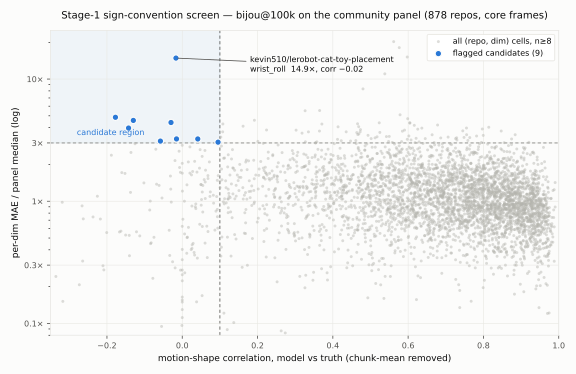
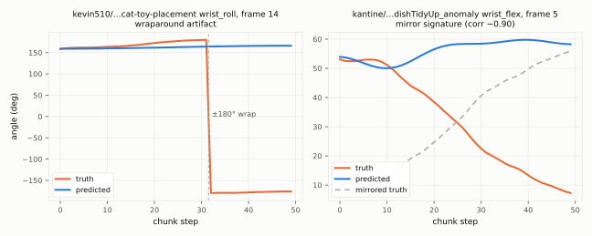

# Stage-1 sign-convention screen: 9 candidate (repo, dim) cells — and three distinct pathologies

*2026-08-05. CPU-side analysis, no GPU touched (ran beside the live
baseline re-score at load ~3/26 cores). Owner hypothesis
(2026-08-05 14:55Z Discord): some community datasets may encode joint
angles with flipped sign conventions, especially wrist roll on
mirrored wrist-cam mounts. This is stage 1 of the agreed two-stage
plan; stage 2 (optical-flow cross-check) is a separate
pre-registration, pending the owner's steer on scope.*

## Instrument

`probes/probe_sign_convention_stage1.py` (anchors asserted in-probe),
run over the laptop reference `--dump-predictions` artifact
`eval__bijou_arb_rcond_100k_ddp4__step_100000__panel_k4l2.npz` from
`~/previous-reports/` — bijou@100000 greedy predictions, frame-paired
with truth, on the frozen community panel (17,204 core frames,
878 repos, 6 action dims). Everything below is model-vs-truth
disagreement sliced per-repo per-dim; no dataset files were re-read.

**The screen:** for each repo with n ≥ 8 panel frames, compute each
dim's mean frame MAE as a ratio to the panel-median per-dim MAE, and
the motion-shape correlation between predicted and true chunks
(chunk-mean removed, valid-masked). A flipped-convention dim should be
a *large, isolated* MAE outlier with ~zero or negative shape
correlation while the repo's other dims stay normal — a merely-hard
repo is bad on most dims with positive correlation.

## Result: 9 candidates at (n ≥ 8, ratio > 3, corr < 0.1)

| repo | n | dim | MAE ratio | shape corr | other dims | wrap | flat | anti | med frame corr |
|---|---|---|---|---|---|---|---|---|---|
| kevin510/lerobot-cat-toy-placement | 16 | wrist_roll | **14.85** | −0.02 | 1.64 | 5 | 7 | 3 | +0.07 |
| lt-s/so100_train_move_two_blocks… | 8 | wrist_roll | 4.87 | −0.18 | 1.24 | 0 | 4 | 1 | +0.21 |
| Dongkkka/koch_arm_gripper_pick_red_pen | 12 | shoulder_pan | 4.59 | −0.13 | 2.02 | 0 | 0 | 2 | **+0.76** |
| kantine/domotic_groceriesSorting_expert | 8 | wrist_roll | 4.41 | −0.03 | 2.23 | 0 | 0 | 3 | +0.06 |
| ThomasGossard/grab_box_h2 | 8 | wrist_flex | 3.97 | −0.14 | 1.76 | 0 | 1 | 1 | +0.24 |
| kantine/domotic_dishTidyUp_anomaly | 8 | wrist_flex | 3.24 | −0.02 | 2.46 | 0 | 0 | **5** | **−0.75** |
| AntoineA/so100_green_cube_black_circle | 8 | wrist_roll | 3.23 | +0.04 | 2.17 | 0 | 1 | 3 | +0.22 |
| aractingi/push_cube_square_light_reward | 8 | shoulder_lift | 3.11 | −0.06 | 1.98 | 0 | 1 | 3 | −0.05 |
| sincostangerines/stack_cubes_p3 | 8 | gripper | 3.04 | +0.10 | 1.44 | 0 | 4 | 1 | +0.26 |

Columns after the bar are the per-frame classification (added after
looking at trajectories, below): wrap = frames whose *truth* spans
> 300° (a ±180° wraparound inside the chunk), flat = frames where the
model predicts a near-constant (< 10⁻³° std), anti = frames with
shape corr < −0.5, med frame corr = median per-frame correlation
where both signals actually move.

4 of 9 candidates are wrist_roll — the dim the owner's
mirrored-wrist-mount hypothesis names. On a null of "candidates land
on dims uniformly" that clustering is suggestive but not conclusive
at these counts.

## Qualitative block: the eyes changed the conclusion

The aggregate screen made kevin510's wrist_roll (14.9× median MAE)
look like the flagship flipped-sign case. It is not — **looking at
the trajectories split the 9 candidates into three different
pathologies**:

1. **±180° wraparound, not a sign flip** — kevin510's wrist_roll
   operates at the ±180° boundary; in 5 of its 16 panel frames the
   *truth* chunk wraps (left panel: truth jumps +180 → −180 at one
   step while the prediction stays smooth near +163). One wrap frame
   contributes ~340° of raw-degree MAE on half its chunk with zero
   convention error. This also means **training targets in raw
   degrees see the same 360° discontinuities** — a data/objective
   pathology worth flagging to mainline independent of the sign
   question (any repo whose wrist operates near ±180° is affected;
   how many do is a one-line follow-up on this same npz).
2. **A genuine mirror signature** — kantine/domotic_dishTidyUp_anomaly
   wrist_flex: no wraps, no flat predictions, and 5 of 8 frames
   anti-correlate below −0.5 (median −0.75; right panel: the model
   confidently predicts the *reflection* of the true motion). This is
   the cleanest stage-2 target in the set. kantine/groceriesSorting
   (same uploader family, median +0.06 with 3/8 anti) and aractingi's
   shoulder_lift (−0.05, 3/8 anti) are second-tier mirror candidates.
3. **Tracked but offset** — Dongkkka's shoulder_pan median frame corr
   is **+0.76**: the model reproduces the motion *shape* fine and is
   simply off in level. Whatever this is (state-conditioning or
   calibration offset), it is not a sign-convention error; it drops
   out of the stage-2 shortlist.

## Caveats (shipped with the claim)

- Per-repo panel samples are n = 8–16 frames; individual ratios are
  noisy. These are screening leads, not per-repo convictions.
- The screen sees model-vs-truth disagreement only. An
  internally-consistent mirror-world repo the model partially fit
  scores *normal* here — stage 1 structurally cannot catch it; only
  the stage-2 optical-flow probe can.
- The npz is the laptop's eval artifact (this box's re-score of the
  same checkpoint/panel was still running); the same-instrument check
  when it lands is expectation-free for this screen since both stem
  from the same deterministic greedy decode.

## Next

Stage 2 (optical-flow curl vs wrist-velocity sign, pre-registered
before running) targets the mirror-signature candidates first:
dishTidyUp_anomaly, groceriesSorting, aractingi. The wraparound
finding spawns its own cheap follow-up: count wrap-affected frames
panel-wide and estimate their MAE contribution — if material, propose
wrap-aware handling (e.g. unwrap or shortest-arc error) to mainline
as a transferable finding. Both queued in [ideas](../ideas.md);
awaiting the owner's reply on folding candidates into the stage-2
pre-reg draft.
