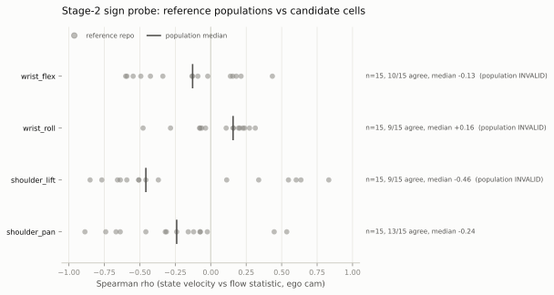

# Stage-2 sign probe: the escalation branch fired — 3 of 4 reference populations are not sign-consistent

*2026-08-05 ~23:5xZ. Execution of the
[stage-2 pre-registration](2026-08-05-prereg-sign-stage2.md), instrument
frozen before any probe code existed. CPU-only (~35 min on nice-19
workers beside the live box batch and draws chain). Probe:
`probes/probe_sign_convention_stage2.py`; full numbers in
`~/sign_stage2_results.json`. **No candidate cell was opened and no
mirror verdict ships** — this is the pre-registered
invalid-by-population branch, and per the pre-reg the population
diversity itself is the finding that escalates to the owner.*

## What happened, in one paragraph

The instrument requires, per target dim, a 15-repo so100 reference
population whose optical-flow-vs-joint-velocity sign agrees ≥ 80%
(≥ 12/15) with median |ρ| ≥ 0.2. Three of the four populations FAILED
that gate — wrist_roll 9/15 (median ρ +0.16), wrist_flex 10/15 (−0.13),
shoulder_lift 9/15 (−0.46 but only 60% agreement). Only shoulder_pan
passed (13/15, median −0.24). The synthetic-flip hard gate therefore
could only run on the t_x family, where it **passed cleanly** (original
NORMAL with bootstrap mass 1.000, doctored MIRRORED with mass 1.000, ρ
∓0.887 on 00ri/so100_battery) — so the mechanism *works* where the
population premise holds. With ω and t_y untestable, the pre-reg's hard
gate fails overall and all three candidate cells
(dishTidyUp_anomaly wrist_flex, groceriesSorting_expert wrist_roll,
aractingi shoulder_lift) stay closed. No verdicts, no repair-arm
eligibility, no falsification.

## Why the populations split: it's camera geometry, not (necessarily) joint conventions

The pre-reg said a failed population gate "would mean sign conventions
vary corpus-wide, a bigger finding than three repos." The diagnostic
cuts point at a sharper — and more repairable — mechanism:

- **The sign of an image-plane flow statistic depends on which camera
  you read it from.** On shoulder_lift, the two cameras of the same
  repo disagree in sign in **11/15** reference repos (ego ρ and
  other-cam ρ are near mirror images: e.g. AkibaGeek +0.83 ego vs
  −0.77 other). A wrist-mounted camera sees the world translate
  opposite to how a fixed front camera sees the arm move. The
  per-repo |ρ| values are *large* (up to 0.85) — the instrument has
  power — but the population pools over repos whose camera geometry
  differs, so the signs never converge.
- **The flow-based ego-cam rule is too weak to carry that
  conditioning.** It had NO-MARGIN (< 0.15) on roughly half the repos
  (8/15 on shoulder_lift), i.e. near-coin-flip camera picks exactly
  where the sign depends on the pick. Restricting to margin-confident
  repos improves agreement (wrist_roll 5/7, wrist_flex 6/8,
  shoulder_lift 5/8) but stays below the 80% gate.
- **ω (wrist_roll) is additionally underpowered:** only 2/15 reference
  repos reach |ρ| ≥ 0.3. Image-plane rotation about the frame center
  only tracks wrist roll when the reading camera looks along the roll
  axis — i.e. it is a wrist-cam statistic, and most ego picks were
  fixed cams.
- Where the geometry is homogeneous the instrument behaves:
  shoulder_pan's t_x (most so100 uploaders put a fixed cam facing the
  arm; pan sweeps horizontal flow) passed at 13/15, and its oracle hit
  mass 1.000 in both directions.

So the honest read is **not** "so100 joint sign conventions vary
corpus-wide"; it is "*image-space* sign references vary with camera
mounting, which is unlabeled and heterogeneous — the reference-population
premise as frozen was wrong for 3 of 4 dims." Stage 1's three mirror
candidates remain exactly what they were: unresolved screening leads.

## The way through (for a stage-2b amendment, before any new run)

The corpus already carries the missing conditioning variable:
`meta/camera_kinds.json` — the VLM camera-labeling pass (2026-08-02,
opus-5, per-cam wrist/front/side/top votes, mostly unanimous). A
stage-2b would re-pool reference populations per **(dim, camera
kind)** — t_y from front cams only, ω from wrist cams only, and the
ego-cam rule replaced (or gated) by the label — leaving every other
frozen constant unchanged. That removes the geometry confound the data
says is the blocker, at the cost of a smaller per-cell reference pool.
If the owner wants the candidate cells settled, that is the amendment
to pre-register; it reuses today's flow cache (the expensive decode is
done and keyed by repo).

## Pre-declared consequences, applied

- Candidate cells: **not opened** (hard gate failed) — per pre-reg,
  "no candidate verdicts, and the diversity escalates to the owner."
- Ideas #13 stays `screening`; the repair arm is **neither eligible nor
  dead** — stage 2 as frozen cannot adjudicate it.
- Controls: never read (cells phase never ran); the instrument-fault
  clause was not triggered — the failure is upstream, in the population
  premise.
- The stream-consistency reads (step 7) were deliberately not run on
  candidates: they accompany verdicts, and running them outside a
  verdict frame would be unregistered peeking.

## Instrument facts (for the record)

15-repo populations selected lexicographically from 374–442 eligible
so100 repos per dim (≥ 8 stage-1 panel frames, MAE ratio ≤ 2.0 on the
dim, ≥ 30 isolated pairs at 2.0× dominance — no repo needed the 1.5×
relax); 40–400 pairs per repo; Farneback at 320×240 with the frozen
params; episode-bootstrap 1000 draws, SeedSequence(13). Flow cache:
38 repos under `~/sign_stage2_cache/`. The oracle's doctored read is a
true end-to-end negation (pair selection invariant, verdict machinery
identical), not a sign flip of the summary statistic.
