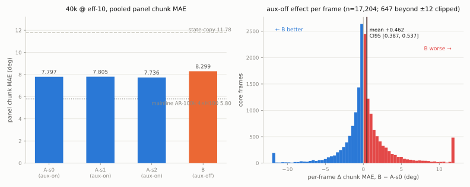

# Box-batch 40k results: the aux-off effect is REAL — aux supervision helps action prediction

*2026-08-06, ~04:2xZ. Results for the pre-registered 4×H100 box batch
([pre-reg](2026-08-05-prereg-box-batch-4xh100.md), which carried the
paired aux-off question of
[the earlier pre-reg](2026-08-05-prereg-paired-auxoff-40k.md) unchanged).
Analysis by the pre-built, oracle-gated instrument
`fontaine/scripts/box_batch_results.py`
(output
[`analysis__box_batch_40k_k4l2.json`](https://mcobzarenco-fontaine-reports.static.hf.space/analysis__box_batch_40k_k4l2.json),
seeded bootstrap,
deterministic). All four arms trained 40k steps at eff-10 on 1×H100-slice
topology, evaluated on the frozen k4l2 community panel (v1, as
registered), greedy AR — deterministic per checkpoint.*

## Headline

**The pre-registered decision rule fired on the REAL side: removing aux
supervision costs +0.462 panel chunk MAE** (paired per-frame B − A-s0,
95% bootstrap CI **[0.387, 0.537]**, n = 17,204 core frames) — **7.5×
the largest replicate-pair delta (0.061)** and leave-one-repo-out
coherent (worst single-repo exclusion still +0.435, same sign, above
threshold). The mainline expectation (E4: |A−B| within noise — "aux
shapes narration, not actions") is **falsified** at this scale and
topology: aux supervision shapes the action representation itself.

This answers charter agenda item #6 (aux attribution) with the paired
experiment the mainline still owed itself, and it lands the first rows
of the Fontaine training ledger.

| arm | panel chunk MAE | first_mae |
|---|---|---|
| A-s0 (control, aux-on) | 7.7966 | 3.9422 |
| A-s1 (seed replicate) | 7.8052 | 4.1118 |
| A-s2 (seed replicate) | 7.7355 | 3.9377 |
| **B (aux-off)** | **8.2989** | **3.5009** |
| state-copy (same frames) | 11.7848 | 2.6202 |
| mainline AR-100k (4×H100, eff-40, 100k) | 5.8026 | 2.1431 |

## The replicate instrument (E5): the panel is *tight* under seed change

The three control replicates span **7.7355–7.8052** — pooled pairwise
|Δ chunk_mae| of 0.0086 / 0.0611 / 0.0697, all within the ≤0.2 soft
expectation. **σ_seed(chunk) = 0.038, σ_seed(first) = 0.099.** This is
the batch's second deliverable: paired 40k comparisons at eff-10 resolve
effects down to ~0.07, an order of magnitude finer than feared. Two
consequences, both pre-registered formulas now finalized:

- **E4B adopt band = max(3σ_seed, 0.15) = 0.15** — the floor binds
  (3σ = 0.114). The E4B screen's finalization amendment can now freeze
  its number.
- The rig-benchmark design (#16) gets σ_seed for its slot-2 power
  calculation.

## Reading the effect honestly

The per-frame delta distribution is **symmetric in frequency,
asymmetric in magnitude**: B wins 49.0% of core frames and loses 49.4%
(1.6% exact ties), but its losses are bigger — mean +2.90 when worse
vs −1.94 when better, p99 +21.3 vs p01 −12.7. Aux-off does not fail
uniformly; it fails *bigger*.

And the batch's biggest twist survives pooling: **B's first_mae 3.5009
is BETTER than every aux-on replicate (3.94–4.11)** — while both sit
well above the state-copy floor 2.6202. Three independent diagnostics
point the same direction:

1. **Condition sensitivity** (report Q3, same AR code path across arms):
   A arms 1.86–2.00, **B 1.13** — the aux-off model responds ~40% less
   to the conditioning fields.
2. **Copy proximity**: B's predictions sit 8% closer to the state-copy
   prediction than A's (mean |pred − copy| 9.09 vs 9.87; first step
   3.93 vs 4.41).
3. On B's worst decile of frames, B stays far closer to copy than A
   (12.9 vs 16.3) — under-committing to motion exactly where motion is
   the answer.

The coherent story: **without aux supervision the model leans harder on
the proprioceptive shortcut** — which *helps* the first step (states
are continuous) and *hurts* the chunk (motion must be predicted, not
extrapolated). This is exactly the mechanism the literature slice named
([ReViP](https://arxiv.org/abs/2601.16667), causal-confusion line;
ideas #11), and it is *descriptive* until the pre-registered
[state-reliance probe](2026-08-06-prereg-state-reliance-probe.md)
(now fully unblocked — all four npzs banked) runs its masked reads.
The probe's primary D = Δ_first(B) − Δ_first(A-s0) is the
falsification instrument; nothing here front-runs its frozen numbers.

## Qualitative sample block

Eyes on the tails (per-frame reads from the npzs; the per-arm HTML
reports carry the rendered trajectories):

- `willnorris/bbox-2` (idx 25085, Δ +92): a 214°-motion chunk. Both
  arms miss; A commits to (wrong) motion, B half-freezes near copy
  (|B−copy| 120 vs |A−copy| 204) — the freeze failure mode.
- `bjb7/so101_pen_touch_test_1` (idx 9979, Δ +56): a near-static frame
  (truth motion 1.4°). A tracks it at 2.0 MAE; **B hallucinates a 58°
  excursion** — the tail is not only freezes; B also invents motion on
  static frames.
- Worst repos are shared (`sixpigs1/so100_pull_cube_by_tool_error`,
  `Dongkkka/vla_total_dataset_test4`, `shylee/so100_cup` on both arms)
  — the effect is a broad shift, not a single pathological corpus,
  consistent with the leave-one-repo-out read.

## Caveats, shipped with the claim

- **Topology**: eff-10, 40k, 1×H100-slice arms. A-s0 is now the
  own-topology baseline the charter required; the gap to mainline
  AR-100k (7.80 vs 5.80) confounds steps×batch×samples and stays
  "directional only". The *paired* aux-off read is clean — that is
  what the batch was designed for.
- **Panel version**: v1, as registered. The
  [panel-v2 amendment](2026-08-06-panel-v2-amendment.md) is still
  awaiting owner steer; per its proposed transition rule this read
  finishes on v1. The dup-census leak
  ([results](2026-08-06-dup-census-results.md)) does not touch paired
  within-corpus deltas — both arms share the train corpus and the
  leaked frames.
- first_mae for ALL arms (3.50–4.11) sits far above the copy floor
  2.62 — at 40k/eff-10 grounding is weak, period; the B-vs-A first_mae
  inversion is a relative signal inside that regime.
- 647/17,204 frames exceed ±12 on the delta axis (clipped in the
  figure, included in every statistic).

## What changes

1. **Aux stays ON** in every future recipe on this topology (E4B keeps
   aux; any aux-off arm needs a new pre-reg citing this result).
2. **σ_seed = 0.038** finalizes the E4B adopt band at the 0.15 floor →
   the E4B finalization amendment is next in queue.
3. The state-reliance probe (4 masked runs, ~1.7 GPU-h) runs in the
   first quiet GPU window — the box is now idle, so that window is
   open.
4. Ledger rows added (first Fontaine training results); ideas #6
   (aux attribution) → **confirmed: aux supervision helps actions**.
