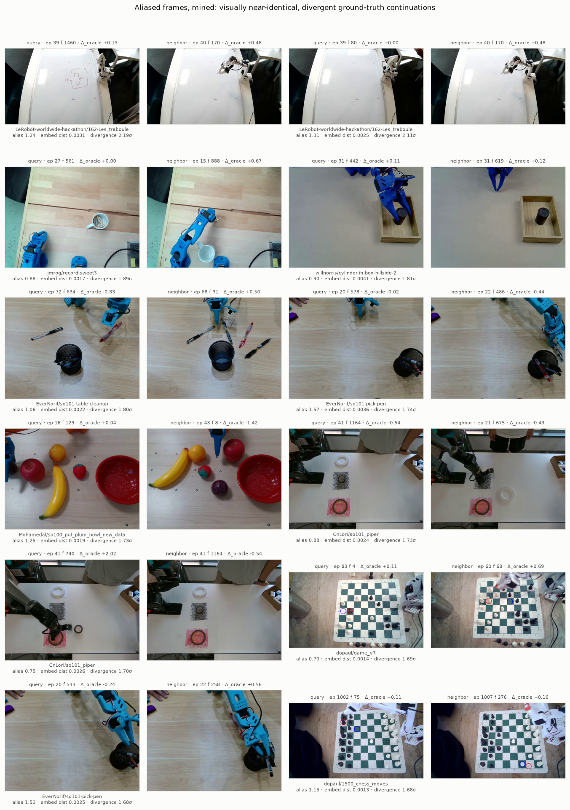

# Aliased frames, mined — and the subgoal gain doesn't live there

*2026-08-08. The frame-mining stage of the owner-steered
field/subgoal-conditioning meta-report (13:21Z steering), executed
early in a GPU-quiet window. Instrument:
`fontaine/scripts/frame_mining.py` (embed → mine → sheet); protocol
from the [observation-aliasing lit slice](../papers/observation-aliasing.md)
(AliasBench's diagnostic run in reverse, 2605.14712). Record-only read
on banked panel data; decision frame pinned in the script header
before execution. Artifacts:
`reports/analysis__framemining_ar100k_k4l2.json` + flagged-frame npz +
embeddings npz.*

## What ran

The owner asked the upcoming meta-report to showcase frames where the
right action is ambiguous from the image alone ("am I at the beginning
of the episode or the end?"). Instead of hand-picking anecdotes, we
mined them: every one of the 17,204 core panel frames embedded with
the **frozen Gemma-4 E2B vision tower — AR-100k's own eye** (that run
trained text-lr only, so this is literally the perception of the
policy being scored; alignment oracle verified every row against the
banked npz, actions included). Then within-dataset top-5 nearest
neighbors (same-episode frames within the 50-step chunk horizon
excluded — overlapping chunks share their continuation by
construction), and an **alias score** per frame: mean
std-normalized ground-truth chunk divergence to its closest visual
neighbors. High score = "frames that look like this one do different
things next."

The top of the list is exactly the owner's ask, found automatically:
the cylinder mid-place vs already-placed (near-identical images, one
frame must keep lowering, the other must retreat), the mug pre- vs
post-grasp, mirrored pick-pen approaches, and chess boards — where the
next move is genuinely unreadable from a wide shot of the position.

## The instrument detects something real

DSSP's Prop 4.2 (same lit slice) predicts a reactive policy carries an
*irreducible* error floor on aliased frames. It shows up: alias score
correlates with AR-100k's per-frame error at **Spearman ρ = 0.41**,
and the flagged decile runs **+29% baseline chunk MAE** (6.84 vs 5.32).
Caveat, carried in the analysis json: state-copy error is elevated on
the same frames (14.4 vs 11.0), so the score partly conflates
"ambiguous" with "dynamic/hard" — the contact sheet is the qualitative
check that genuine aliasing sits at the top.

## The concentration read: a clean null

The meta-report's central question, pinned before the run: does the
per-frame oracle-subgoal gain (Δ_oracle, conditioned − baseline,
banked rung-(a) arms) **concentrate** on the aliased frames?
IntentVLA's 9% → 45.8% says intent conditioning earns its keep on
aliased states specifically; if our subgoal slot is a disambiguator,
the −0.29 pooled gain should pile up where the image underdetermines
the action.

It does not. Flagged − rest = **−0.003** [CI95 −0.205, +0.176,
dataset-clustered], Spearman ρ = **−0.01** over 14,064 qualifying
frames (427 datasets; 3,140 frames in sub-16-row pools dropped,
counted, not silent). The oracle-subgoal gain is **uniform across the
aliasing spectrum** — with one real exception at the bottom: the least
aliased decile (frames whose visual neighbors all agree on the
continuation) gets almost nothing (−0.04). That dip is a post-hoc
observation, not the pinned read — but it is the shape you'd expect if
the subgoal only matters once *some* uncertainty exists, and then adds
a constant amount regardless of how much.

Under the pinned decision frame: **the subgoal channel is not
(primarily) a disambiguator of aliased observations** on this corpus —
it behaves like a uniform prior/guidance signal (style, phase, task
framing) that helps everywhere except where the image already fully
determines the action. That reframes the meta-report's story: the
−0.29 oracle headroom is not hiding in the ambiguous frames; fixing
subgoal *generation* (the rung-(a) bottleneck) buys a broad, flat
gain, and closing the aliasing-specific error (the +29% floor) would
need conditioning the policy could not get from a better subgoal —
i.e. history/memory, which is exactly the #11 census's entry
condition.

The census view: aliasing is a continuum here, not a bimodal split —
the top decile (score ≥ 0.62σ) is a long tail, not a cluster. The
"what fraction of our corpus is aliased" number the history-arm
decision wants should therefore be read off this distribution with an
external anchor (AliasBench's <3e-3 embedding-gap criterion lands in
our top ~2%), not a threshold we pick ourselves.

## Where it fed

- **`fieldcond-subgoal-meta-report`**: mining stage DONE — flagged
  frames + contact sheet + the concentration null are banked inputs;
  the report composes them with the fields-panel numbers after the
  60k close.
- **[#6 aux attribution](../ideas/06-aux-attribution.md)**: the
  external-validation read landed — the subgoal slot's gain is flat
  across aliasing, so escalations should sell generation quality, not
  disambiguation.
- **[#11 visual grounding](../ideas/11-visual-grounding.md)**: the
  aliasing census exists now; the +29% irreducible-floor read on
  flagged frames is the quantified prize a history/memory arm would
  be chasing.
