# Aliased frames, mined — and the subgoal gain doesn't live there

*2026-08-08. The frame-mining stage of the owner-steered
field/subgoal-conditioning meta-report (13:21Z steering), executed
early in a GPU-quiet window. Instrument:
`fontaine/scripts/frame_mining.py` (embed → mine → sheet); protocol
from the [observation-aliasing lit slice](../papers/observation-aliasing.md)
(AliasBench's diagnostic run in reverse, 2605.14712). Record-only read
on banked panel data; decision frame pinned in the script header
before execution. Artifacts:
`reports/analysis__framemining_ar100k_k4l2.json` + flagged-frame npz +
embeddings npz.*

## What ran

The owner asked the upcoming meta-report to showcase frames where the
right action is ambiguous from the image alone ("am I at the beginning
of the episode or the end?"). Instead of hand-picking anecdotes, we
mined them: every one of the 17,204 core panel frames embedded with
the **frozen Gemma-4 E2B vision tower — AR-100k's own eye** (that run
trained text-lr only, so this is literally the perception of the
policy being scored; alignment oracle verified every row against the
banked npz, actions included). Then within-dataset top-5 nearest
neighbors (same-episode frames within the 50-step chunk horizon
excluded — overlapping chunks share their continuation by
construction), and an **alias score** per frame: mean
std-normalized ground-truth chunk divergence to its closest visual
neighbors. High score = "frames that look like this one do different
things next."

One figure per mined pair (per the owner's spec, 2026-08-08
16:20Z): the two near-identical frames side by side, then both
ground-truth action-chunk continuations overlaid — blue follows the
query frame, orange the neighbor — with each frame's **subgoal
label** in the caption. The subgoal is the text the oracle arm
conditions on: on most pairs it names exactly the phase distinction
the image alone can't carry.

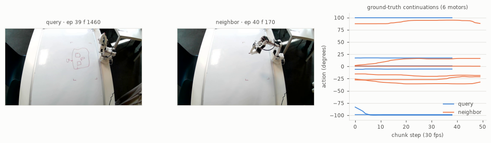

*Pair 1 — `LeRobot-worldwide-hackathon/162-Les_traboules-record_draw_lerobot` · alias score 1.24 · embed dist 0.0031 · continuation divergence 2.19σ. **Query** (blue): ep 39 f 1460, Δ_oracle +0.13, subgoal “lift the pen away and hand it off”. **Neighbor** (orange): ep 40 f 170, Δ_oracle +0.48, subgoal “trace the outer head outline”.*

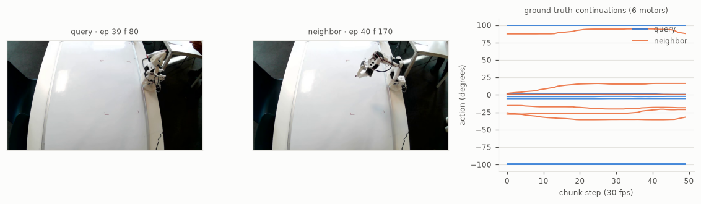

*Pair 2 — `LeRobot-worldwide-hackathon/162-Les_traboules-record_draw_lerobot` · alias score 1.31 · embed dist 0.0025 · continuation divergence 2.11σ. **Query** (blue): ep 39 f 80, Δ_oracle +0.00, subgoal “lower the pen onto the whiteboard surface”. **Neighbor** (orange): ep 40 f 170, Δ_oracle +0.48, subgoal “trace the outer head outline”.*

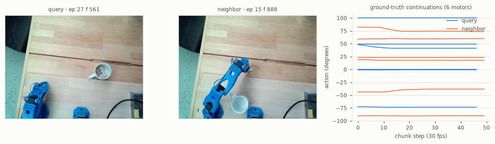

*Pair 3 — `jmrog/record-sweet3` · alias score 0.88 · embed dist 0.0017 · continuation divergence 1.89σ. **Query** (blue): ep 27 f 561, Δ_oracle +0.00, subgoal “retract the arm back to rest”. **Neighbor** (orange): ep 15 f 888, Δ_oracle +0.67, subgoal “align the gripper over the sweet”.*

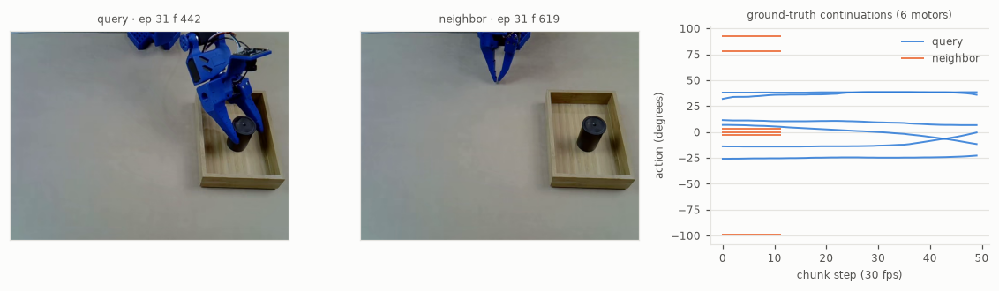

*Pair 4 — `willnorris/cylinder-in-box-hillside-2` · alias score 0.90 · embed dist 0.0041 · continuation divergence 1.81σ. **Query** (blue): ep 31 f 442, Δ_oracle +0.11, subgoal “lower the cylinder into the box”. **Neighbor** (orange): ep 31 f 619, Δ_oracle +0.12, subgoal “retract the arm to the rest pose”.*

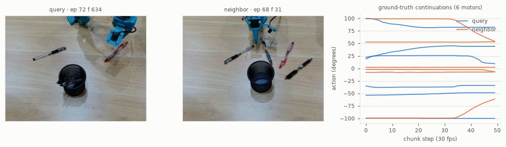

*Pair 5 — `EverNorif/so101-table-cleanup` · alias score 1.06 · embed dist 0.0022 · continuation divergence 1.80σ. **Query** (blue): ep 72 f 634, Δ_oracle -0.33, subgoal “grasp the red pen and place it into the holder”. **Neighbor** (orange): ep 68 f 31, Δ_oracle +0.50, subgoal “pick up the first black pen and drop it in the holder”.*

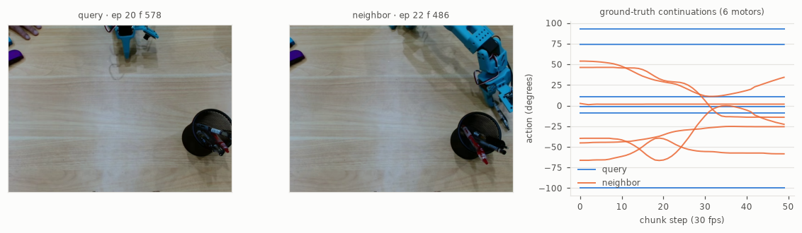

*Pair 6 — `EverNorif/so101-pick-pen` · alias score 1.57 · embed dist 0.0036 · continuation divergence 1.74σ. **Query** (blue): ep 20 f 578, Δ_oracle -0.02, subgoal “retract the arm away from the holder”. **Neighbor** (orange): ep 22 f 486, Δ_oracle -0.44, subgoal “pick up the last 0.5 mechanical pencil and drop it in the holder”.*

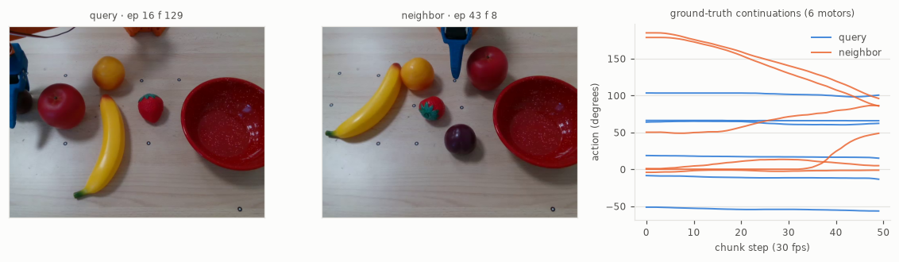

*Pair 7 — `Mohamedal/so100_put_plum_bowl_new_data` · alias score 1.25 · embed dist 0.0019 · continuation divergence 1.73σ. **Query** (blue): ep 16 f 129, Δ_oracle +0.04, subgoal “lower the gripper onto the plum and close on it”. **Neighbor** (orange): ep 43 f 8, Δ_oracle -1.42, subgoal “reach down toward the plum on the table”.*

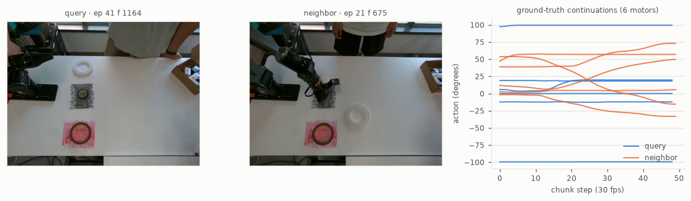

*Pair 8 — `CnLori/so101_piper` · alias score 0.88 · embed dist 0.0024 · continuation divergence 1.73σ. **Query** (blue): ep 41 f 1164, Δ_oracle -0.54, subgoal “release and retract the arm”. **Neighbor** (orange): ep 21 f 675, Δ_oracle -0.43, subgoal “pick the black tape and set it on the gray square”.*

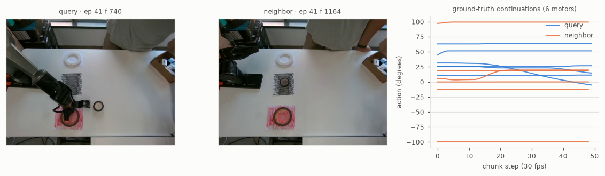

*Pair 9 — `CnLori/so101_piper` · alias score 0.75 · embed dist 0.0026 · continuation divergence 1.70σ. **Query** (blue): ep 41 f 740, Δ_oracle +2.02, subgoal “pick the black tape roll and place it on the gray square”. **Neighbor** (orange): ep 41 f 1164, Δ_oracle -0.54, subgoal “release and retract the arm”.*

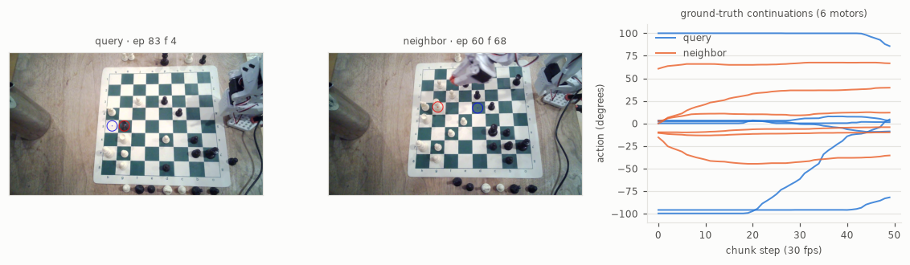

*Pair 10 — `dopaul/game_v7` · alias score 0.70 · embed dist 0.0014 · continuation divergence 1.69σ. **Query** (blue): ep 83 f 4, Δ_oracle +0.11, subgoal “lower the arm toward the piece on the red-marked square”. **Neighbor** (orange): ep 60 f 68, Δ_oracle +0.69, subgoal “reach over the board toward the red-marked square”.*

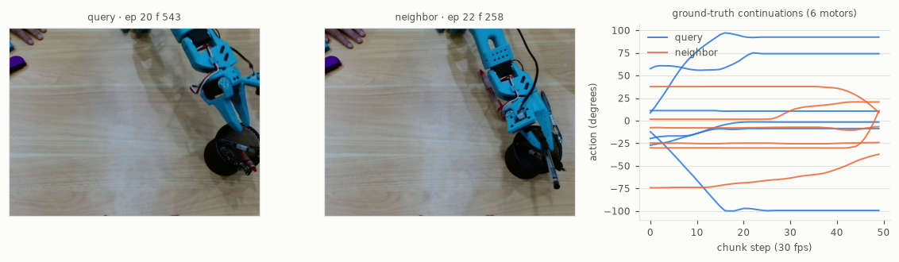

*Pair 11 — `EverNorif/so101-pick-pen` · alias score 1.52 · embed dist 0.0025 · continuation divergence 1.68σ. **Query** (blue): ep 20 f 543, Δ_oracle -0.24, subgoal “pick the last pen and place it in the holder”. **Neighbor** (orange): ep 22 f 258, Δ_oracle +0.56, subgoal “pick up the clear-barrel pen and place it in the holder”.*

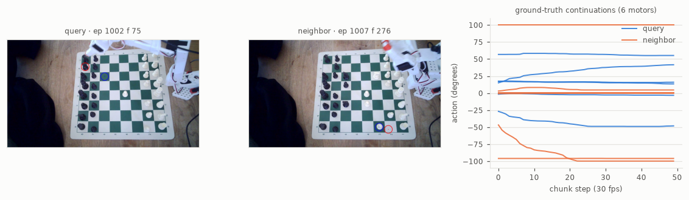

*Pair 12 — `dopaul/1500_chess_moves` · alias score 1.15 · embed dist 0.0013 · continuation divergence 1.68σ. **Query** (blue): ep 1002 f 75, Δ_oracle +0.11, subgoal “swing the arm over the board toward the red-marked square”. **Neighbor** (orange): ep 1007 f 276, Δ_oracle +0.16, subgoal “release the piece on the blue square”.*

The top of the list is exactly the owner's ask, found automatically:
the cylinder mid-place vs already-placed (near-identical images, one
frame must keep lowering, the other must retreat), the mug pre- vs
post-grasp, mirrored pick-pen approaches, and chess boards — where the
next move is genuinely unreadable from a wide shot of the position.

## The instrument detects something real

DSSP's Prop 4.2 (same lit slice) predicts a reactive policy carries an
*irreducible* error floor on aliased frames. It shows up: alias score
correlates with AR-100k's per-frame error at **Spearman ρ = 0.41**,
and the flagged decile runs **+29% baseline chunk MAE** (6.84 vs 5.32).
Caveat, carried in the analysis json: state-copy error is elevated on
the same frames (14.4 vs 11.0), so the score partly conflates
"ambiguous" with "dynamic/hard" — the per-pair figures above are the
qualitative check that genuine aliasing sits at the top.

## The concentration read: a clean null

The meta-report's central question, pinned before the run: does the
per-frame oracle-subgoal gain (Δ_oracle, conditioned − baseline,
banked rung-(a) arms) **concentrate** on the aliased frames?
IntentVLA's 9% → 45.8% says intent conditioning earns its keep on
aliased states specifically; if our subgoal slot is a disambiguator,
the −0.29 pooled gain should pile up where the image underdetermines
the action.

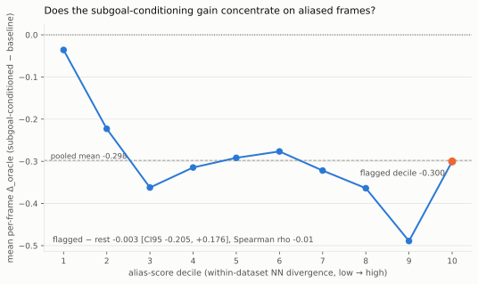

It does not. Flagged − rest = **−0.003** [CI95 −0.205, +0.176,
dataset-clustered], Spearman ρ = **−0.01** over 14,064 qualifying
frames (427 datasets; 3,140 frames in sub-16-row pools dropped,
counted, not silent). The oracle-subgoal gain is **uniform across the
aliasing spectrum** — with one real exception at the bottom: the least
aliased decile (frames whose visual neighbors all agree on the
continuation) gets almost nothing (−0.04). That dip is a post-hoc
observation, not the pinned read — but it is the shape you'd expect if
the subgoal only matters once *some* uncertainty exists, and then adds
a constant amount regardless of how much.

Under the pinned decision frame: **the subgoal channel is not
(primarily) a disambiguator of aliased observations** on this corpus —
it behaves like a uniform prior/guidance signal (style, phase, task
framing) that helps everywhere except where the image already fully
determines the action. That reframes the meta-report's story: the
−0.29 oracle headroom is not hiding in the ambiguous frames; fixing
subgoal *generation* (the rung-(a) bottleneck) buys a broad, flat
gain, and closing the aliasing-specific error (the +29% floor) would
need conditioning the policy could not get from a better subgoal —
i.e. history/memory, which is exactly the #11 census's entry
condition.

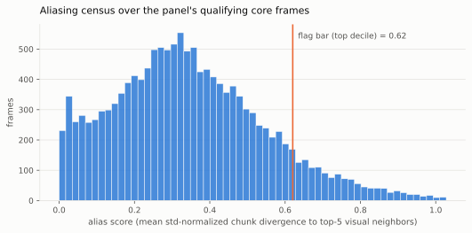

The census view: aliasing is a continuum here, not a bimodal split —
the top decile (score ≥ 0.62σ) is a long tail, not a cluster. The
"what fraction of our corpus is aliased" number the history-arm
decision wants should therefore be read off this distribution with an
external anchor (AliasBench's <3e-3 embedding-gap criterion lands in
our top ~2%), not a threshold we pick ourselves.

## Where it fed

- **`fieldcond-subgoal-meta-report`**: mining stage DONE — flagged
  frames + the per-pair figures (owner-spec form, 16:20Z steering) +
  the concentration null are banked inputs; the report composes them
  with the fields-panel numbers after the 60k close.
- **[#6 aux attribution](../ideas/06-aux-attribution.md)**: the
  external-validation read landed — the subgoal slot's gain is flat
  across aliasing, so escalations should sell generation quality, not
  disambiguation.
- **[#11 visual grounding](../ideas/11-visual-grounding.md)**: the
  aliasing census exists now; the +29% irreducible-floor read on
  flagged frames is the quantified prize a history/memory arm would
  be chasing.
