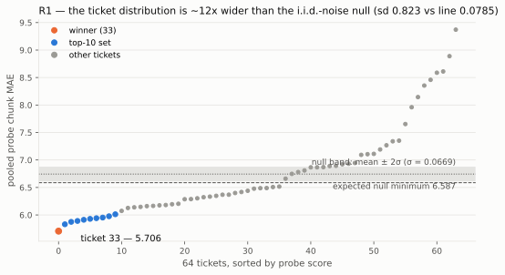
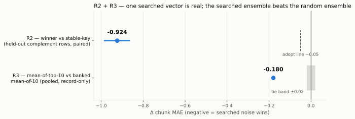
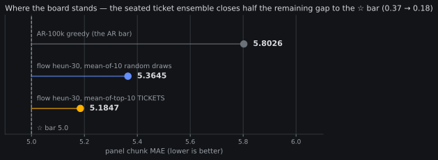
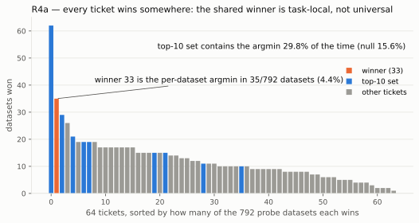
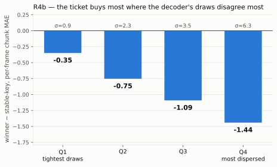
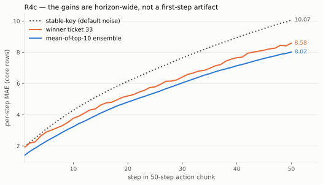
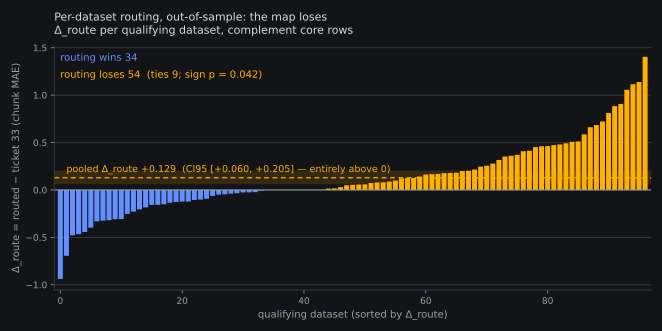

# Golden tickets, the whole story — a visual report (#1)

*2026-08-08. Owner-requested consolidation (steering 08:42Z): the
golden-ticket thread ran across a
[pre-registration](2026-08-07-prereg-golden-ticket-screen.md), a
[results post](2026-08-08-goldenticket-results.md), three frozen
stage analyses, and a
[selector side-read](../papers/noise-space-steering-3.md) — this page
subsumes them into one chart-led report. Every number is read from
the banked stage JSONs
(`analysis__goldenticket_stage{1,2,3}.json`,
`analysis__noise_ladder_seating.json`); charts are rendered by
`fontaine/scripts/goldenticket_report_charts.py` from those files
and nothing is re-computed.*

*Refreshed 2026-08-08 ~23:4xZ, the night the ladder's second rung
closed end-to-end: R3 is upgraded from record-only to **CONFIRMED and
seated on the leaderboard** (paired re-run, CI entirely below zero),
rung 2's out-of-sample falsification of per-dataset routing is folded
in, and the chart set is restyled to the dark eval-report theme.*

## The idea in one paragraph

A flow-matching policy turns a noise vector into an action chunk
through a deterministic ODE. The *Golden Ticket* observation
(banked on the [noise-steering pages](../papers/noise-space-steering.md))
is that some noise vectors are systematically better than others —
not per-sample luck, but a reusable property of the vector. The
screen asked, with every read pre-registered: draw **64 i.i.d.
"tickets"** (sha-pinned noise vectors), score them once on a probe,
and check whether the winners are (R1) wider-spread than chance,
(R2) real on held-out rows, (R3) still better inside the ensembling
regime, and (R4) *where* the advantage lives. Total cost ~5.55 GPU-h,
zero training.

## Headline numbers

| read | question | number | verdict |
|---|---|---|---|
| R1 | is the ticket spread real? | sd **0.823** vs null line 0.0785 | **CONFIRM** (~12× the null) |
| R2 | does the winner hold on held-out rows? | **−0.924** [CI95 −0.985, −0.866] vs adopt line −0.05 | **REAL** |
| R3, seated | searched ensemble vs random ensemble, paired re-run? | **−0.174** [CI95 −0.196, −0.152] | **CONFIRMED — board row 5.1847/1.3831** |
| R4a | is the winner universal? | argmin in **4.4%** of 792 datasets | task-local |
| R4b | where does it buy? | quartile gains **−0.35 → −1.44** | monotone in dispersion |
| rung 2 | does per-dataset routing beat the global ticket out-of-sample? | Δ_route **+0.129** [CI95 +0.060, +0.205] | **FALSIFIED** |

## R1 — the spread is ~12× the i.i.d. null

If tickets were interchangeable, 64 probe scores would scatter with
σ ≈ 0.067 (the frozen null, computed from banked per-draw variance
before any data). Measured: **sd 0.823**, minimum 5.706 vs an
expected-null-minimum of 6.587. The distribution isn't a noisy
constant — it has a long bad tail and a usable good tail.

## R2 + R3 — real on held-out rows, and the searched ensemble is seated

R2 is the confirmatory read the screen lived or died on: the winner
ticket, judged only on **complement rows it was never selected on**,
paired per-frame against the banked stable-key default. It landed
**−0.924**, eighteen times past the adopt floor.

R3 asked whether search survives *ensembling* — mean-of-top-10-tickets
vs mean-of-10-random-draws. The screen's first pass could only score
it record-only (the banked comparator retained no per-frame npz), so
the [rung-2 pre-reg](2026-08-08-prereg-noise-ladder-perdataset.md)
folded in a paired re-run: both ensembles decoded fresh on the full
panel, same frames, same noise discipline. That read landed
2026-08-08 ~23:1xZ: **paired Δ = −0.17358 [CI95 −0.19556, −0.15214]**
on 17,204 core frames, entirely below zero (the dataset-clustered CI
[−0.202, −0.148] agrees; first-step mirror −0.041 [−0.047, −0.034]).
**R3 is confirmed, and the leaderboard row moved.** (The read
survived its own integrity gate the hard way — a base-equality abort
that turned out to be kernel-order drift from the batched-ensembling
merge, adjudicated at the npz level before any tolerance moved; the
[results post's seating section](2026-08-08-noiseladder-rung2-results.md)
has the full detour.)

## The board, after seating

The seated row — **chunk 5.1847, first-step 1.3831** — is the best
chunk *and* the best first-step number measured on this panel by any
config, and it costs nothing at train time: the tickets are ten
sha-pinned noise vectors, found for ~5.5 GPU-h of one-off search.
The gap to the ☆ bar (≤ 5.0) shrinks from 0.37 (random-10 family
decode) to **0.18**.

## R4a — every ticket wins somewhere

The free stage-1 read that reframed the whole thread: per-dataset,
the global winner is argmin in only **35/792 datasets (4.4%)** — and
it isn't even the most task-general ticket (a blue top-10 ticket
wins 62). The top-10 set contains the per-dataset argmin **29.8%**
of the time, ~2× the 15.6% null. The published analog
([2603.11642](https://arxiv.org/abs/2603.11642)): noise main effect
1.4%, context×noise **interaction 39.4%**, best shared noise optimal
in 3.1% of contexts. Loud caveat, banked in advance: the median
dataset has **2 probe frames** — these per-dataset winners are
hypotheses for the next rung, not results.

## R4b — the ticket buys most where the decoder is least sure

Split the panel by draw dispersion (how much the 10 ticket decodes
disagree per frame): the winner's gain is monotone across quartiles,
−0.35 on the tightest frames to −1.44 on the most dispersed. The
ticket is not shaving uniform noise — it wins where the decoder's
noise-response is largest, which is exactly where any per-dataset or
per-frame escalation has the most room.

## R4c — horizon-wide, not a first-step artifact

Per-step MAE across the 50-step chunk, all three configs: the
ordering stable-key → winner → ensemble holds at every step, and the
gap *grows* with horizon.

## The side-read that failed (and why that's useful)

SDN's smoothness selector ("pick the least jerky draw",
[2606.14084](../papers/noise-space-steering-3.md)) was placed on the
banked ticket-64 stack at table cost: **null** (agreement 1.5% vs
1.6% chance). Heun-30 ODE draws are uniformly smooth — the criterion
has nothing to grip on this family. The family decode
(mean-of-draws) stands.

## Rung 2 — per-dataset routing, falsified out-of-sample

R4a's "every ticket wins somewhere" begged the escalation: route each
dataset to its own probe-picked ticket. The
[rung-2 pre-reg](2026-08-08-prereg-noise-ladder-perdataset.md) ran it
honestly — a CPU reliability floor picked the 97 dataset cells that
were even decidable, then one confirm eval on held-out complement
rows. The answer was decisive, on the wrong side of zero: **Δ_route
+0.129 [CI95 +0.060, +0.205]** — routing is significantly *worse*
than the global ticket (34W/54L, sign p = 0.042). The in-sample
−0.60 probe delta inverted out-of-sample: with a median of ~6–20
probe frames per cell, the per-dataset argmin memorizes its cell —
exactly the R4a caveat cashing out. The golden-ticket effect itself
stayed intact (routed still beats stable-key by −0.756); it's the
*per-dataset selection* that doesn't transfer. Full readout:
[rung-2 results](2026-08-08-noiseladder-rung2-results.md).

## Where the ladder stands

Rung 2 is closed end-to-end, with one confirmation and one
falsification — which is what a ladder is for:

- **Adopted**: the seated top-10 ticket ensemble is the flow board
  row (5.1847/1.3831). One global ticket set, no routing.
- **Falsified**: per-dataset ticket routing. The probe stack can rank
  tickets globally; it cannot pick per-dataset winners at 6–20 frames
  per cell.
- **Named next candidates** (each needs its own pre-reg):
  *dispersion-gated draw allocation* — R4b's monotone gain-vs-
  dispersion curve is exactly the premise of
  [ELASTIC](../papers/elastic-adaptive-compute.md), and the read is
  free on banked dumps; and a *chunk-position* noise policy — rung 2's
  record-only lead that routing wins early chunk steps (~1–8) and
  loses late ones (~15+).
- Named unknown inherited by every ticket config: the panel cannot
  see chunk-boundary artifacts — a rollout-gated read (#16) stands
  between any ticket and a rig.
