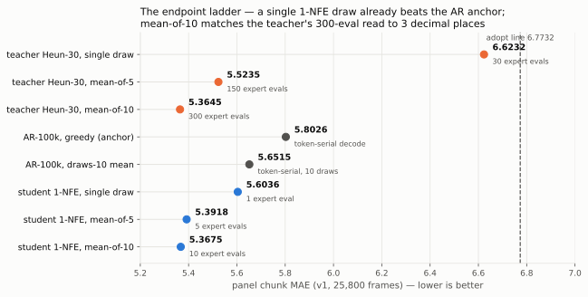
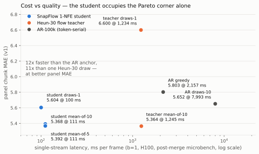
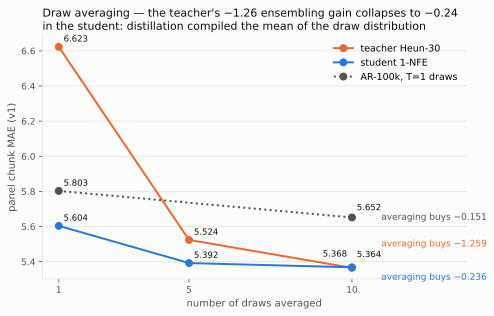
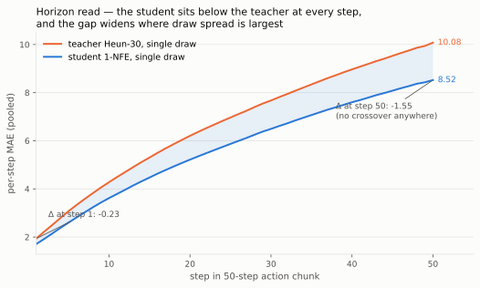
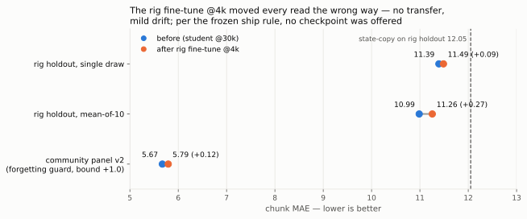

# SnapFlow, the whole story — a visual report (#12)

*2026-08-08. Owner-requested consolidation (steering 09:22Z): the
SnapFlow thread ran across a
[distillation pre-registration](2026-08-06-prereg-snapflow-distill.md),
a [σ_draw finalization amendment](2026-08-06-sigma-draw-finalization.md),
a [results post](2026-08-06-snapflow-results.md), a
[rig fine-tune pre-reg](2026-08-06-prereg-snapflow-ftrig.md) with its
[diagnosis post](2026-08-06-ftrig-diagnosis.md), and the
[decode micro-benchmark](2026-08-07-prereg-leaderboard-decode-microbench.md)
— this page subsumes them into one chart-led report. Every number is
read from the banked jsons
(`analysis__snapflow_distill_30k_k4l2.json`, the
`analysis__leaderboard_decode_microbench*.json` set, the AR draws
readout, and the ftrig eval jsons); charts are rendered by
`fontaine/scripts/snapflow_report_charts.py` from those files and
nothing is re-computed.*

## The idea in one paragraph

Our best flow policy turns a noise vector into a 50-step action chunk
by integrating an ODE — 30 expert evaluations (Heun, 15 steps × 2)
per chunk, and its best panel score needs a *mean of 10 draws*: 300
expert evals per prediction. SnapFlow (#12) asks the shortcut-model
question: can the same network learn to jump the whole trajectory in
**one** evaluation? We self-distilled the teacher into a 1-NFE
student — same trunk (frozen), the flow head extended with a
target-time input φ_s initialized so that step 0 is *bit-exact* the
teacher — for 30k steps, ~4.5 h on one H100. Zero new data, zero
trunk training. The pre-registered question was whether one draw
could hold parity with the teacher's 30-eval draw; the answer came
back stronger on every read.

## Headline numbers

| read | question | number | verdict |
|---|---|---|---|
| primary | 1-NFE single draw vs adopt line 6.7732 | **5.6036** | **PARITY-ADOPT**, beats the teacher's own single draw by 1.02 |
| deployment | mean-of-10 @1-NFE vs AR anchor 5.8026 | **5.3675** | **FIRES** — matches the teacher's 300-eval read (5.3645) to 3 dp |
| grounding | first-step MAE vs edge line 1.9831 | **1.7039** | survives, improves on the teacher's 1.9331 |
| cost | single-stream latency vs AR greedy | **100 ms vs 2,157 ms** | ~12× faster at better panel MAE |
| rig fine-tune | 4k-step rig adaptation | all reads worse | **no ship** (frozen rule) — the rig gap is not a few gradient steps |

## The endpoint ladder — one eval beats the anchor

The pre-reg's modal outcome was "parity or slightly better" against
the adopt line. Measured: a **single 1-NFE draw scores 5.6036** —
already below the AR-100k greedy anchor (5.8026), below the AR
family's own 10-draw ensemble (5.6515), and 15% below the teacher's
single draw it was distilled from. Averaging 10 student draws lands
**5.3675**, a statistical tie with the teacher's mean-of-10 (5.3645,
Δ 0.003 ≈ 1σ_draw) at **30× fewer expert evals**. Ranks 1–4 of the
[leaderboard](../leaderboard.md) are this lineage.

## Cost vs quality — the Pareto corner is empty except for the student

The [micro-benchmark](2026-08-07-prereg-leaderboard-decode-microbench.md)
measured every leaderboard row on the same harness, decode flags
byte-matched to the banked panel stems (single-stream b=1, the
deployment-facing read; post-merge tree, where mean-of-N noise draws
batch into one forward). The student's 10 draws cost **11% extra
latency** over its single draw (100 → 111 ms); the AR family pays
serially either way (2.2 s greedy, 8.0 s for draws-10). Nothing else
on the board is within an order of magnitude of the student at equal
or better MAE.

## What distillation did to the draws — it compiled the mean

The teacher's ensembling gain is −1.258 (6.623 single → 5.365
mean-of-10). The student's is −0.236 — same fractional shape (~90% of
the gain banked by draw 5) at **one-fifth the amplitude**, because
each single student draw already sits near the mean of the teacher's
draw distribution. This is the fairness-probe finding operating in
reverse: chunk-MAE rewards mode non-commitment, the 1-NFE endpoint
approximates the posterior mean, so the distillation banked most of
the ensembling gain *into every draw*. The AR family's curve
(−0.145, [readout](https://mcobzarenco-fontaine-blog.static.hf.space/reports/analysis__draws10_t1_ar100k_k4l2.json))
shows the same mean-collapse from the other side: greedy AR decode
already sits near its predictive mean, so draws buy little there too.
Mean-of-draws is a flow-teacher superpower, and the student
internalized it.

The flip side, stated plainly: the student is **not** a sampler.
Anyone needing mode diversity — best-of-N search, multimodal
planning, the [golden-ticket](2026-08-08-goldenticket-visual-report.md)
selection machinery — stays on the Heun teacher, whose best-of-10
probe bound (3.8597) has no student counterpart.

## The horizon read — compression is largest where spread is largest

The pre-registered worry was that a 1-NFE jump would degrade faster
along the 50-step chunk than the 30-eval integration. The opposite:
the student sits below the teacher at **every** horizon step
(`crossover_step: null`), and the per-step delta *widens* from −0.23
at step 1 to −1.55 at step 50. Late-horizon steps carry the most draw
spread, and a mean-valued prediction profits most exactly there — the
same mechanism as the draws collapse, visible along the time axis.

## The branch that failed: rig fine-tuning at 4k steps

The owner-steered follow-up asked whether a short fine-tune on rig
data (51 episodes) could close the student's rig-transfer gap. The
[pre-reg](2026-08-06-prereg-snapflow-ftrig.md)'s frozen ship rule:
the rig-holdout read must improve or no checkpoint ships. It did not
ship — both holdout reads ended slightly **worse** (single draw
+0.09, mean-of-10 +0.27) while the community-panel forgetting guard
barely moved (+0.12 against a +1.0 bound). The in-run probe descended
the whole time; the descent was memorization of the 51 training
episodes, not transfer. Diagnosis: the rig gap (11.39 on rig holdout
vs 5.60 on the community panel, with state-copy at 12.05) is
distribution shift — camera framing, state calibration — that 4k
gentle steps on this data cannot teach. The honest next moves are rig
*data* work or on-robot measurement (#16), not a longer fine-tune.

## Where the thread stands

- **Adopted**: the 30k student
  (`fontaine_flow_snapdistill_h1024_30k_1xh100/step_030000`, on
  `fontaine-checkpoints`) is the deployment-class config of this
  lineage — single draw as the latency floor (100 ms/frame,
  1 expert eval), mean-of-10 as the quality mode (111 ms, tied with
  the teacher's 300-eval read).
- **Built on it since**: the golden-ticket screen used the cheap
  panel substrate this unlocked; the critical-frame re-pooling
  confirmed the board's ordering isn't an easy-frame artifact.
- **Open**: the ☆ chunk bar (≤ 5.0) — current best 5.3675, gap 0.37;
  the rig-transfer gap (#16, the north star); and every panel number
  remains an offline proxy until a rollout-gated read exists.
