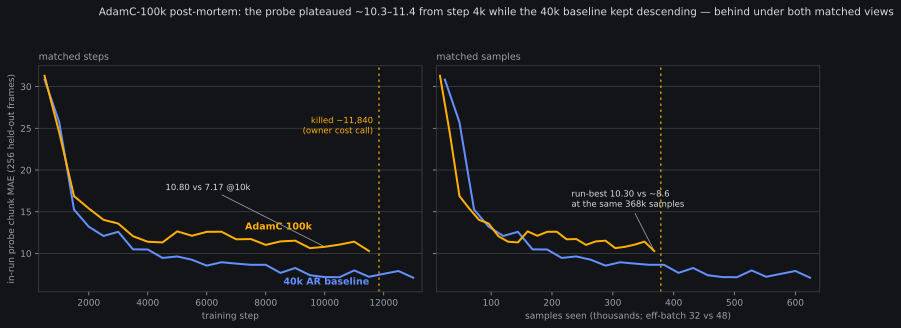

# 2026-08-09 — AdamC-100k post-mortem: a plateau, three matched views, and what the run leaves behind

*Written 2026-08-09 23:1x–23:3xZ, from the banked `train_log.jsonl`
(box + local). Zero GPU-h — the run was owner-killed at 22:40Z; this
is the promised chart-led close-out. Pre-reg:
[AdamC-100k parameter sheet](2026-08-09-prereg-molmo2-adamc-100k.md).*

**In plain words**: the owner asked for a long 100k-step run with a
different optimizer (AdamC), the vision tower unfrozen from step 0,
and a smaller batch. Nine hours in, its held-out probe had flattened
around 10.3–11.4 while our earlier 40k baseline, at the same point in
training, had already descended past 7.2 and was still improving. The
owner called it ("not looking great") and reassigned the GPUs to the
Molmo2-ER run. This post records what was measured, what it does and
doesn't imply, and what the run leaves behind.

## The run

Owner-specified 12:37Z 08-09, launched 13:30Z after sheet approval:
base Molmo2-4B, 100k steps, effective batch 32 (8/rank × 4×H100),
vision encoder **unfrozen from step 0** (text + vision lr 2e-5),
warmup 1000, **AdamC** (arXiv 2506.02285 — AdamW with per-group decay
λ·γ_t/γ_max; our implementation landed oracle-gated in `401d6f7`,
λ=1e-5 owner-pinned to the lineage value), seed 1. Killed 22:40Z at
step ~11,840 — **~35.7 GPU-h** of a 310 gate, ~9.2 h wall at a median
**2.57 s/step**.

## What was measured

The comparison run throughout is the 40k AR trunk run (AdamW, vision
frozen, eff-48) — same data, same eval probe (256 held-out frames
every 500 steps). Three matched views, each less flattering than the
last is honest about:

- **Matched steps**: at step 10,000, probe **10.80 vs 7.17**. From
  step ~4k the AdamC curve oscillates in a 10.3–12.6 band; the
  baseline goes on descending 10.5 → 7.2 over the same steps.
- **Matched samples** (the fairer axis — eff-32 vs eff-48 means at
  any step the AdamC run has seen a third fewer samples): at the kill
  point the run had consumed ~379k samples; its run-best **10.30**
  (@11,500) sits against ~**8.6** for the baseline at the same
  samples-seen.
- **Matched compute**: the baseline hit **7.09** by its step 13k eval
  at ~31.6 GPU-h; the AdamC run's 35.7 GPU-h bought run-best 10.30.
  Per-sample cost was **1.77×** the baseline (0.080 vs 0.046
  s/sample; the unfrozen 439M-param vision tower's backward is the
  obvious owner of most of that).

Two secondary observations, both record-only:

- **Train loss reached near-parity while the probe did not** — total
  loss 3.74 at step 11,880 vs the baseline's ~3.44 at matched steps
  (different batch sizes, so window noise differs). Whatever was
  wrong was not "the loss isn't going down"; it showed up in the
  held-out action probe, not the training objective.
- **The three-rise probe watch resolved as a recede**, again: the
  ladder ran 10.63@9500 → 10.80 → 11.06 → 11.41@11000, three
  consecutive rises (a named watch — every prior uptick receded
  within 1–2 evals), then dropped to the run-best 10.30@11500 at the
  final eval before the kill — the recede precedent held even at
  three rises.

## What this does NOT say

The run differed from the baseline in **three** ways at once —
optimizer (AdamC vs AdamW), vision tower (unfrozen vs frozen), and
effective batch (32 vs 48) — and was killed at 11.8% of its designed
length. So this is a *descriptive* post-mortem of one configuration,
not a verdict on AdamC: no single-delta attribution is available, and
a 100k-step design killed at 12k steps never got the schedule it was
shaped for. If AdamC (or vision-unfreezing) is ever measured for
real, it needs a single-delta arm; the vu5k warm-start screen
(idea #17, pre-reg'd) remains the right instrument for the vision
half of that question.

One flag for anyone reading the raw log: `lr_backbone` in this run's
jsonl tracks the full 1e-4 decoder schedule — that is the **known
logging artifact** the owner caught at 15:02Z (hardcoded group index
1; AdamC's three-way decoder split made index 1 the decoder head).
The fix (`f112f08`) landed after launch, and a live run keeps its
loaded code, so the artifact persists through this log. The banner
and the optimizer group table confirm the actual backbone groups ran
at 2e-5 as approved.

## What the run leaves behind

- **The AdamC implementation stays landed** (`401d6f7`): corrected
  decay on 4,074.7M hidden params, standard decay on the 2.6M output
  head, 0.6M 1-D params undecayed, tied-param guard, 10 oracles in
  `check.py` — available to any future single-delta screen at zero
  new cost.
- **step_010000 weights** (weights-only, optimizer state stays
  box-local) are on `fontaine-checkpoints` — a warm-startable
  vision-unfrozen checkpoint if anything ever wants one.
- The `lr_backbone` logging fix + regression oracle (`f112f08`).
- The banked `train_log.jsonl` behind this post (box + local).

The freed GPUs went to `fontaine_molmo2_er_60k_ddp4` the same hour
([pre-reg](2026-08-09-prereg-molmo2-er-60k.md)) — 40k recipe
verbatim from the Molmo2-ER init, whose probe-vs-40k-curve delta is
exactly the kind of single-delta read this run couldn't give.
