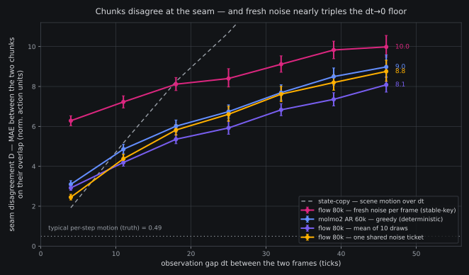

# The seam is real: cross-chunk boundary read is NOT a null (#22/#1)

*2026-08-09 ~15:2xZ. The boundary-incompatibility CPU read banked from
the [SEAM lit slice](../papers/seam-boundary-steering.md) —
exploratory, record-only, zero GPU: a pure function of five banked
full-panel npz stacks. Reads produced by
`fontaine/scripts/boundary_incompat_results.py` (one command,
oracle-gated pre-data: planted compatible/offset pairs recovered
exactly, degenerate same-frame overlap reads exactly 0, NaN poison on
invalid steps leaks nowhere, dt=48 hand fixture to float64, 6 abort
branches). No decision rule was registered and none is applied — this
read was priced as "a null closes the #22 bridging direction for our
stack"; the null did not materialize.*

## TLDR

**Our chunks disagree at the seam, a lot, for every policy we have
banked — and the disagreement decomposes cleanly.** For same-episode
panel frames dt < 50 ticks apart, the earlier chunk's tail and the
later chunk's head predict *the same actions* (truth overlaps agree
byte-exactly on all 13,693 pairs — asserted, not assumed). The two
predictions disagree by MAE ≈ 6.3–8.4 (norm. action units) pooled
over all dt — comparable to each model's own error on the same
overlap (D/err ≈ 1.1–1.27), and the executed-trajectory jump at the
switch point is **11–14× the typical per-step motion** while chunks
stay smooth *inside* (the SDN within-chunk null replicated). Smooth
within, jerky between: SEAM's problem statement, confirmed on our
stack at k4l2 geometry.

The dt→0 intercept (dt ≤ 5, observations nearly identical) splits the
cause:

| policy | D at dt≤5 | CI95 |
|---|---|---|
| flow 80k, fresh noise per frame (stable-key) | **6.04** | [5.76, 6.32] |
| molmo2 AR 60k, greedy (deterministic) | 2.74 | [2.55, 2.94] |
| molmo2 AR 40k, greedy | 2.69 | [2.52, 2.87] |
| flow 80k, mean of 10 draws | 2.66 | [2.52, 2.79] |
| flow 80k, one shared noise ticket | **2.07** | [1.93, 2.23] |

Fresh-noise flow — the deployment condition — carries a **~3.3-unit
pure noise/mode term** above the deterministic baseline: two draws
from nearly the same observation land ~6 units apart. Sharing the
noise across frames (ticket33) deletes that term entirely and lands
*below* greedy AR — the most seam-consistent policy we have banked.
That is direct, free evidence for the SEAM/PAINT-family premise:
cross-chunk noise coupling is the cheap lever on the seam.

## The read, exactly

Panel plans place ~6 frames per episode (4 core + 2 labeled); 13,693
pairs sit 1–49 ticks apart, dt near-uniform. For a pair (dt), the
early chunk's steps [dt:50) and the late chunk's steps [0:50−dt)
cover the same wall-clock actions. Per pair, valid-masked:

- **D** = mean |early_tail − late_head| over the overlap;
- **anchors**: each side's MAE vs truth on the *same* overlap
  (D/err), and within-chunk step size W = mean |a[t+1] − a[t]|
  (the SDN anchor);
- **J** = |late_head[0] − early_tail[0]|, the switch cost the
  executed trajectory would pay at the seam.

Pooled mean + bootstrap CI95 + leave-one-repo-out, the banked
box-batch conventions. Full numbers (per-dt-bin curves, LORO,
state-copy references): `reports/analysis__boundary_incompat_panels.json`.

Headline pooled rows (all 13,693 pairs):

| policy | D | D/err | J | J/W_truth |
|---|---|---|---|---|
| flow stable-key | 8.43 | 1.27 | 7.00 | 14.2 |
| flow ticket33 | 6.28 | 1.10 | 5.69 | 11.5 |
| flow draws10-mean | 5.83 | 1.09 | 5.31 | 10.8 |
| molmo2 AR 40k greedy | 6.67 | 1.10 | 6.09 | 12.3 |
| molmo2 AR 60k greedy | 6.57 | 1.10 | 5.96 | 12.1 |

State-copy's D (10.65 pooled — it is exactly |state(f1) − state(f2)|)
is the scene-motion scale: every model's seam disagreement sits well
under "the scene moved", but far above "the plans agree".

## What this does and does not say

- **The dt-curve slope is partly a horizon effect, not all
  observation drift.** The early chunk's overlap steps are its
  far-horizon predictions (err 7.8–8.7), the late chunk's are
  near-horizon (err 3.6–4.5) — regression-toward-the-mean at long
  horizon inflates D as dt grows. The *intercept* is the clean
  statistic: at dt ≤ 5 both sides predict at nearly matched horizons
  from nearly the same observation, and the fresh-noise flow still
  disagrees with itself by 6 units.
- **AR is not seam-clean either.** 2.7 units of disagreement at
  nearly-identical observations for a *deterministic greedy* decode
  means the argmax plan itself is sensitive to tick-level observation
  change (and the 40k→60k trunk did not shrink it). Noise is the
  biggest seam term, not the only one.
- **Open-loop proxy caveat, carried loud.** In deployment the next
  chunk is generated from the observation *after executing* the
  previous one; our pairs condition both sides on ground-truth
  observations. This read prices the disagreement term SEAM targets,
  not closed-loop jerk itself — the offline panel can price the
  *problem* but must never be asked to validate a *fix* (the fix is
  #16-gated by construction).
- **Record-only.** No decision rule fires. Any SEAM/PAINT-class arm,
  or a noise-coupling deployment policy (shared/slow-varying ticket
  across consecutive chunks), needs its own pre-registration and a
  rig bench to score on.

## What it changes

1. **#22 stays alive and gains a measured target.** The direction
   this read could have closed at zero cost is instead confirmed:
   seam disagreement ~1.1–1.3× model error, boundary jump 11–14×
   step motion. Arm order unchanged (measure naive-switch cost →
   HAS → SEAM → PAINT → A2C2 → DEFLECT-class), still parked on #16.
2. **Noise coupling is evidenced, not just imported.** The ticket33
   column is an accidental ablation the GoldenTicket bank paid for
   already: sharing noise across frames removes the entire
   noise-induced seam term (6.04 → 2.07 at dt≤5). A deployment
   policy as dumb as "reuse yesterday's ε" beats per-chunk fresh
   noise at the seam — SEAM/PAINT get the same effect while keeping
   per-chunk diversity.
3. **#1 gets a cross-chunk data point** the within-chunk SDN null
   could not see: draw dispersion that is invisible to per-draw
   smoothness statistics shows up as 6 units of plan disagreement at
   matched observations.
