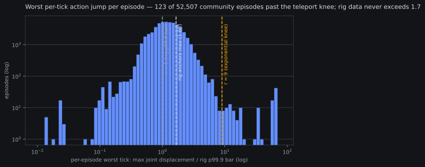
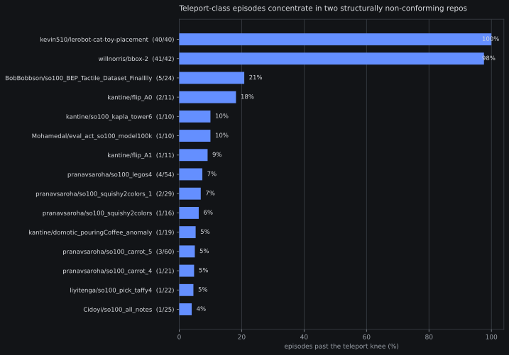

# Kinematic-continuity screen: the teleport tail is real, already known, and small

*2026-08-09 17:1xZ. CPU-only screen over the full community corpus
(idea #9), record-only, no pre-registration — an exploratory read of
banked data on the VISTA hook
([papers page](../papers/vista-umi-validation.md)): score every
episode for per-tick action continuity and see whether a
kinematic-corruption tail hides under the VLM-judged curation. It
extends the [±180° wraparound census](2026-08-05-wrap-census.md),
which asked a narrower question with a wrap-specific detector.
Instrument `fontaine/scripts/corpus_continuity_screen.py`
(oracle-gated, 7 synthetic fixture families); numbers banked in
`reports/analysis__corpus_continuity_screen.json`.*

## The instrument

VISTA's continuity score, recalibrated from our own rig: per-tick
displacement per action dim, divided by that dim's p99.9 over the two
rig repos (57 episodes, 36,021 ticks of trusted SO-101 teleop — bars
3.3/5.2/6.2/9.7/11.0 deg on the five joints, 6.4 on the gripper
command). A tick's ratio `r` is the worst dim; the score keeps
VISTA's three regimes — full marks at `r ≤ 1`, linear penalty to 0.5
at `r = 9`, exponential decay past that knee (their 5 mm → 45 mm
ratio, kept verbatim). Episode score = min over ticks; thresholds
scale by 30/fps for non-30-fps repos. Past the `r = 9` knee means a
single-tick jump nine times the rig's own 99.9th-percentile motion —
teleport-class, not fast teleop.

## The distribution

52,507 episodes across all 981 repos (zero read failures). The corpus
is kinematically clean almost everywhere: median worst-tick ratio
1.2, p99 = 4.2 — inside the linear regime and well under the knee.
The rig anchors under identical bars: max ratio **1.66** across all
57 episodes, zero tail. The tail that does exist is sharp:
**123 episodes (0.23%), 65,910 frames, 32 repos** past the knee, 59
of them extreme (`r ≥ 50`).

## The tail is two structural repos plus dust

| slice | episodes | what it is |
|---|---|---|
| kevin510/lerobot-cat-toy-placement | 40/40 | ±180° angle wrap on shoulder_lift + wrist_roll — the [wrap census](2026-08-05-wrap-census.md)'s canonical repo, rediscovered independently (`r = 69.3`: a ~358° recorded jump for a ~2° physical move) |
| willnorris/bbox-2 | 41/42 | actions stored as raw encoder counts (range ≈ 926–3141), not calibrated degrees — a units mismatch, flagged here because degree bars don't fit count-scale motion; its motion is smooth *in its own units*. The census saw its other disease (state-stream glitches) |
| 30 further repos | 42 | genuinely new catches: sub-300° single-tick jumps the census's wrap-specific `>300°` line could not see — freeze-then-jump dropout shapes (BobBobbson's gripper teleporting 29 units after a frozen stretch), isolated 30–90° glitch ticks (pranavsaroha, kantine) |

Cross-checks: the tail has **zero overlap** with the banked
influence-ranked repos (box-batch LORO top-5 — the arch-batch
analysis banked no repo list), so nothing that moves our deltas is
corrupted. Eight tail episodes sit in the k4l2 panel (4 kevin510, 4
willnorris — ≤ 32 of 25,800 rows); the wrap census already measured
this class of contamination at **+0.072 pooled MAE** from 16 wrap
frames, and per-dataset normalization means the counts-repo rows
return count-scale errors into a raw-unit pool. Pooled anchors are
robust (bounded ~0.05-class worst case), but per-repo or max-row
diagnostics touching these two repos are not trustworthy — standing
caveat, carried where those anchors are quoted.

## Verdict: qualified null — hook closed

The screen found no *unknown* corruption: both material repos were
already caught by the wrap census, which also traced the mechanism
(lerobot wrist_roll calibration bug, exposure window Jun 2025 – Mar
2026) and sized the panel damage. The genuinely new tail — 42
episodes in 30 repos, 0.08% of the corpus — is an order of magnitude
below the census's own "an unwrap-at-load arm cannot pay for an H100
run" line, and the owner already dropped that arm on exactly this
sizing (16:13Z 08-05 steering). Dropping 0.23% of episodes cannot
move a 40k-step run outside pairing noise, so **no curation pre-reg
is queued**; re-proposing a killed decision at smaller effect size
would be process noise.

What survives is the instrument: an oracle-gated, rig-calibrated,
zero-GPU episode score that takes ~2 minutes over the full corpus.
If a curated_v1 ever gets built (or new community data lands), this
runs as a standing intake filter — VISTA's 65%-vs-0% result is the
argument that it will matter at that point, even though at 0.23%
prevalence it cannot matter today. Idea #9's VISTA hook closes at
zero GPU cost.
