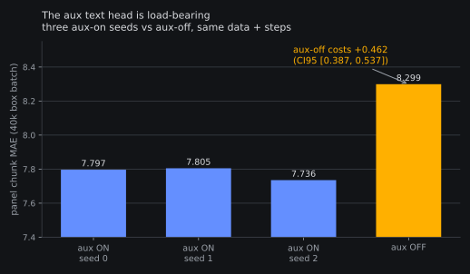
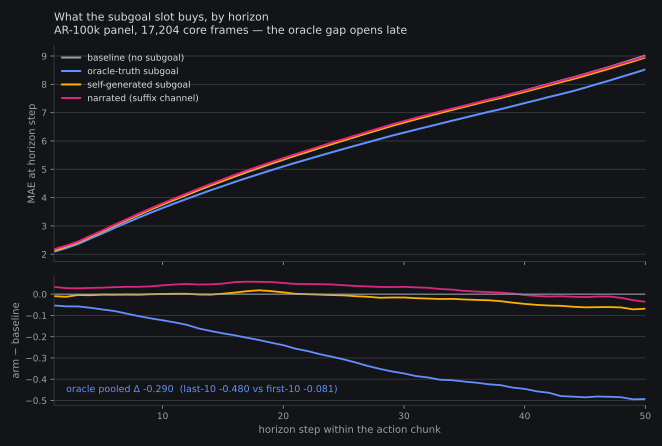
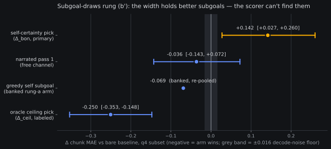

# Conditioning on words: what the subgoal channel actually buys

*2026-08-09. Consolidated report (owner ask 13:21Z 08-08) on the
field-conditioning and subgoal-conditioning programme: the aux text
head (#6 root), the subgoal slot and the model's attempts to fill it
(rung (a), the draws ladder (b)/(b′)), the accuracy-by-field table
both trunks, and the mined ambiguous frames. Every number below is a
banked, pre-registered read — links go to the results post that
landed it. Charts render from the frozen analysis jsons
(`fieldcond_meta_report_charts.py`); nothing is recomputed here.*

**The arc in one paragraph.** Making the policy *talk* while it
trains is load-bearing: deleting the aux text head costs +0.462
panel MAE. The subgoal *slot* inside that channel is worth −0.29
when an oracle fills it with the true next subgoal — and the win
lives almost entirely late in the action chunk, where phase context
matters most. But the model cannot yet feed itself: self-generated
subgoals recover none of it at 3× decode cost, and the failure is
located precisely — single-frame *phase estimation* (the generation
step), not the conditioning channel, not frame ambiguity, and (as of
rung (b′)) not the width of candidates either: better subgoals sit
in the model's own sample set, and every free scorer we're allowed
anti-selects them. The gap is real, bounded, and now priced: it
needs either a learned scorer or history — each named below, none
yet run.

---

## §1 — The channel is load-bearing (aux attribution, #6 root)

Three seeds of *aux on* vs a matched *aux off* arm at the 40k box
recipe ([results](2026-08-06-box-batch-results.md),
`analysis__box_batch_40k_k4l2.json`): removing the aux text head
costs **+0.462 [0.387, 0.537]** panel chunk MAE — about 7.5× the
seed replicate threshold (σ_seed 0.038).

Whatever narrating "what am I holding / what happens next / what is
visible" does to the representation, the action head cashes it in.
(Arm B's `first_mae` twist — aux-off is *better* on the first step —
handed a thread to the visual-grounding idea #11; not retold here.)

## §2 — What the slot is worth when fed truth (rung (a))

The self-subgoal probe
([results](2026-08-08-selfsubgoal-results.md),
`analysis__selfsubgoal_ar100k_k4l2.json`) split the question into
arms on the same frames:

- **Oracle-truth subgoal: Δ −0.290 [−0.331, −0.225]** vs baseline —
  and 6× stronger late in the chunk (last-10 steps −0.480 vs
  first-10 −0.081). This is the slot's *ceiling* when the words are
  right.
- **Self-generated subgoal: Δ −0.018 [−0.052, +0.026]** — zero, at
  3× decode cost.
- **Channel read**: narrated-arm − self-arm ≈ **+0.043** (CI
  excludes 0) — moving the same self-generated text between input
  channels changes little, so the *generation* is what's broken,
  not the plumbing.

The late-horizon shape is the report's fingerprint: it recurs in
every later read (the (b′) oracle pick concentrates −0.464 in the
last 10%), which is why we read the slot as *phase context* — the
words tell the policy where in the task it is, which matters most
where the chunk drifts furthest from the current frame.

## §3 — What the model actually knows about fields

Both trunks now have the accuracy-by-field table (weak judge
labels; ~80% inter-judge holding agreement — treat ceilings as
label-noise-bounded). AR-100k was banked all along; the Molmo2
number needed a
[found-and-fixed gate bug](2026-08-08-prereg-accuracy-by-field.md)
(`2f4d575`: molmo2 checkpoints silently reported no trained fields —
an integrity aside worth remembering) and landed
[2026-08-09](2026-08-09-molmo2-fields-panel-results.md):

| field | metric | AR-100k | Molmo2 60k |
|---|---|---|---|
| holding | accuracy | 0.807 | **0.897** |
| progress | MAE (lower better) | 0.062 | **0.059** |
| event | presence accuracy | 0.878 | 0.880 |
| visible | slot-set accuracy | 0.319 | **0.819** |

The action-adjacent fields barely move; **visible jumps +0.50** on
the strictest metric (exact set-equality, and with *more* frames
parsed). The pointing-supervised trunk's grounding shows up exactly
where grounding is measured — field-level support for the
vision-side half of the Molmo2 bet (#17). Meanwhile the
does-narration-help sign is consistent on both trunks: decoding the
fields *before* the actions costs (+0.054 Gemma, +0.083 Molmo2
paired), concentrated on failure-labeled frames — reading your own
possibly-wrong narration at decode time is a tax, not a win. The
aux head earns its keep at training time (§1), not at decode time.

## §4 — The ambiguous frames (what conditioning *should* rescue)

The owner asked for specific episode frames where the right action
is ambiguous from the image alone. We
[mined them automatically](2026-08-08-framemining-aliased-frames.md):
embed every core panel frame with a frozen vision tower, retrieve
nearest neighbors, flag pairs that are nearly identical in embedding
but *divergent in ground-truth continuation* (the
observation-aliasing diagnostic run in reverse). The miner is valid:
alias score correlates with baseline error at ρ 0.41, and flagged
frames carry a **+29% baseline error floor**.

*The classic start-vs-end trap (`jmrog/record-sweet3`): visually
near-identical arm poses (embed dist 0.0017), but the query frame's
true continuation is "retract the arm back to rest" while the
neighbor's is "align the gripper over the sweet" — opposite
directions of travel, 1.89σ apart in action space.*

*Goal not decidable from the frame (`EverNorif/so101-table-cleanup`):
"grasp the **red** pen and place it into the holder" vs "pick up the
first **black** pen" — same scene, same pose, different target
object. The subgoal words carry exactly the missing bit; on this
pair the conditioned policy improves −0.33 on the query frame.*

*Phase confusion (`Mohamedal/so100_put_plum_bowl_new_data`): "lower
the gripper onto the plum and close on it" vs "reach down toward the
plum" — adjacent phases of the same task, 1.73σ apart. The neighbor
frame is the section's largest conditioning win: Δ_oracle −1.42.*

*Drawing tasks are aliasing-dense
(`LeRobot-worldwide-hackathon/162-…-draw_lerobot`): mid-stroke
frames look alike while the pen's *program* differs ("hand the pen
off" vs "trace the outer head outline").*

**And the honest twist, stated loudly:** the subgoal gain does
**not** concentrate on these frames. Flagged-vs-rest Δ_oracle
−0.003 [−0.205, +0.176], Spearman ρ −0.01 across 14k frames:

So the slot is *uniform prior/guidance*, not disambiguation rescue —
the published aliasing-rescue shape (9% → 45.8%) does not replicate
on our stack. The mined frames remain valuable for what they were
asked for (they are the hardest frames — +29% error floor, the #11
history-arm prize) but the subgoal channel is not how they get
fixed.

## §5 — Closing the gap: the selection ladder

If the oracle is worth −0.29 and self-generation is worth ~0, can
the model *sample* its way there? Draw K candidate subgoals, pick
one, decode conditioned on the pick:

- **Rung (b)** ([close](2026-08-08-subgoal-draws-stage1-close.md)):
  closed at table cost — at T=1, **11.5%** of sampled subgoals
  derail into truncation artifacts; the eligibility bar passed only
  20/60 stage-1 rows. No Δ measured; the fix became the rung-(b′)
  clean-list rule.
- **Rung (b′)**
  ([results](2026-08-09-subgoal-draws-cleanlist-results.md),
  `analysis__subgoal_draws_cleanlist_q4_ar100k_k4l2.json`): the
  clean-candidate list is structurally healthy (eligible 8.06/9
  candidates per row, zero fallback rows) — and the primary
  falsifier fired anyway. Self-certainty **anti-selects**: the SC
  pick is **+0.142 [+0.027, +0.260]** *worse* than the bare
  baseline and +0.210 [+0.113, +0.312] worse than greedy
  self-generation. But the **ceiling is alive**: the oracle pick
  from the same 8 candidates beats baseline **−0.250
  [−0.353, −0.148]**, with −0.464 in the late horizon — the §2
  slot signature again. Better subgoals *are in the set*; nothing
  free finds them (~40% oracle agreement across all free scorers).

**Verdict: NO-SCORER** (pre-registered adjudication). The
scorer-free selection family is closed; the remaining −0.25 is a
*scorer* problem. Priced escalations, from the lit pages, each
needing its own pre-reg:

| gap hypothesis | escalation | prior art |
|---|---|---|
| scorer | supervised chunk-level verifier — the (b′) run dumped 4,298 in-domain picked-vs-oracle pairs as free training data | [RoVer](../papers/rover-learned-verifier.md) |
| scorer, label-free | set-joint scoring (score the candidate *set*, not per-candidate confidence — per-candidate is the shape that just anti-selected) | [uPRM / SDN](../papers/label-free-selection-signals.md) |
| physics-side | jerk-based pick: **already priced OUT alone** — recovers 8% of the oracle gap on the banked stacks (flow: nothing) | [SDN jerk read](../papers/noise-space-steering-3.md) |
| phase | history/prefix-logit progress probes — the rung above the whole ladder | [progress-from-logits](../papers/progress-from-logits.md) |

The §3 table adds one forward-pointing fact: a learned scorer built
on the Molmo2 trunk starts from a far better scene reader (visible
0.819 vs 0.319) than the AR-100k numbers implied.

## §6 — Open questions (pre-named, not pre-judged)

1. **Subgoal-swap sensitivity**: condition on a *wrong-episode*
   subgoal at a fixed frame — one panel pass closes the
   presence(−0.29) / channel(+0.043) / **content** triangle.
   Flagged in [idea #6](../ideas/06-aux-attribution.md); needs a
   pre-reg.
2. **The scorer choice** after (b′): supervised-from-dumps (RoVer
   shape, 4,298 free pairs) vs set-joint label-free (uPRM
   principle). Physics-side is priced out alone; either learned
   route needs its own pre-reg before any GPU.
3. **History-conditioned phase estimation**: if single-frame phase
   is the bottleneck (§2) and aliased frames carry a +29% error
   floor regardless of subgoals (§4), the structural fix is
   history — the #11 arm. Cited here, not run.

*Artifact map: every chart renders from
`reports/analysis__{box_batch_40k,selfsubgoal_ar100k,framemining_ar100k,subgoal_draws_cleanlist_q4_ar100k}_k4l2.json`
+ the two fields-panel eval jsons; pair figures from the
frame-mining run — all 12 pairs in the
[frame-mining post](2026-08-08-framemining-aliased-frames.md).*
