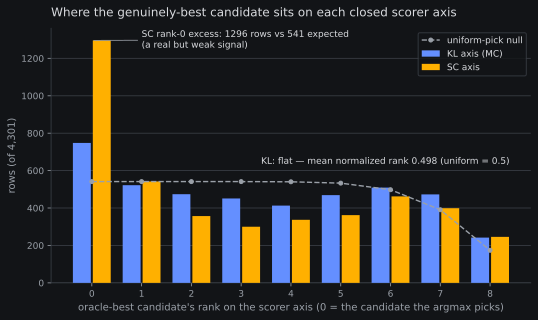
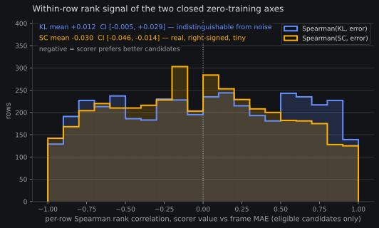

# Rung (c) results: masked-contrast ANTI-SELECTS — the zero-training scorer family closes

*2026-08-09 ~10:2xZ. Pre-reg:
[2026-08-09-prereg-subgoal-mcselect.md](2026-08-09-prereg-subgoal-mcselect.md)
(finalized 09:2xZ, run launched 09:12:36Z, complete 10:20Z — ~1.1
GPU-h of the 4.0 gate). Frozen read:
`mcselect_results.py` → `reports/analysis__subgoal_mcselect_q4_ar100k_k4l2.json`.
Everything below is that script's output; the argmax, tie rule and
CI machinery were landed and oracle-gated BEFORE the run.*

**Plain words.** The model can write several candidate "next step"
notes to itself, and we know (from rung (b′)) that the sampled set
usually contains a genuinely better note than the one it writes by
default — but the first scorer we tried (pick the note the model is
most *confident* about) chooses badly. This rung tried the opposite
philosophy, imported from MG-Select: pick the note that most
*changes* what the model wants to do (measured against a
"no-note-at-all" reference). Verdict: that scorer chooses badly too
— in fact worse. Picking maximally-informative notes drags the
policy toward disruptive, phase-wrong instructions. Two strikes
means this whole family of free scorers is now closed for this
model; anything further has to *learn* what a good note looks like.

## The frozen reads

| read | value | bar / comparator |
| --- | --- | --- |
| **PRIMARY (mc − self), paired CI95** | **+0.31317 [+0.19962, +0.42894]** | PASS needed CI < 0; **entirely > 0 = ANTI-SELECT** |
| Δ mc vs bare (planner-less) | +0.24453 [+0.12344, +0.36786] | the mc pick is worse than no subgoal at all |
| capture fraction of ceiling | **−1.73** | banked ceiling (ceil − self) −0.181; mc collects −173% of it |
| late-horizon signature (last-10%) | **+0.385** | ceiling's slot is −0.464 territory; SC's fingerprint was +0.055 |
| SC comparator (banked) | bon − self +0.210 [+0.113, +0.312] | mc's +0.313 is the HARDER anti-select |

Agreement diagnostics: the scorer is decidedly not inert — the mc
pick differs from the greedy text on **66.1%** of rows (inert-guard
bar was 5%; 244 tie rows) — yet it agrees with the oracle pick on
only **14.4%** of labeled rows and with SC's pick on 14.5%:
chance-level against the oracle at a 9-candidate width. Execution
oracles all green pre-read (τ/sha echo, KL-finiteness ==
eligibility, state-copy byte-match on 4,301 joined rows;
pred_masked-vs-banked flip count 1207/4301 = exactly the amendment-1
composition-noise figure, a free instrument confirmation).

## What this means

**Informativeness is anti-correlated with quality here, not merely
uncorrelated.** KL(p_cond ‖ p_masked^{1/τ}) rewards the candidate
that most bends the action distribution away from the planner-less
default. On our trunk the biggest benders are disruptive
instructions — phase-wrong, over-specific, or off-task text the
policy obediently follows — and the damage lands hardest exactly in
the late-horizon slot where real subgoal signal lives (+0.385
last-10%, the mirror image of the ceiling's −0.464). Self-certainty
failed by rewarding *plausibility*; masked-contrast fails by
rewarding *impact*. The better candidates the width provably holds
(ceiling −0.250 vs bare) sit between those poles: right-phase text
that shifts the policy moderately, which neither free axis ranks
first.

**The pre-registered kill rule executes: the zero-training scorer
family CLOSES for this trunk.** Two independent scorer philosophies
(likelihood-flavored, contrast-flavored) both anti-select on the
same frozen width with the same eligibility rules. Per the pre-reg,
learned-verifier shapes
([RoVer](../papers/rover-learned-verifier.md),
[Q-guided](../papers/qguided-flow-critic.md)) now need their own
affirmative case — cost, labels, and a reason to believe a learned
critic escapes both failure axes — not a routing inheritance from
this ladder. Candidate 2 (TOPReward-shape history phase estimation)
was pre-named as the escalation only for a *flat-late-horizon* mc
failure; the observed failure is active anti-selection, not
phase-blindness, so it does not auto-open either.

**What stays alive**: the ceiling itself. Rung (b′)'s finding is
unchanged — the sampled width holds genuinely better subgoals
(−0.250 [−0.353, −0.148] vs bare). The gap is now firmly a
*scorer* gap, measured against two closed attempts. Free
exploratory follow-up banked as a queue item: a record-only
post-mortem on the banked `[N,C]` KL + `[N,C,S,D]` per-candidate
error dump — per-candidate KL-vs-quality correlation and the
oracle pick's KL-rank histogram — to see WHERE on the
informativeness axis the good candidates actually sit before anyone
prices a learned verifier.

## Cost

Run ~1.1 GPU-h (68 f/min steady over 4,301 q4 rows × ~10 decodes +
9 reference forwards each) vs the 4.0 gate and the 2–2.5 projection
— the capture-during-decode design (no logit re-forward) is what
kept the conditioned side at single-decode price.

## Addendum 2026-08-09 ~11:0xZ — the post-mortem map (record-only)

*The queued post-mortem
(`mcselect_postmortem.py` →
`reports/analysis__subgoal_mcselect_postmortem_q4_ar100k_k4l2.json`)
ran same-day on the banked dump. NOT pre-registered, no decision
rides on it — it is the map to read before anyone prices a learned
verifier. Oracle-gated like everything else (planted monotone
fixture with exact hand arithmetic, tie/degenerate/contract abort
branches). "Oracle-best" below = the eligible candidate with the
lowest realized frame MAE — the frame-error oracle over all 4,301
rows, not the labeled ceiling pick.*

**The section above needs one correction of emphasis.** The frozen
read's story was "informativeness is anti-correlated with quality."
At the *per-row rank* level that is not what the map shows — the
truth is stranger and more useful:

| read | KL (MC) axis | SC axis |
| --- | --- | --- |
| per-row Spearman vs frame error, mean CI95 | **+0.012 [−0.005, +0.029]** | **−0.030 [−0.046, −0.014]** |
| fraction of rows with positive rho | 0.503 | 0.469 |
| oracle-best's mean normalized rank on the axis | **0.498** (uniform = 0.5) | **0.422** |
| oracle-best at the axis top (argmax slot) | 17.4% (null 12.6%) | **30.1%** (null 12.6%) |
| scorer's pick IS the oracle-best | 25.6% | 23.6% |

**KL is rank-noise, not a reversed compass.** Within a row,
informativeness carries *zero* rank information about candidate
quality (Spearman +0.012, CI straddling 0; the good candidate sits
uniformly on the axis, 0.498 vs the 0.5 null). You cannot fix MC by
flipping the argmax to an argmin — the bottom of the KL axis is as
uninformed as the top (bottom-1 excess 16.8% vs 12.6% null, the
mirror of the top's 17.4%: mild excess at BOTH extremes, i.e. the
best candidate is merely somewhat *atypical*). The +0.313 harm is
magnitude-driven, not order-driven: the value-level row-centered
Pearson is +0.126 (vs the rank-level ~0), so when the argmax rides
the far KL tail it occasionally lands on catastrophically wrong
text, and those rows carry the read. That is the winner's curse at
an extreme of a noisy axis, amplified by heavy-tailed damage —
consistent with the late-horizon +0.385 fingerprint.

**SC was the better axis all along — ~6× too weak to matter.** Its
per-row signal is real and right-signed (−0.030, CI entirely below
0; the oracle-best is at SC-rank-0 in 30.1% of rows vs 12.6%
chance) — and it still lost by +0.210 as a selector. A rank signal
of |rho| ≈ 0.03 over ~8 candidates simply cannot survive an argmax.
That is the calibration number this map exists for: **the banked
ceiling (−0.250 vs bare) is real, and the two free axes offer
|rho| ≤ 0.03 toward it.** A learned verifier has to clear a
per-row rank signal perhaps an order of magnitude stronger than
anything zero-training gave us — that is the affirmative case it
must make before its GPU-hours are priced.

**The family failed twice independently, not once twice.** The two
axes are essentially uncorrelated with each other (per-row
Spearman(KL, SC) +0.032 [+0.017, +0.047]; the banked pick agreement
was already chance-level at 14.5%). "Zero-training scorer family"
was the right closure unit: likelihood-flavored and
contrast-flavored signals are *different* measurements, and each is
separately too weak. One curiosity for the record: MC's pick is the
frame-error-best candidate slightly MORE often than SC's (25.6% vs
23.6%) while losing harder on MAE — more evidence that MC's failure
lives in the magnitude of its misses, not their count. (153 rows
had a constant KL across all eligible candidates and are excluded
from the rho reads; eligible width spans 4–9, median 8.)
