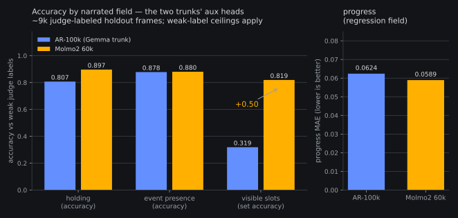

# Accuracy by field: Molmo2's aux head reads the scene far better — visible slots 0.32 → 0.82

*2026-08-09 01:0xZ. The registered fields panel
([pre-reg](2026-08-08-prereg-accuracy-by-field.md), owner ask 10:08Z
08-08) closed rc=0 at 00:49Z on the box: the 60k Molmo2 endpoint's
chained-eval command re-run byte-identical with the narrated pass
riding (`bijou@60000+fields` decodes every trained aux field, then
its actions). ~3.1 GPU-h of the 6 gate (00:03:30→00:49:43Z × 4
GPUs). All reads record-only per the
pre-reg; the launcher printed them mechanically at rc=0.*

**Read 3 first (validity oracle): green.** The fields run's base
`bijou@60000` arm reproduces the chained eval's chunk MAE to full
JSON precision (5.86022663460471) — same instrument, same 4-rank
sharding, so the narrated numbers below sit on a verified base.

## Read 1 — the accuracy-by-field table (the owner deliverable)

| field | metric | AR-100k anchor | **Molmo2 60k** | frames (M2) |
|---|---|---|---|---|
| holding | accuracy | 0.807 | **0.897** | 8,987 |
| progress | MAE (lower better) | 0.062 | **0.059** | 8,987 |
| event | presence accuracy | 0.878 | **0.880** | 8,987 |
| visible | slot-set accuracy | 0.319 | **0.819** | 8,981 |

The headline is **visible: 0.319 → 0.819 (+0.50)** on the strictest
metric in the table (exact set-equality of the parsed object slots).
Two details make it hard to dismiss:

- **No parse-selection excuse.** AR-100k only produced scoreable
  visible lines on 8,260 frames; Molmo2 parsed 8,981 — it scored
  *more* frames *and* got the sets right 2.6× as often.
- **It rhymes with the trunks' pedigrees.** Molmo2's VLM was trained
  with dense pointing/grounding supervision; "which objects are
  visible" is the most vision-grounded field we narrate. The
  action-adjacent fields (event presence, progress) barely move —
  the gap is specifically in scene reading, not narration fluency.

Holding also steps up meaningfully (0.807 → 0.897, n=8,987);
progress improves at the label-noise floor. Standing caveats travel
with all of it: the judge labels are weak (~80% inter-judge holding
agreement, ±15% progress MAE), so the flat fields may simply be at
their label ceilings, and columns are not comparable to each other.
Anchor robustness: the AR-100k anchor is the pre-registered
`panel_k4l2` table; the same-panel `panel_curated_v0` values agree
to ≤0.007 on every field, so nothing hangs on the panel choice.

## Read 2 — does narration help actions? (still no)

Paired on the same frames, `+fields` **costs** chunk MAE on Molmo2:
pooled 5.9467 vs 5.8602 (**+0.0865**; paired mean Δ +0.083, win rate
44%) vs the AR-100k anchor +0.054. Slightly worse than the Gemma
trunk, same sign. The by-outcome slice adds a wrinkle we've seen
before: the narration cost concentrates on *failure*-labeled frames
(+0.50 there vs +0.09 on success) — conditioning on decoded text
hurts most exactly where the model's own scene reading is likely
wrong.

So the fields head is a *diagnostic asset*, not a decode-time win:
consistent with the whole #6/fieldcond thread (the aux head is
load-bearing for representation quality at training time; making the
model read its own narration at decode time never pays).

## Where this lands

- The owner table now exists for both trunks; this was the last
  pending input for the consolidated field-conditioning + subgoal
  meta-report (`fieldcond-subgoal-meta-report`), which can now
  compose.
- The visible-field jump is the first *field-level* evidence for the
  vision-side story in the Molmo2 bet (#17): the trunk's grounding
  shows up exactly where grounding is measured. It also sharpens the
  scorer-escalation map from rung (b′): any future learned
  subgoal/candidate scorer on Molmo2 gets a much better scene reader
  for free.
- Nothing here gates the attach chain: the K-smoke ladder re-run at
  the 60k warm start remains the next box item after perf-pass1.

Artifacts: `reports/eval__fontaine_molmo2_ar_60k_ddp4__step_060000__panel_curated_v0_k4l2_fields.{npz,json,html}`
on the box (json mirrored locally for the chart); run log + mechanized
read block in the unit journal (`fontaine-fields-panel-60k`, rc=0).
