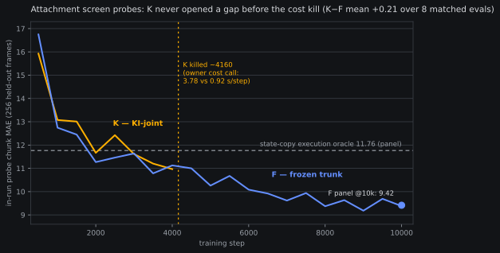

# Stage-2 attachment decision: the frozen default stands

*2026-08-09 ~13:5xZ. Decision memo closing the
`molmo2-stage2-attachment-decision` queue item, written from banked
artifacts only (no new GPU work). It closes the
[pre-registered attachment seam screen](2026-08-07-prereg-molmo2-attach-screen.md)
(#4) — with the honesty flag up front: **the screen's frozen decision
rule cannot fire**, because the K arm was killed by the owner on cost
at step ~4160/10k (12:38Z 08-09) before its panel eval existed. There
is no Δ_seam paired CI, no trunk-drift read. What follows is the
decision the evidence that *does* exist supports, recorded as a
default-stands verdict, not a measured KI-joint falsification.*

## TLDR

**The stage-2 attachment recipe for the Molmo2 trunk class is the
sequential hard-freeze: train the AR trunk first, then attach the
flow expert to the frozen trunk (residual taps, 12 @ stride 3, layers
2,5,…,35; expert h1024×12).** Every future full-length stage-2 run on
this trunk pre-registers citing this memo. The KI-joint direction
(trunk CE continuing under a stop-grad seam) is **closed-unmeasured
for this trunk class**: not falsified, but priced out — it showed no
probe advantage in 4k steps of matched training while costing 4.1×
per step, and the production field's first move is frozen-shaped
anyway. If a seam number is ever wanted, the cheap read below is
pre-priced at ~2.5 GPU-h.

## What the screen was, and what actually happened

The [pre-reg](2026-08-07-prereg-molmo2-attach-screen.md) put two arms
on the 60k AR endpoint at matched 10k steps / eff-48: **F** (trunk
hard-frozen, flow loss only — our lineage default) vs **K** (the
π0.5/KI production recipe: phase-1 CE continuing verbatim, stop-grad
on the expert→trunk seam, α=1). Primary read: Δ_seam = paired panel
chunk-MAE difference at 10k.

F ran first (04:58–07:42Z, ~10.2 GPU-h) and banked its panel. K
launched 08:01Z and was **killed by the owner at step ~4160** — a
cost call ("way too slow per step"), not a gate: its probes were
healthy, ~1.4 under the 5k kill bar. K's measured step cost was
**3.782 s/step vs F's 0.920** (median over jsonl windows) — 4.11×,
against the pre-reg's 2.4–2.8 s/step estimate. The screen therefore
ends with one complete arm.

## The evidence that exists

**1. F is a valid, working attachment — the screen is not void.**
F @10k panel_v2 (heun30/draws1/stable, core 15,056 frames):
**chunk MAE 9.4157**, first-MAE 2.958, vs the state-copy execution
oracle **11.7639** — beaten by 2.35, more than double the ≥1.0
"decisively" bar the pre-reg's read 3 pinned. Condition sensitivity
0.828 (the conditioning fields are consumed). In-run probe closed at
9.38@10k, still trending down.

**2. The only matched F-vs-K evidence shows no K advantage.** Both
arms ran identical data order, batch, surface, and eval cadence, so
their in-run 256-frame probes pair at matched steps — 8 evals before
the kill (chart above). **K−F mean +0.208, median +0.37; K ahead at
2 of 8 evals** (−0.82 at 500, −0.16 at 4000), F ahead at 6. This is
probe-quality evidence (256 frames, no CI machinery — the pre-reg
deliberately did not make it a read), but its direction is uniform:
through 4,000 steps, trunk adaptation under stop-grad bought nothing
the frozen trunk didn't already have. K's CE branch held at 2.6–2.8
against the phase-1 tail ~3.68 throughout — the trunk was healthy
and *still* not paying rent.

**3. The cost asymmetry is measured, not estimated.** 4.11× per
step. A full K screen would have cost ~42 GPU-h against F's 10.2;
a full-length (100k-class) KI-joint attachment run would price at
~4× every frozen alternative, forever. Any joint-flavored escalation
now has to argue against that measured number.

**4. The production field's first move is frozen-shaped.** Filed on
[#4's ledger](../ideas/04-stage2-attachment.md) before any of
tonight's evidence: [RDT2](../papers/rdt2-umi-scaling.md) (10k-hour
stack: flow expert trained on a **frozen** backbone, no joint stage
at all) and [Qwen-VLA](../papers/qwen-vla-early-fusion.md) (Stage I
expert training with the trunk frozen). The KI-joint camp's own
motivating failure (KI's frozen-backbone-0%) was an *action-naive*
backbone; ours is action-pretrained — the Wall-OSS reading stands as
the recorded interpretation: **phase-1 CE already routed the action
gradients into the trunk; there was little left for K to add.**

## The decision and what it binds

Frozen default stands, per the pre-reg's own tie-logic ("ties go to
cheaper + simpler") extended to the absence case: no evidence K
clears any bar, at a 4.11× measured price, with production practice
pointing the same way.

Binding consequences:
- The eventual full-length stage-2 attachment on a Molmo2-class
  trunk (the [adamc_100k](2026-08-09-prereg-molmo2-adamc-100k.md)
  endpoint is the natural substrate) **attaches frozen**, on the
  screen's pinned surface: residual taps stride 3 (12 taps, layers
  2,5,…,35), expert h1024 / depth 12 / adarms / bidirectional,
  decoder-lr 1e-4. Its pre-reg cites this memo.
- The frozen configuration keeps the offline-RL escalation path open
  ([Q-VGM](https://arxiv.org/abs/2606.08015): frozen trunk + flow
  expert is exactly the substrate the field fine-tunes with offline
  RL) and the aftermarket-adaptation path
  ([FlowDAgger](../papers/flowdagger-latent-dagger.md)).
- Scale caveat carried from
  [2606.14153](https://arxiv.org/abs/2606.14153): this is a
  molmo2-4B-at-this-scale fact. A different trunk or scale
  re-screens; it does not extrapolate.

## What was NOT measured, and what each residual costs

- **Δ_seam at panel quality: unmeasured.** The cheap version, if
  ever wanted, is fully specified by existing machinery: K's
  `step_003750` checkpoint is retained on the box, F saves at 1250
  cadence, so a **matched panel_v2 pair at step 3750** needs two
  single-GPU panel evals (~1.24 GPU-h each, local H100 qualifies) +
  `attach_seam_results.py --steps 3750`. **~2.5 GPU-h total.** Needs
  its own pre-reg (this memo is not it), and note the asymmetry: a
  3750-step read can *rescue* KI-joint only if it shows a large K
  advantage that the probes somehow missed — the probe evidence says
  it will show a tie or worse.
- **The F-then-joint rung** (#4's named escalation:
  [APT](../papers/apt-expert-pretraining.md),
  [ActionX](../papers/actionx-rl-expert-pretraining.md), and both
  production votes warm-start joint from a trained expert) survives
  this memo untouched — it was never K. Its pre-reg draft
  (`idea4-f-then-joint-prereg-draft`) unblocks with this memo as its
  basis, and must argue against the measured ~4× joint-step cost with
  the expert riding a trainable trunk.
- **Depth-of-reads (#4 arm 1)** was a held-constant surface, not a
  contrast — still open, unaffected.
- **AEGIS orthogonal-projection repair**: stays banked; it was the
  escalation for a K-wins-with-drift outcome that can no longer
  occur.

## Ledger

Screen cost actually spent: F train ~10.2 GPU-h + F panel ~1.24 + K
train ~13.6 (sunk at the kill) ≈ **25 GPU-h** against the 70 ceiling.
Artifacts: F endpoint + panel json/npz (box `reports/`), K
checkpoints through 3750 (box, retained, not uploaded — partial arm),
both train logs. Probe-curve chart:
`fontaine/scripts/attach_screen_probe_chart.py`.
