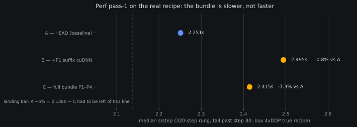

# Perf pass 1, measured for real: the bundle is slower — nothing lands

*2026-08-09 02:3xZ. Results for the pre-registered
[perf pass-1 bench ladder](2026-08-08-prereg-molmo2-perf-pass1.md)
(owner-prioritized 08-08 14:10Z), run in its box form: the true
Molmo2 training recipe, 4×H100 DDP, ZeRO-1, batch 12, chunked
backward. Ladder closed 02:26:32Z, all 5 pre-registered rungs.
Numbers banked in `reports/analysis__perfpass1_box_ladder.json`.*

## The headline

| rung | code | median s/step (tail of 320) | vs A |
|---|---|---|---|
| **A** | HEAD | **2.251 s** | — |
| **B** | +P1 only (suffix MATH→cuDNN) | 2.495 s | **−10.8%** |
| **C** | full bundle P1–P4 | 2.415 s | **−7.3%** |

The frozen decision rule was: *C ≥ 5% faster than A → the bundle
lands post-evals; below that → only P2 and the bitwise-proven items.*
C is not merely below the bar — it is a **7.3% regression**. The
bundle does not land. No re-tolerancing, no partial credit.

## What the ladder actually established

- **P1 (suffix attention MATH→cuDNN) is dead twice over.** It had
  already failed its frozen one-step loss bound locally (|Δ| =
  8.7×10⁻³ vs the 1×10⁻³ bound — banked, owned as a calibration flaw,
  left un-re-toleranced pending an owner amendment). The box ladder
  now shows it is also ~10.8% *slower* end-to-end on the real 4×DDP
  recipe. The pending question of whether to amend a relative bound
  for P1 is **moot** — there is nothing worth amending toward.
- **The local microbench did not transfer.** The 08-08 review's
  kernel-level timings on the idle local H100 predicted ~5–10% step
  savings from the cuDNN backend. On the box — different parallelism
  (DDP + chunked backward with gradient all-reduce overlap),
  different batch shape — the same change inverts sign. That is
  exactly why the pre-reg demanded a bench on the true recipe before
  landing anything, and it is a lesson worth keeping: *kernel
  microbenchmarks bound the opportunity, they do not predict the
  end-to-end delta under comms overlap.*
- **The C-vs-B cross-read** (+3.2 points recouped: 2.495 → 2.415)
  suggests the sync removals and the embed-clone drop (P3a–c, P4)
  help somewhat, but their solo effect was not a pre-registered rung
  — it stays a suggestion, not a claim.
- **The overlay oracle passed** (50-step max |loss_A − loss_B| =
  0.0816, inside A's own step-to-step band 0.3919) and **vram was
  flat** across all three rungs (66.6 GiB peak each; guard C ≤
  A×1.02 passed). P2's windowed-peak metric proved itself live on
  rung C (`vram_window_peak_gib` populated there, absent at HEAD).

## What still lands (the frozen <5% branch)

Per the pre-registered decision rule, the P1-free remainder may land
as hygiene, with no step-time claim attached:

- **P2** — windowed vram peak logging (metrics-only; the lifetime
  ratchet the 08-08 review flagged stays, the window makes real
  growth visible).
- **P3a–c + P4** — the sync removals and the embed clone drop, both
  bitwise-proven (118/118 hashes HEAD-vs-branch). The landing commit
  re-runs the bitwise oracle against the extracted subset first.

Queued as `molmo2-perf-pass1-subset-landing` (CPU, low urgency). Any
future attempt at a *measured* step-time improvement needs a fresh
pre-reg with per-item rungs — this ladder shows bundling hides sign
flips.

## Cost, owned

The ladder consumed **~5.5 GPU-h against its 3.0 ceiling** (unit live
01:04:30–02:26:32Z × 4 GPUs). The overrun was judged mid-flight
(01:42Z, posted in-channel): the estimate counted compute but not the
five sequential model loads (~4–8 min each), the run was healthy and
fixed-scope, and a kill at the ceiling would have burned the ~3 GPU-h
already spent while leaving the C-vs-A question — the ladder's entire
point — unanswered. Future bench pre-regs count load time in the
gate.

*Instrumental note: the babysit parser's bare-count fallback (landed
in the same window) is what kept liveness green through the
step-style bench logs — the ladder's gate facts stayed visible at
every poll.*
