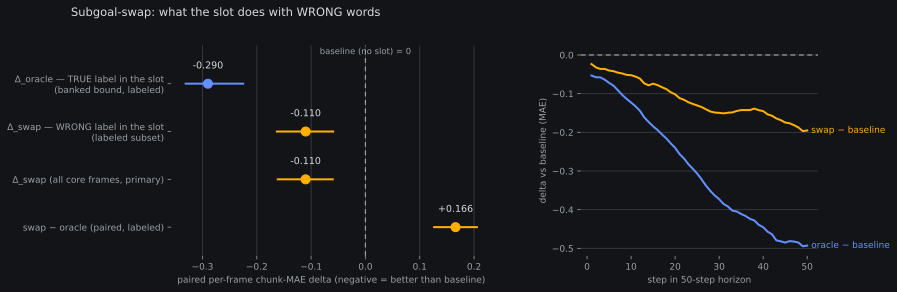

# Subgoal-swap results: the slot reads the words — and also just likes being fed words

*2026-08-09 ~03:5xZ. Results for the
[pre-registered subgoal-swap content read](2026-08-09-prereg-subgoal-swap.md)
— the closer of the presence / channel / **content** triangle from the
[consolidated #6 report](2026-08-09-fieldcond-subgoal-report.md) §6.1.
Zero training; one greedy full-panel pass of AR-100k
(`bijou_arb_rcond_100k_ddp4/step_100000`) on the shared k4l2 plan with
every frame's true segment label replaced by a different episode's
(seed-0 within-dataset Sattolo derangement — format-valid,
content-wrong), paired per-frame against the banked planner-less
baseline 5.8026 / 2.1431 and the banked oracle arm (neither re-run).
Reads produced by `fontaine/scripts/subgoal_swap_results.py`
(oracle-gated: exact-arithmetic fixtures + 10 abort branches pre-data;
all execution oracles green on the real artifacts before any scalar
below was quoted).*

## TLDR

**Both mechanisms are real, so no single row of the frozen table
fires — this is the pre-registered MIXED outcome, recorded without a
decision.** Feeding the slot *wrong-but-plausible* words still beats
feeding it nothing: **Δ_swap = −0.113** chunk MAE [CI95 −0.161,
−0.060], entirely below zero. But the truth beats wrong words by
clearly more: paired on identical frames, **swap − oracle = +0.166**
[+0.127, +0.205], entirely above zero (banked Δ_oracle = −0.290).

In decomposition terms: of the −0.29 the oracle-truth slot is worth,
roughly **40% is a format/prior effect** (any plausible segment-label
text regularizes the decode) and **60% is content** (the words being
*right* is most of the value). The pre-reg's two clean escalation
verdicts both miss: the scorer ladder is *not* chasing a pure format
mirage (content is consumed — row 2 does not fire), but wrong content
is also not neutral-or-harmful (rows 1 and 3 don't fire either; wrong
words still *help*). What a scorer could ever buy is bounded by the
content margin (~0.17), sitting on a format floor (~0.11) that costs
nothing to reach.

## What ran

Four phases in one transient unit (`fontaine-subgoal-swap`, launched
02:13:47Z, rc=0 03:42:36Z, ~1.5 GPU-h ≤ 3 gate):

1. **Live-oracle selftest** (all abort branches fired green);
2. **Identity run** — full panel with ALL swap plumbing live but every
   episode its own donor. **Oracle (ii), the keystone: it
   byte-reproduced the banked oracle-arm npz** over all 25,800 rows,
   every shared column — certifying the swap machinery changes
   nothing but the text in the slot;
3. **Swap arm** — same panel, seed-0 derangement (`_swapsubgoal`);
4. **Mechanical dump check** — oracles (i)+(iv) over all 25,788
   per-frame swap records: derangement bijective, no identity
   mappings, every rendered text equal to the donor episode's
   fraction-matched label. 25,788/25,788 labeled panel rows swapped,
   0 empty-slot renders, 0 datasets skipped.

## The reads (frozen semantics, one command)

| read | value | CI95 |
|---|---|---|
| **Δ_swap, core frames (primary)** | **−0.113** | [−0.161, −0.060] |
| Δ_swap, labeled subset | −0.113 | [−0.163, −0.059] |
| Δ_swap, first-token mirror | −0.023 | [−0.042, −0.006] |
| **swap − oracle, paired (labeled)** | **+0.166** | [+0.127, +0.205] |
| Δ_oracle (banked context, labeled) | −0.290 | [−0.331, −0.225] |

Pooled: swap 5.690 / 2.120 vs baseline 5.8026 / 2.1431 vs oracle
5.512 / 2.090. All 17,204 core frames paired; the labeled subset is
17,192 of them (12 label-less rows decode untouched by construction —
oracle (iii)).

## The horizon fingerprint is the interesting part

The pre-reg predicted a pure format effect "should be horizon-flat".
It is not flat — and that refines the picture rather than muddying
it:

- **oracle − baseline**: first-10 mean −0.081 → last-10 **−0.480**
  (the banked −0.464-shaped late-horizon signature, reproduced);
- **swap − baseline**: first-10 −0.041 → last-10 **−0.175** — the
  same shape at ~36% of the amplitude.

So the late-horizon dive is not exclusively a truth-reading effect.
Two readings are compatible and this arm cannot split them: (a) the
format/prior effect itself compounds over the horizon (a conditioned
decode drifts less, right or wrong), or (b) wrong-*episode* text from
the *same dataset* is still partially right content — "reach toward
the object"-class instructions transfer across episodes. Which leads
to the one caveat worth stating loudly:

**Coincidence caveat (recorded, not adjudicated):** 2,162 of the
25,788 swapped rows (8.4%) drew a donor label *textually identical*
to the frame's true label — short generic labels recur across
episodes. Those rows are "swap" in provenance but true in content,
so the measured Δ_swap slightly *overstates* the pure-wrong-words
effect and +0.166 slightly *understates* the content margin. The
direction of the conclusion is unaffected (the bias runs against the
content reading, which won anyway).

## What this feeds

Recorded against the frozen table, no decision row fires — per the
pre-reg the fallback is record-only. What it settles for the #6
escalation map:

- **Learned-scorer escalations remain coherent** — the slot consumes
  content (row-2's "format mirage" deprioritization does NOT
  trigger). But their realistic prize is the ~0.17 content margin,
  not the full −0.29 bound, because ~0.11 comes free with any
  plausible words.
- **The cheap floor is real and nobody has to pick words well to get
  it.** Worth remembering when costing scorer rungs: the do-nothing
  comparator for any subgoal-selection scheme is now "feed it
  anything plausible", not "feed it nothing".
- The rung-(a) verdict stands unchanged: self-generated subgoals
  (−0.018) recover almost none of either component at ~3× decode
  cost — generation quality, not the slot, stays the bottleneck.

**Not licensed by this read** (each needs its own pre-reg): any
scorer escalation, a coincidence-excluded re-read, cross-dataset
swaps, Molmo2-side swap arms.

Cost: ~1.5 GPU-h of the ≤ 3 gate (identity + swap + checks).
Artifacts: `panel_k4l2_swapsubgoal.{npz,json,html}` + 25,788-row swap
dump + `analysis__subgoal_swap_ar100k_k4l2.json`, all banked.
