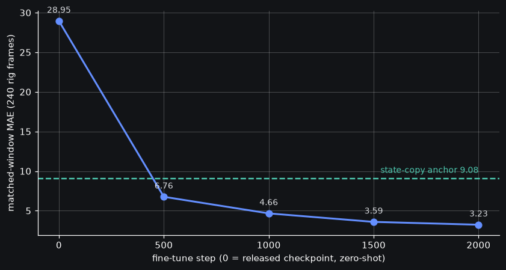
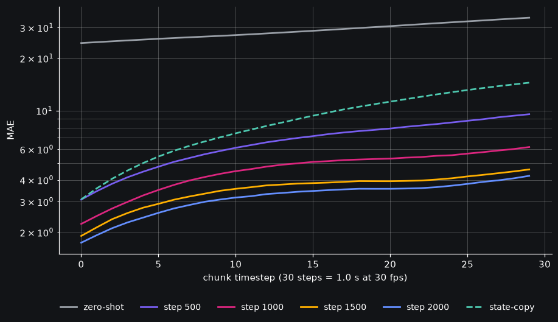
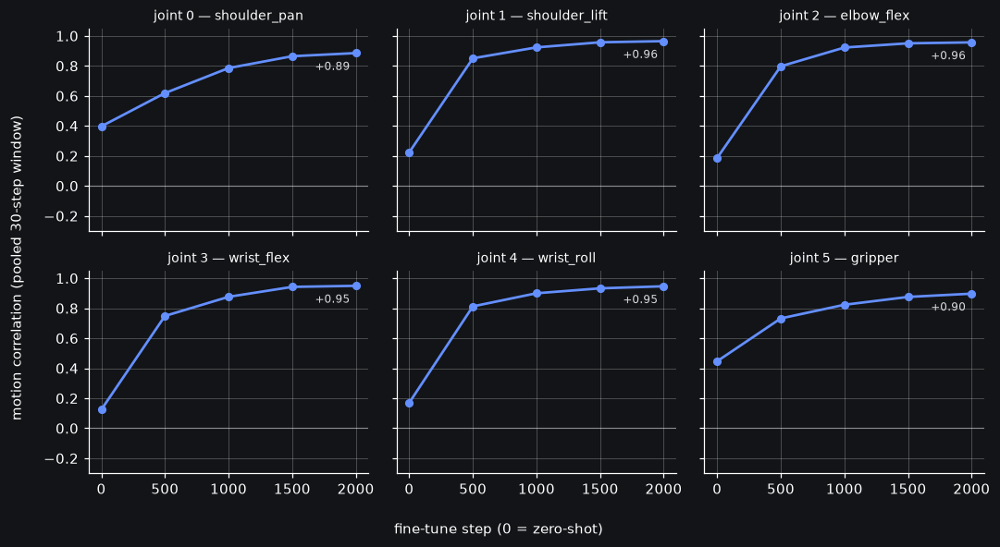

# MolmoAct2 rig fine-tune — results (rig_ft_r1, pre-reg PASS)

*2026-08-10 20:4xZ. Pre-reg:
[prereg-molmoact2-rig-finetune](2026-08-10-prereg-molmoact2-rig-finetune.md)
(+ Amendment 1). Runbook:
[molmoact2-rig-finetune-runbook](2026-08-10-molmoact2-rig-finetune-runbook.md).
Full HTML report:
[anchor-rung report](https://mcobzarenco-fontaine-reports.static.hf.space/eval__fontaine_so101_rig_ae_r1__anchor_rungs.html).*

**The run**: AE-only fine-tune of the released
`allenai/MolmoAct2-SO100_101` on the two owner SO-101 rig repos
(`so101_pick_place_clean` 7 ep + `_v2` 50 ep, LeRobot v3.0
end-to-end, rig-only q01/q99 norm stats). Their `train_lerobot.py`
(branch `fontaine-so101-rig`), 2000 steps, global batch 64, AE lr
5e-5, 577M trainable of 5.5B. Launched 17:48:18Z, rc=0 20:27:44Z,
**~2.7 GPU-h of the 12 GPU-h gate**.

## Headline

**Matched-window MAE 3.23 at step 2000** on the 240 anchor frames —
monotone through every rung, past both pre-registered anchors:

| checkpoint | MAE | vs anchors |
|---|---|---|
| zero-shot (released) | 28.95 | 3.2× worse than state-copy |
| step 500 | 6.76 | beats both anchors at ¼ training |
| step 1000 | 4.66 | |
| step 1500 | 3.59 | |
| **step 2000** | **3.23** | 2.8× better than state-copy 9.08 |

Every pre-registered gate passed: both anchors beaten (expectation 2,
met from rung 500 on), step-0 continuity green every rung (offsets
≤ 0.63 units on 37–280-unit joint spans), all 6 motion correlations
positive at every rung, no hard failures.

## The per-timestep picture

The fine-tuned model beats state-copy at **every** chunk timestep,
not just in the pooled mean — by the end of the 1.0 s window the
step-2000 curve sits ~3.5× below the state-copy line. Zero-shot is
off the top of the chart the whole way: the released checkpoint
predicts sane joint-unit *motion* in the wrong workspace frame
(the posture-collapse mechanism Amendment 1 measured — 97% of rig
frames saturate their joint-1 state encoding), so it never competes
on this rig.

## Amendment 1's prediction, closed

Amendment 1 reclassified the preflight joint-1 tripwire as
posture-collapse-via-state-norm-saturation and predicted rig-only
q01/q99 stats would absorb exactly that gap. They did: joint 1's
motion correlation went **+0.22 → +0.96** across the rungs (offset
+79 → +0.6), and the weakest joint at step 2000 is still +0.89.

## Caveat (pre-registered) and what's next

These are **train-frame sanity reads — contaminated by
construction** (the 240 anchor rows come from the same 57 episodes
the model trained on). They prove the recipe learns this rig's
workspace; they say nothing about generalization. The real eval is
**on-rig rollouts** per runbook §3–4: point the SO-101 server at the
converted dir, no-execute dry-run gate + command clamp before any
motion.

Artifacts: serve-ready HF dir
`~/checkpoints/molmoact2-so101-rig-r1-step2000-hf` (rig norm_stats
baked in); weights delta uploaded to
[fontaine-checkpoints](https://huggingface.co/mcobzarenco/fontaine-checkpoints/tree/main/molmoact2_so101_rig_r1_step2000)
(AE + resized embeddings, trunk deduplicated — 704/707 trunk tensors
verified byte-identical to the released checkpoint); frozen reads
`reports/analysis__molmoact2_rig_ft_step{500,1000,1500,2000}.json`.

Next on this thread: the owner-GO'd
**first-class MolmoAct2 port** (items 1–4, rig-path-first) — action
expert + processing + parity harness + AE fine-tune in our trainer,
which retires the three `train_lerobot.py` patches this run needed.
