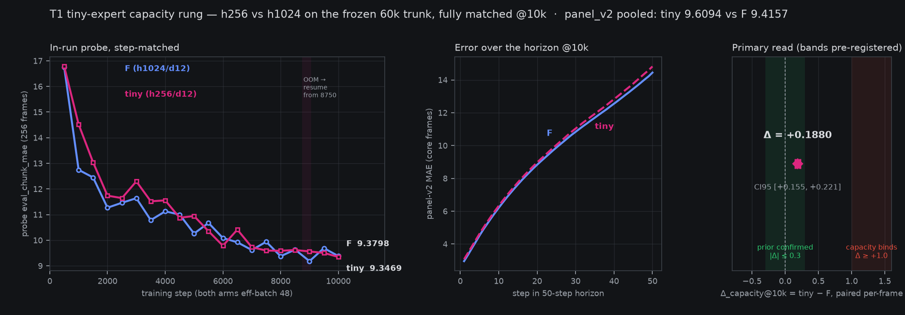

# Tiny-expert capacity rung: prior CONFIRMED at the band — Δ_capacity@10k = +0.188 (#4/#16)

*2026-08-10 05:4x–06:0xZ. The T1 rung
([pre-reg](2026-08-09-prereg-tiny-expert-40k.md), final amendment =
matched-F 10k design) closed 05:06Z with train complete and its
chained panel_v2 eval landing ~05:4xZ; this is the canonical frozen
read — paired per-frame vs the banked F@10k npz via the
oracle-gated `attach_seam_results.py` read-1 machinery pointed at
explicit paths (per the pre-reg), analysis banked in
`analysis__tiny10k_delta_capacity.json`. The "Δ_seam" decision
branches in that machinery do NOT apply here — only the paired read,
the state-copy execution oracle, and the record-only mirrors are
consumed; interpretation runs on the tiny pre-reg's own pinned
bands.*

## The question

Is the flow expert over-provisioned at h1024/d12? The
[Decoupled Action Expert](../papers/decoupled-action-expert.md)
prior says task knowledge lives in the trunk's residual streams, not
the expert — a 5M MLP matched a 244M U-Net there. T1 tests the
width direction on our stack: **h256/d12** (~16× smaller transformer
blocks; tap surface and adapters identical) on the same hard-frozen
60k trunk (sha `e6ed783b` verified at init and at upload), trained
fully matched to F — 10k steps, eff-batch 48 (48×1 local vs F's
12×4 box), same LR schedule, same save cadence.

Measured expert sizes (safetensors headers, record-only read): tiny
**86.8M** params vs F **367.5M** — 4.2× smaller in total, not 16×,
because the tap/adapter surface reading the h2048 trunk streams is
held identical by design and is a fixed cost that dominates the
tiny expert's count. The width contrast is in the transformer
blocks; the conditioning surface is the controlled variable.

## The reads, in pre-reg order

**Primary — Δ_capacity@10k (fully matched):** paired per-frame
chunk_mae, tiny@10000 − F@10000, panel-v2 core frames
(n = 15,056), seeded 10k-resample bootstrap CI95:
**+0.18805 [+0.15527, +0.22139]** — inside the |Δ| ≤ 0.3 band, and the CI excludes zero: the width cost is *real but small* (~2.0% of the panel number; median +0.149, tiny wins 43.2% of frames).
Pooled panel numbers: tiny **9.6094** vs F **9.4157** (chunk);
first_mae 3.0758 vs 2.9581 (mirror Δ +0.1176 [+0.1025, +0.1328] —
same shape as the chunk read).

**Execution oracle (state-copy):** the tiny npz's state-copy rows
byte-match the banked F-side values (hard-abort guard in the read
machinery — the PAIR_KEYS byte-equality check covers the shared
state-copy column). Passed — byte-identical across the box (F) and local (tiny) eval
machines, so the plan, frames, and state-copy column are provably
the same rows. Both arms beat the state-copy
pooled number (11.7639) by the pre-pinned VOID margin, so the read
is live, not void.

**Record-only:** the step-matched probe ladder (chart, left panel) —
tiny trailed F early (expected: same LR schedule on 16× fewer
expert-block params), converged from ~step 6000, and finished
**9.3469@10000 vs F's 9.3798** probe-level; the panel read above is
the one that counts. Per-step-in-horizon curves (chart, middle) —
the tiny gap is late-horizon — Δ per step-in-horizon grows from
+0.106 at step 1 to +0.374 at step 50, i.e. the small expert tracks
F early in the chunk and cedes ground as the horizon extrapolates.

## Interpretation (bands pinned pre-data)

The pre-reg froze: |Δ@10k| ≤ 0.3 → **capacity prior CONFIRMED** at
this scale (tiny is a free ~16× shrink); Δ ≥ +1.0 → capacity binds,
h1024 justified; between → gray zone. **The prior is confirmed at the pinned band:
+0.188 is deep inside |Δ| ≤ 0.3 and nowhere near the ≥ +1.0
capacity-binds line.** Quoted honestly: the CI excludes zero, so
this is not "within noise" — a 4.2× smaller expert (86.8M vs
367.5M) costs a real +0.19 chunk (+2.0%), concentrated late in the
horizon. Width alone does not separate the experts at this scale;
h1024 buys a small, measurable, probably-not-decision-relevant
margin. One more datum for the probe-is-not-a-headline file: the
256-frame probe had tiny *under* F (9.3469 vs 9.3798, Δ −0.069) —
the 15,056-frame panel flips the sign. Small-sample probes kill
runs; panels make claims.

What this re-prices: the fjoint expert (#4) does not need h1024 to
hold the frozen-trunk score — the cheap-expert pole is real capital
for rig inference cost (#16, the north star's deployment side). What
this does NOT test (pre-reg's own list): depth/tap-count (T2's
business), the joint pole (closed by the
[attachment decision memo](2026-08-09-molmo2-stage2-attachment-decision.md)),
and trunk quality (frozen, shared).

## Run record

Train 2026-08-09 20:1xZ → 2026-08-10 05:06Z on the local H100,
~8.7 GPU-h of the 15 gate **including** a host-RAM OOM at step
~9,060 (04:00:55Z, DataLoader-worker RSS class — the second
host-RAM incident of this run, after the step-500 kill at launch
workers 20; workers 10→6 on resume) and
the resume-from-8750 replay (~310 steps, fresh shuffle seed 1 per
the standing resume-seed policy, eval-seed 0 held so the probe
ladder stays comparable). The resumed path converged back onto the
pre-kill curve: 9.37@9000 pre-kill → 9.56/9.50 wobble → 9.35@10000.
Chained panel_v2 @10000: pre-reg args verbatim, k4l2 panel_v2 plan
sha-verified, heun30/draws1/stable, eval ~38 min / ~0.6 GPU-h at ~660 f/min single-GPU — run total ~9.3 of the 15 GPU-h gate.

Artifacts: [panel report (tiny)](https://mcobzarenco-fontaine-blog.static.hf.space/reports/eval__fontaine_molmo2_flow_tiny_h256_10k_1xh100__step_010000__panel_v2_heun30_draws1_stable.html)
· [panel report (F comparator)](https://mcobzarenco-fontaine-blog.static.hf.space/reports/eval__fontaine_molmo2_flow_frozen_10k_ddp4__step_010000__panel_v2_heun30_draws1_stable.html)
· [frozen analysis JSON](https://mcobzarenco-fontaine-blog.static.hf.space/reports/analysis__tiny10k_delta_capacity.json)
· checkpoint `fontaine_molmo2_flow_tiny_h256_10k_1xh100/step_010000`
(weights-only, backbone deduplicated) on
[fontaine-checkpoints](https://huggingface.co/mcobzarenco/fontaine-checkpoints).
