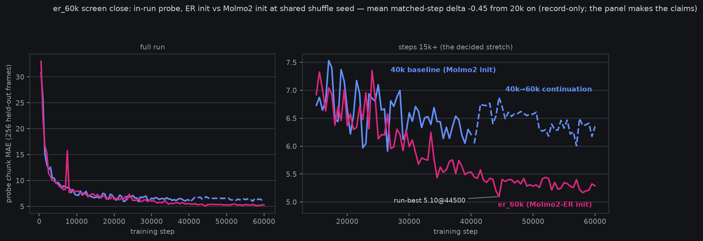
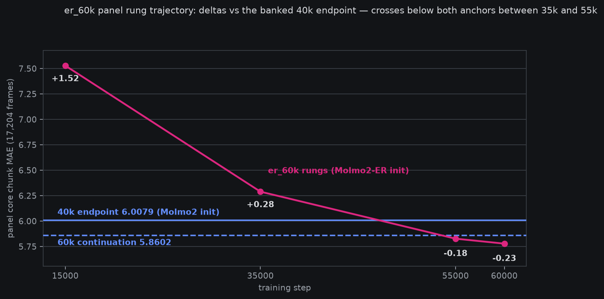
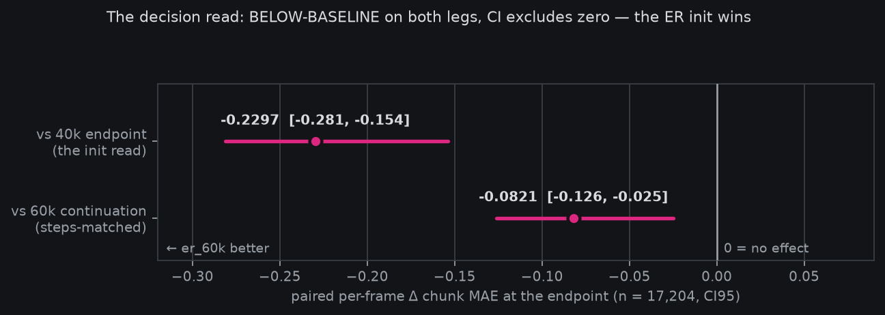

# ER-init screen CLOSED: Molmo2-ER init wins both legs — er_60k/step_060000 is the new reference trunk

*2026-08-11 16:1x–17:xxZ. The consolidated screen-close for
`fontaine_molmo2_er_60k_ddp4`
([pre-reg](2026-08-09-prereg-molmo2-er-60k.md), owner-steered
2026-08-09 22:14Z). The decision read itself landed 2026-08-11
13:28Z and went to the owner in-channel the same hour; this page is
the durable long-form — the full story with the charts, in one
place. All numbers below are read from banked artifacts (panel
JSONs, the frozen decision JSON, and the salvaged train logs — the
4× box that ran this screen was retired 14:37Z the same day).*

> **Plain words.** We train robot-arm models on top of a large
> vision-language model ("the trunk"). Until now every run started
> from the stock Molmo2-4B trunk. AllenAI also publishes Molmo2-ER,
> the same network fine-tuned further on "embodied reasoning" —
> robot-flavored video understanding. Their paper says starting from
> ER made their robot much better; this screen asked whether that
> transfers to *our* stack. We trained our exact recipe from the ER
> weights and compared against two anchors we already had: our best
> 40k-step run from stock Molmo2, and that same run continued to 60k
> steps so the step counts match. The ER-initialized run ended
> better than both, by a margin the statistics say is real, and it
> was never behind after the early noise settled. Every future run
> now starts from this checkpoint.

## The question, and what was at stake

Is `allenai/Molmo2-ER` — MolmoAct2's embodied-reasoning
specialization of our exact Molmo2-4B trunk — a better starting
point than stock Molmo2 for our action-decoder training, holding
*everything else* fixed? The external prior said yes and loudly:
MolmoAct2's own ablation prices the Molmo2 → Molmo2-ER swap at
**+6.0 LIBERO-Long at fixed everything-else**, the largest single
lever in their stack
([deep dive](2026-08-09-molmoact2-deep-dive.md)). But their
downstream is an action-token AR head on their data; ours is our
own decoder recipe on the community-curated corpus. Priors that
size are exactly the ones worth a controlled screen.

The design made the read as clean as our infrastructure allows:

- **Same recipe, verbatim**: the 40k AR launcher re-pinned flag for
  flag (4×H100 DDP, eff-batch 48, FAST v2, same aux/condition
  fields, same LRs and schedule), deltas named in the
  [pre-reg](2026-08-09-prereg-molmo2-er-60k.md).
- **Shared shuffle seed 0** (owner call at launch): identical data
  order removes shuffle variance from the curve comparison — the
  in-run delta *is* the init effect.
- **Verified drop-in init**: the ER config diff vs stock is RoPE
  metadata only; safetensors manifests are key-identical. The whole
  change is `--backbone allenai/Molmo2-ER`.
- **Rig data at natural share**: the owner's two SO-101 datasets
  rode along from step 0 at their natural **0.19%** of the mix (no
  oversampling flag existed; ~0.15 expected visits per rig frame
  over the run). At that share it cannot move the panel — this run
  is an init screen, and the rig ingredient is a separate,
  still-open lever.
- **Two anchors, two legs**: the banked 40k endpoint (stock init,
  the fleet reference) and the 40k→60k continuation (stock init,
  steps-matched). Beating the first says "better than our
  reference"; beating the second says "not just more steps."

## Read 1 — the in-run probe (record-only)

The 256-frame probe at shared seed: chaotic crossings through the
warm-up and mid-run (the two curves swap the lead repeatedly to
~18k), then a clean separation — **mean matched-step delta −0.45
from 20k on**, er_60k run-best **5.10@44500** vs the baseline's
best 5.91@26500. The continuation's probe (dashed) actually drifts
*up* over 40k→60k while its panel number improves — the standing
house lesson applies in both directions: 256-frame probes kill
runs; 17,204-frame panels make claims. The probe was pre-registered
record-only and stayed that way.

## Read 2 — the panel rung trajectory

Four scheduled panel rungs (identical holdout, plan, and decode
settings as the anchors): **7.5284@15k → 6.2892@35k → 5.8269@55k →
5.7782@60k**, i.e. deltas vs the 40k endpoint of **+1.52 → +0.28 →
−0.18 → −0.23**. The 55k rung was the first below-baseline panel
read of the whole ER arc, and the endpoint extended it rather than
regressing — the trajectory crossed both anchor lines between 35k
and 55k and kept going.

## Read 3 — the decision

The pre-registered decision read: paired per-frame Δ chunk MAE at
the endpoint, n = 17,204 core frames, seeded bootstrap CI95, against
both banked anchor npz files (state-copy columns byte-match across
arms, so the frames are provably the same rows):

| leg | pooled | Δ paired | CI95 | classification |
|---|---|---|---|---|
| er_60k endpoint | **5.7782** | — | — | — |
| vs 40k endpoint (6.0079) | | **−0.2297** | [−0.281, −0.154] | BELOW-BASELINE |
| vs 60k continuation (5.8602) | | **−0.0821** | [−0.126, −0.025] | BELOW-BASELINE |

Both legs below baseline with CI excluding zero. The first leg says
the ER-initialized run beats our reference trunk; the second —
the one more steps alone cannot explain — says it beats stock
Molmo2 *at matched steps and matched recipe*. First-frame MAE
mirrors the direction (1.9898 vs 2.1871 / 2.0719). **The ER init
wins. `fontaine_molmo2_er_60k_ddp4/step_060000` is the new
reference trunk.**

## The aux heads across rungs

Panel-side auxiliary-head reads (same JSONs; ~8,987 labeled frames
each), against the continuation's endpoint:

| arm | holding acc | event acc | progress MAE | visible acc |
|---|---|---|---|---|
| er @15k | 0.8989 | 0.8622 | 0.0752 | 0.7037 |
| er @35k | 0.9151 | 0.8755 | 0.0655 | 0.8226 |
| er @55k | 0.9200 | 0.8578 | 0.0604 | 0.8222 |
| er @60k | 0.9148 | 0.8582 | 0.0595 | 0.8221 |
| 60k continuation | 0.8966 | 0.8805 | 0.0589 | 0.8191 |

At the endpoint: **holding** is er-better (+1.8pp), **event** is
continuation-better (−2.2pp), progress and visible are ties. The
event deficit got its own owner-requested follow-up the same day —
the [events one-off report](https://mcobzarenco-fontaine-reports.static.hf.space/report__er60k_events_oneoff.html)
found **63% of the model's event misses are
saw-it-under-threshold**: in a forced-choice probe with `none`
banned, the model names the ground-truth event class on 428/679
missed frames — the miss mode is calibration, not blindness (idea
#23, on ice with a named trigger).

## What this screen does NOT say

- **Nothing about the rig data.** At 0.19% natural share the rig
  datasets are a passenger, and the pre-registered rig-holdout read
  was skipped by its own if-clause (no owner-rig repos in the panel
  plan). The rig-mixture lever (repeat-factor oversampling) remains
  unpriced.
- **Nothing about *why* ER helps** — trunk representation probes
  vs the stock trunk would be a separate screen; the MolmoAct2
  paper's own story (robot-adjacent video pre-training) is prior,
  not evidence from here.
- **The probe overlay is color, not claim** — decision weight sits
  entirely in the paired panel reads above.

## What it re-prices

Every follow-on arm now sits on `er_60k/step_060000` by default:
the AE-attachment work (the owner's every-layer-KV action-expert
implementation, pre-reg pending the main-branch rebase), any
mixture screen, and the eventual rig fine-tune chain. The 40k stock
endpoint stays banked as the historical reference; the continuation
run has served its purpose as the steps-matched control and closes
with this post.

## Run record

Launched 2026-08-09 22:53Z (relaunch at seed 0 after the seed-2
false start was stopped pre-step-1), 4×H100 box, 2.23 s/step steady.
One infra incident against the run's window: the 08-10 07:09–08:25Z
credits outage stalled ticks, not the run. Train complete @60000
2026-08-11 12:36Z; chained panel_v2 eval rc=0 13:28Z; **~153 GPU-h
against the amended 155 gate** (the original 65 was a rate-class
estimate error, amended at first poll per the pre-reg's own
correction note). Weights (step_060000, weights-only) banked to
[fontaine-checkpoints](https://huggingface.co/mcobzarenco/fontaine-checkpoints)
before the box retired; train logs salvaged to the local archive
and used for the probe chart above.

Artifacts:
[endpoint panel report](https://mcobzarenco-fontaine-reports.static.hf.space/eval__fontaine_molmo2_er_60k_ddp4__step_060000__panel_curated_v0_k4l2.html)
· [decision JSON](https://mcobzarenco-fontaine-reports.static.hf.space/analysis__er60k_endpoint_vs_banked_k4l2.json)
· rung reports
[@15k](https://mcobzarenco-fontaine-reports.static.hf.space/eval__fontaine_molmo2_er_60k_ddp4__step_015000__panel_curated_v0_k4l2.html)
/ [@35k](https://mcobzarenco-fontaine-reports.static.hf.space/eval__fontaine_molmo2_er_60k_ddp4__step_035000__panel_curated_v0_k4l2.html)
/ [@55k](https://mcobzarenco-fontaine-reports.static.hf.space/eval__fontaine_molmo2_er_60k_ddp4__step_055000__panel_curated_v0_k4l2.html)
· anchors:
[40k endpoint](https://mcobzarenco-fontaine-reports.static.hf.space/eval__fontaine_molmo2_ar_40k_ddp4__step_040000__panel_curated_v0_k4l2.html)
/ [60k continuation](https://mcobzarenco-fontaine-reports.static.hf.space/eval__fontaine_molmo2_ar_60k_ddp4__step_060000__panel_curated_v0_k4l2.html)
· charts regenerable via
`fontaine/scripts/er60k_screen_close_charts.py` (reads only banked
files).
