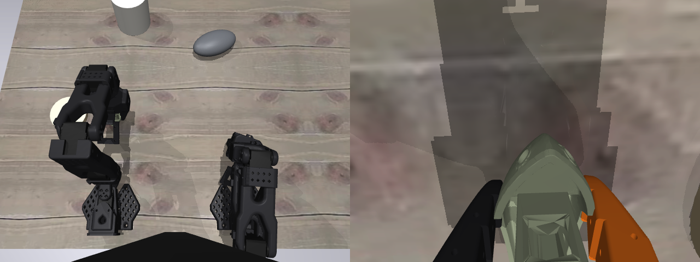
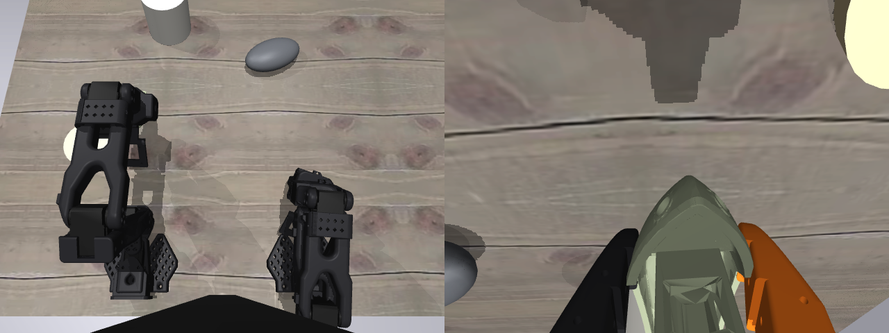

# Sim fixes, batch 1: clean starts, honest grasps — all four findings closed

*2026-08-11 18:4x–19:xxZ work session. Executes the fix list from the
[sim review](2026-08-11-sim-review-findings.md) (findings) and the
[contact-fidelity lit page](../papers/sim-contact-fidelity.md) (named
mechanisms), items 2–4 of that page's pre-reg-order list. This unblocks
the `sim-policy-eval-100seeds` protocol pre-reg; servo sysid (item 1)
is queued next as its own work item.*

> **Plain words.** Yesterday's audit found four problems with our robot
> simulator: the arm physically couldn't fold into the pose real
> episodes start from, the arm sometimes smacked the boat while the
> scene was being set up, the boat wore an invisible ~4 mm "force
> field" that let the gripper shove it before visibly touching it, and
> a gripped boat pivoted in the jaws far too easily. All four are now
> fixed and re-measured with the same probes that found them: episode
> starts are identical across all 100 candidate seeds (zero setup
> collisions), the force field is down to under half a millimeter, and
> the boat now barely rotates in a closed gripper (6.9° → 0.4°). One
> regression appeared along the way — the finer collision skin made
> the resting boat creep across the table — and was traced to the
> physics solver being given too small an iteration budget, not to the
> new skin; raising the budget fixed it at zero speed cost.

## What changed (all measured, before → after)

| Probe read | before | after |
| --- | --- | --- |
| home-pose error, elbow_flex | 19.9° (pinned at force limit) | 6.6° (documented residual, no jam) |
| home-pose error, wrist_roll | 0° or ~15–17°, **seed-dependent** | 0° |
| home-pose error, shoulder_lift | 2.7° (ctrlrange clamp) | 0.1° |
| settled start-state spread across seeds | bimodal wrist_roll | **< 0.003° on every joint** |
| reset strikes (candidate seeds) | 2/20 (up to 30.4 mm displacement) | **0/100** (max 0.7 mm own-settle) |
| phantom margin p99 / max | 3.78 / 5.39 mm | **0.45 / 0.69 mm** |
| collision volume vs visible boat | 1.75× | 1.13× |
| in-grip spin during lift | 6.9° | **0.4°** |
| lift tilt (upright score) | 0.84 | 0.91 |
| rest drift / spin per 10 s | 0.000 mm / 0.000° | 0.001 mm / 0.004° |
| bit-determinism (qpos + renders) | green | green |
| cost per control tick | 26.9 ms | 26.7 ms |

## Fix 1 — the start state: three layers deep

The review blamed the unreachable home pose on the wrist-camera mount.
That was layer one of three:

1. **`camera_box2` ↔ shoulder**: the mount's collision box wedged
   0.46 mm into a shoulder geom, pinning elbow/wrist_flex/wrist_roll
   at the ±2.94 N·m force limit. The real arm demonstrably folds into
   this pose (every recorded episode starts there), so the scene now
   excludes that contact pair (follower + leader). This alone fixed
   wrist_flex and the seed-dependent wrist_roll bimodality; elbow
   error dropped 19.9° → ~9.6°.
2. **wrist ↔ shoulder**: with the mount pair gone, the wrist link's
   own collision geom wedged 0.87 mm into the same shoulder geom —
   same over-approximation class, same evidence, same fix. Elbow
   error → 7.7°.
3. **The model couldn't represent the rig's start state at all**:
   menagerie's `shoulder_lift` range is ±100° but the rig's *median*
   episode start is −102.7° (half the real episodes start beyond the
   sim's limit); elbow_flex 97.0° vs range ±96.8°. Both ranges are
   widened at load (runtime patch, vendored XML untouched, same
   pattern as the arm recolor) — the real servos demonstrably reach
   these values. The servo-sysid item pins final ranges.

The remaining 6.6° elbow residual is *real physics, not a jam*: at
full shoulder lift the jaw tip rests on the table, and folding the
elbow further would push it through. This is the review's second named
cause (zero-perfect sim joints vs the rig's calibration offsets: the
same numeric pose is a slightly different physical pose, and on the
rig the jaw clears where in sim it touches). Per the review's fix
direction, the eval protocol pins the **settled reachable projection**
of the rig median — now bit-reproducible and identical across seeds
(max per-joint spread 0.003° over 12 seeds). The table contact is
deliberately *not* excluded: jaw–table contact is task-relevant.

## Fix 2 — reset never touches the boat (0/100 seeds)

`reset()` now settles the arm **first** (boat parked far down-table,
outside the sweep of the arm rising from `mj_resetData`'s laid-out
pose), then places the boat at its seeded pose and gives it a short
settle of its own. `SO101Sim.reset_strike_contacts` counts arm–boat
contacts during the whole reset — the probe reads it through the
public API instead of hand-replicating the reset sequence (the old
probe re-implemented reset step-by-step, which would have silently
drifted from this change).

Re-verified over seeds 0–99 (the candidate protocol list): first pass
found **4/100 seeds still struck** — a new, subtler channel: at the
settled home the jaw tips rest at x = 0.155 m *inside the old spawn
region*, and a boat spawned at x ∈ [0.17, 0.183] with its 3 cm
half-length could land *on the parked jaw*. The spawn near-bound moved
0.17 → 0.195 (≥1 cm hull-to-jaw clearance); the design target is
preserved (settled initial boat→disk distance over 100 seeds: mean
9.5 cm, range 7.1–12.1 — the tuned-for value was ~9.5 cm). Final read:
**0/100 strikes, max spawn→settled displacement 0.7 mm** (the boat's
own settle).

## Fix 3 — threshold-driven CoACD: phantom margin p99 3.78 → 0.45 mm

Exactly as the lit page prescribed: the conversion now drives CoACD by
its **concavity threshold** (0.05 → 0.015, in the grasping-grade
0.01–0.02 band), removes the 16-hull cap that had forced it to stop at
3× its concavity target, and doubles preprocessing resolution
(50 → 100). Result: 340 hulls, collision volume 1.75× → **1.13×** the
visible boat, phantom margin median 0.34 → −0.06 mm, p99 3.78 →
**0.45 mm**, max 5.39 → 0.69 mm. The gripper now touches the boat
where the cameras show the boat.

340 hulls sounds expensive; measured it is free at this scene scale:
26.7 ms/control-tick vs 26.9 before (render-dominated). The SDF path
(which would also close the CC-BY-ND per-machine asset hazard) stays
a named alternative if hull count ever bites; it was not needed.

## Fix 4 — the jaw seam: priority, not pairs

The review measured the gripper's `priority="1"` silently replacing
the boat's tuned condim-6 friction (torsional 0.05) with its own
near-zero values (5e-3) at every jaw–boat contact. The queue item
called for an explicit `<contact><pair>`; the landed fix is
`priority="2"` on the generated benchy geoms instead, for a concrete
reason: pairs need geom *names*, and menagerie's actual jaw contact
surfaces (`collision_gripper_mesh` class) are **unnamed** in the
vendored XML — a pair list would miss the geoms that do the gripping.
Priority is the same documented override mechanism (the
higher-priority geom's friction is used wholesale), reaches unnamed
geoms, and needs one generated attribute. The rest of the recipe the
fix list asked for — elliptic cones, impratio 10, Newton — was
verified already present in the model options.

Isolated measurement (priority flip alone, old hulls): in-grip spin
6.9° → 2.7°, lift tilt 0.84 → 0.91. Combined with the new
decomposition: **spin 0.4°, tilt 0.91**, penetration 2.5 → 2.2 mm,
still a firm hold (boat rises 7.2 cm with the arm). Friction *values*
stay untuned per SIMPLER Table X.

## The regression the fixes exposed: solver budget, not physics

First full-suite run after the new decomposition: rest drift
**6.2 mm/10 s** (the drift fix's original 0.000 mm read was the
review's one clean bill of health — this was the owner-visible bug
class coming back). Diagnosis ruled out the usual suspects
empirically: more free-joint damping made it *worse* (0.2 → 54.8 mm,
0.5 → 76.4 mm — the creep is a biased contact solve decaying slower,
not jiggle to damp), harder solref did nothing. The actual cause: the
vendored arm model ships `iterations="10" ls_iterations="20"` solver
caps, tuned for a bare arm — the fine decomposition rests ~30–80
simultaneous keel–table contacts and the Newton line search runs out
of budget, leaving a slightly wrong solution every step.
`ls_iterations` 20 → 50 alone collapses the drift to **0.001 mm/10 s
at unchanged tick cost** (caps only bind when the solve is hard; the
scene now sets 50/50 with margin). Lesson worth keeping: *collision
fidelity and solver budget are coupled knobs — upgrading one can
silently invalidate the other's tuning.*

## What this unblocks, and what it does not

- **Unblocked**: the `sim-policy-eval-100seeds` protocol pre-reg. The
  start state is now deterministic, seed-independent, strike-free
  over the candidate seed list, and the initial-distance read is
  clean (mean 9.5 cm, range 7.1–12.1 over seeds 0–99).
- **Still open (queued, `sim-servo-sysid`)**: the 56× kp discrepancy
  vs upstream — SIMPLER's ablation says controller gains are the
  first-order eval-fidelity lever, and the fix-list's item 1 is
  deliberately its own work item. The 100-seed pre-reg may pin
  current gains as explicit "v0 physics" if the owner prefers speed.
- **Unchanged**: cross-machine asset reproducibility (assets are
  still per-machine builds; the protocol pins one eval machine +
  menagerie SHA, or adopts SDF later); `success()`'s missing
  gripper-open check (distance is the primary metric; noted for the
  pre-reg's success-rate column).
