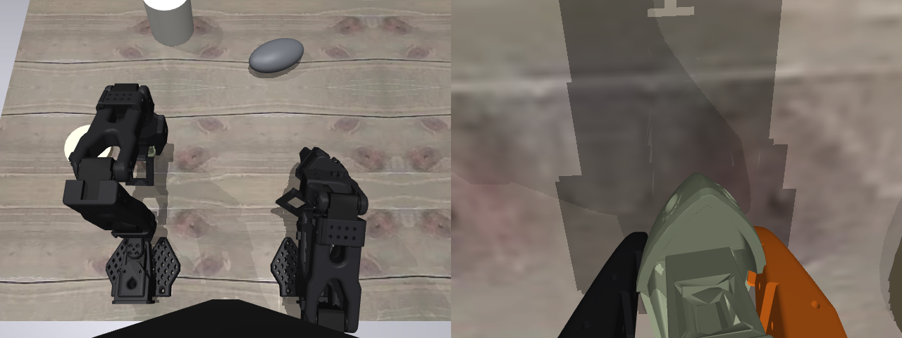
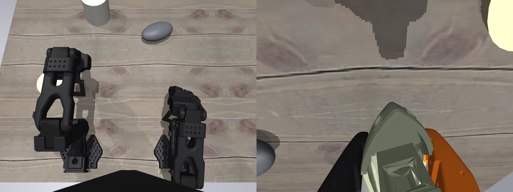

# Sim review: what the SO-101 digital twin gets right, and where the boat physics actually hurts

*2026-08-11 17:4x–18:xxZ work session. Owner directive 17:07Z: next-day
focus is simulations — review `sim/` first, findings before fixes,
feeding the 100-fixed-seed policy-eval protocol. Everything below is
measured this session with two new committed probes
(`sim/probe_benchy_contact.py`, `sim/probe_phantom_volume.py`); nothing
is from memory of the sim's development sessions.*

> **Plain words.** We have a small physics simulation of the robot rig:
> the arm, the table, the toy boat it must pick up, and the wooden disk
> it must place the boat on. Before trusting it to score our robot
> policies on 100 repeatable scenarios, we audited it. The good news:
> the plumbing between the sim and the policy is exactly right (same
> cameras, same joint conventions, same normalization), everything is
> perfectly repeatable, and it's fast. The bad news, in order of how
> much it distorts an eval: (1) the arm's episode-start pose is wrong
> by up to 20° on some joints — the model that holds the arm together
> physically can't fold into the pose the real arm starts episodes in,
> so every episode opens in a state the policy never saw; (2) in a
> tenth of the scenarios the arm smacks the boat while the scene is
> still being set up; (3) the boat's invisible "collision skin" is up
> to ~5 mm fatter than the visible boat, so the gripper shoves it
> before appearing to touch it; and (4) a gripped boat can pivot and
> tilt in the jaws more easily than a real 40 g print would. All four
> have clean fix directions; none block a *relative* comparison
> between policies, but (1) and (2) should be fixed before the
> registered 100-seed eval.

## What was reviewed

The `sim/` package (737 LOC, prototype-graded): `so101_sim.py` (env),
`rollout_sim.py` (closed-loop bijou rollouts), `convert_benchy.py`
(asset conversion), the task scene `bijou_pickplace.xml`, plus probes
and the asset fetcher. Scene: menagerie `robotstudio_so101` follower +
leader arms on the owner-measured table geometry, top + wrist cameras
matched to the rig's mounts, wooden disk, freely floating benchy with
CoACD convex-decomposed collision geometry, seeded spawn + color
randomization.

## The seam to the policy is right (all checks green)

This is the part that had to be exactly right and is:

- **Cameras.** The sim names its cameras `top` and `wrist`. The rig
  dataset recorded the overhead view under a `front` key — but the
  camera-kind judge stamped that camera **kind = top** (32–18 vote,
  `meta/camera_kinds.json`), and training prompts use the *kind*, not
  the name. The collator also orders images by `(kind, name)`, so
  training (`front`→top, `wrist`) and sim (`top`, `wrist`) produce the
  same prompt tags in the same order. No mismatch.
- **State/actions.** 6-dof degrees in bus order
  (`shoulder_pan`…`gripper`) on both sides; `rollout_sim` builds items
  through the *same* `observation_to_item` as the physical rollout
  path, with per-dataset stats resolved from the checkpoint.
- **Stats for the candidate policy.** `er_60k/step_060000` (local at
  `~/checkpoints/er_60k/`) carries `mcobzarenco/so101_pick_place_v2`
  in its 880-entry normalization table; chunk 50, state_dim 6.
- **Determinism (measured).** Same seed + same action sequence ⇒
  **bit-identical** `qpos` *and* bit-identical rendered frames.
  er_60k decodes actions AR-greedy (no flow noise), batch size 1
  always ⇒ the policy side is deterministic too. A 100-seed eval is
  exactly reproducible on one machine.
- **Cost (measured).** 26.9 ms per control tick including both camera
  renders ⇒ ~12 s sim-side per 15-replan episode, **~20 min for 100
  seeds** plus policy inference. Cheap enough to run variants.

## Finding 1 — the episode-start pose is unreachable (biggest policy-facing gap)

`reset()` drives the arm toward `HOME_DEGREES` — the median first-frame
`observation.state` of the real teleop episodes — and the docstring
assumed 1 s settles it. Measured end-of-reset error, and after **+3
extra seconds** of driving:

```
joint          target   error@reset  error@+3s
shoulder_lift  -102.7      2.7          2.7     (known ctrlrange clamp)
elbow_flex       97.0     19.9         19.0     (persists = steady-state)
wrist_flex       78.7      6.0          7.6
wrist_roll       77.6     17.5 or 0    14.8/0   (bimodal across seeds)
```

The error is *not* transient. Diagnosis: at the folded home pose the
wrist-camera mount's collision box (`camera_box2`, on `camera_mount`)
is **jammed 0.46 mm into a shoulder collision geom**, and
`elbow_flex`, `wrist_flex`, `wrist_roll` all sit **pinned at the
±2.94 N·m actuator force limit** pushing against it. The menagerie
model physically cannot fold into the pose the real arm demonstrably
starts episodes in (every real episode opens there). Two candidate
causes, probably both: the camera-mount collision box over-approximates
the real bracket, and the sim's zero-perfect joints vs the rig's
calibration offsets mean the same numeric joint vector is a slightly
different physical pose (the known ~2.7° shoulder_lift clamp is the
same class). The `wrist_roll` bimodality (0° or ~15° error depending
on seed) is stiction against that jam releasing or not — it makes the
*start state itself* seed-dependent, which a fixed-seed protocol must
not have.

Policy impact: every sim episode opens ~20° off the training start
distribution on elbow, with a visibly different wrist camera pose.
For a policy evaluated zero-shot from real-rig training data, that is
a systematic domain shift injected *before the first action*.

Fix directions (not executed — findings-first): exclude the
camera-mount↔shoulder contact pair (or shrink `camera_box2`), and/or
re-derive `HOME_DEGREES` as the *reachable* projection of the rig
median; re-measure; then pin the settled start state in the eval
protocol.

## Finding 2 — the arm strikes the boat during reset (2/20 seeds)

`mj_resetData` zeroes the joints, which lays the arm out *over the
workspace*; `reset()` then drives it up to home while the boat is
already spawned. Measured over seeds 0–19: **2 seeds (10%) have
arm–boat contact during the settle**, knocking the boat up to
**30.4 mm** from its seeded spawn before the episode starts. So the
"fixed seed ⇒ fixed initial condition" property silently fails for a
tenth of seeds, and the seed-2 class of reset (arm pose differing
after contact) is downstream of the same event.

Fix direction: spawn the boat *after* the arm settles (or start the
drive from a keyframe already near home). One-line-class change;
re-verify strike count = 0/100 over the protocol's seed list.

## Finding 3 — the boat's phantom collision skin (~0.3 mm typical, ~4–5 mm worst)

The CoACD decomposition (16 hulls) already fixed the worst of the
original single-hull problem (2.63× volume). Remaining, measured by
sampling the collision surface against the visual mesh:

- collision volume 27.4 cm³ vs 15.7 cm³ visible boat = **1.75×**;
- phantom margin: **median 0.34 mm, p90 1.85 mm, p99 3.78 mm, max
  5.39 mm**; 74% of the collision surface sits outside the visible
  boat;
- CoACD's own convergence log: at the 16-hull cap max concavity is
  **0.149**, 3× the requested 0.05 (the deck/cabin/bow concavities
  are still bridged).

Concretely: a fingertip approaching the deck or bow can shove the
boat ~4–5 mm before visual contact — likely a big share of the
owner-observed "batting". Fix direction: raise `COACD_MAX_HULLS`
(32–64) / lower the threshold and re-measure the margin distribution;
contact cost stays trivial at this scene scale.

## Finding 4 — the grasp seam: penetration is fine, torsion is weak

Scripted pinch test (boat teleported between the jaws at menagerie's
pickup pose, close, then lift — frames below):

- open-jaw settle: zero contact, boat still;
- close + hold: max penetration **2.5 mm**, boat nudged 9 mm, stays
  upright — acceptable for 15 mm-thick jaws on a 31 mm beam;
- lift + hold 2 s: boat **held** (rose 7.4 cm with the arm), but
  **pivoted 6.9° in the jaws and tilted to upright 0.84 (~33°)**,
  peak speed 0.64 m/s — snappier and loosier than a real 40 g PLA
  print in rubber-less jaws would move, but not a drop.

Cause worth knowing: the gripper collision class sets `priority="1"`,
so at every gripper↔boat contact **the gripper's friction wins** —
torsional 5e-3, rolling 5e-4 — and the boat's carefully tuned
condim-6 friction (torsional 0.05, from the drift fix) is *ignored
exactly at the seam that matters*. The drift fix itself is healthy:
10 s untouched after settle = **0.000 mm drift, 0.000° spin**.

Fix direction: give the benchy geoms `priority="2"` (or raise the
gripper class's torsional friction); re-run the pinch probe and
compare spin/tilt.





## Infrastructure notes (for the protocol pre-reg)

- **Assets are per-machine artifacts.** `fetch_assets.sh` clones
  menagerie at **unpinned `main`** and regenerates the CoACD
  decomposition locally (benchy is CC BY-ND — converted meshes are
  deliberately not committed). Different machines/versions can produce
  different collision geometry ⇒ *cross-machine* trajectory
  reproducibility is NOT guaranteed even though same-machine runs are
  bit-identical. The 100-seed protocol must pin: one eval machine, the
  menagerie SHA (fix the placeholder), and the asset-build tool
  versions — or bank the generated meshes privately.
- This box needed EGL runtime libs installed (`libegl1` +
  `libnvidia-gl-580`) before the renderer would start; now done and
  renders run on the H100 (inference-only steer respected — rendering
  is the sim's own workload).
- `success()`'s docstring claims a gripper-open check that the code
  does not implement — success can latch while the boat is still
  gripped on the disk, and its `still` clause reads *all* joint
  velocities (an arm still moving blocks success). Neither hurts the
  *distance* metric the owner named as primary; both matter if success
  rate is reported alongside. Also: the eval's initial distance should
  be read *after* settle (as `rollout_sim` already does), which makes
  the metric robust to Finding 2's displacement but not to its arm
  perturbation.

## What this feeds

The 100-seed protocol pre-reg (`sim-policy-eval-100seeds`, blocked on
this review) should: fix Findings 1–2 first (they corrupt the start
state itself), re-verify 0 reset strikes over the registered seed
list, pin the asset/machine story, define the primary read as
initial−final (or initial−min) benchy→disk distance from the settled
state, and caveat grasp-phase physics (Findings 3–4) as
sim-fidelity-limited until the phantom-margin and torsion fixes land
and re-measure. Sim-side cost is ~20 min per policy — variants are
affordable.
