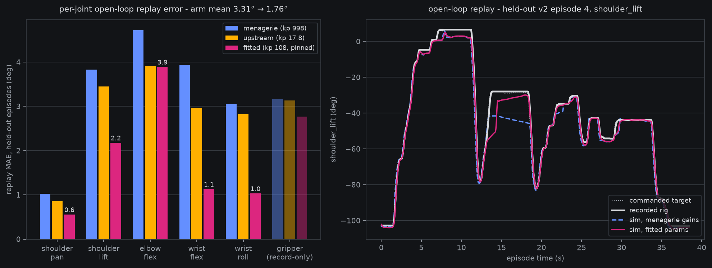

# Servo sysid: the 56× kp question answered — replay error 3.31° → 1.76°

*2026-08-11 19:2x–2x:xxZ work session. Closes `sim-servo-sysid`, the
last physics item ahead of the `sim-policy-eval-100seeds` protocol
pre-reg. Follows the [sim-as-eval lit page](../papers/sim-as-eval.md)
(SIMPLER: controller gains are the FIRST-order eval-fidelity lever) and
the [sim fixes batch 1](2026-08-11-sim-fixes-batch1.md) contact work.*

> **Plain words.** Our simulator and the robot's own manufacturer
> disagree by a factor of 56 about how stiff the arm's servo motors
> are, and nobody had measured which value is right. We settled it with
> data we already own: take real recorded episodes, feed the same motor
> commands into the simulated arm, and check how closely the simulated
> joints retrace what the real joints actually did. The vendored
> stiffness turns out to be badly wrong — it makes a motor that slams
> to its force limit at the slightest error, then can't hold a raised
> arm posture where the real arm holds steady. Fitting six physical
> parameters against the recordings cut the retrace error roughly in
> half on episodes the fit never saw, and the fitted values are now the
> simulator's defaults. Every safety check from the last batch of sim
> fixes was re-run and still passes — one number even improved: a
> gripped boat now twists only 0.1° in the jaws instead of 0.4°.

## The question

The vendored menagerie model drives every STS3215 with
`kp 998.22, kv 2.731, forcerange ±2.94`; TheRobotStudio's own MJCF for
the same servo says `kp 17.8, kv 0, ±3.35`. At kp 998 with a ±2.94 N·m
force clamp, the actuator saturates at **0.17° of position error** — a
bang-bang force-clamped servo, not a proportional controller. The
[sim review](2026-08-11-sim-review-findings.md) measured exactly that
signature on the rig-median home pose (joints pinned at ±2.94). SIMPLER's
ablation says this is the parameter class that moves sim-vs-real eval
fidelity most (control loss 0.131→0.432 moved MMRV 0.031→0.100), so it
had to be answered before the 100-seed protocol pins "v0 physics".

## Method (SIMPLER's recipe, our data)

Open-loop replay, `sim/sysid_servo.py`: reset the sim arm to a recorded
episode's first `observation.state`, then feed the episode's recorded
`action` stream (absolute joint targets, degrees, 30 Hz) tick-for-tick
into the position actuators and score the sim joint trajectory against
the recorded `observation.state` stream — mean absolute error in
degrees over the **5 arm joints** (the gripper is contact-coupled: real
episodes close it onto a boat the arm-only replay doesn't carry;
reported record-only).

- **Fit set** (train-side): clean ep 0; v2 eps 0, 7, 20, 30, 47.
- **Validation set**: the er-60k deterministic episode holdout
  (fraction 0.1, split-seed 0) — clean ep 2; v2 eps 1, 4, 10, 36, 44.
  Same split the policy evals use; every headline number below is
  validation.
- **Fitted params** (shared by all six servos, log₁₀ space, 6-D):
  kp, kv, forcerange, joint damping, frictionloss, armature. Optimizer
  is a dependency-free coordinate descent (golden-section per
  coordinate, 4 shrinking sweeps, ~240 objective evals), two starts.
- **Scale to read errors against**: the real servo itself trails its
  own commands by 2.19° mean (`|action[t] − state[t+1]|` on val) — a
  sim that *teleported* to each command would score ≈ that. Beating it
  requires actually modeling the lag.

## Results (validation = held-out episodes, arm-joint MAE)

| candidate | kp | kv | force | damping | friction | armature | fit MAE | **val MAE** |
| --- | --- | --- | --- | --- | --- | --- | --- | --- |
| menagerie (vendored) | 998.22 | 2.731 | 2.94 | 0.60 | 0.052 | 0.028 | 2.74° | **3.31°** |
| upstream (TheRobotStudio) | 17.8 | 0 | 3.35 | 0.60 | 0.052 | 0.028 | 2.40° | **2.80°** |
| fitted, start=menagerie → **pinned** | 108.2 | 13.38 | 3.48 | 0.72 | 0.018 | 0.204 | 1.47° | **1.76°** |
| fitted, start=upstream | 8.80 | 0.52 | 1.97 | 0.60 | 0.043 | 0.036 | 1.32° | **1.90°** |

Reads:

- **The vendored gains are the worst candidate measured** — worse than
  a servo that teleports to its target (3.31° vs the 2.19° lag scale).
  The failure mode is visible in the overlay: holding a raised
  shoulder posture (t≈13–18 s), the bang-bang servo sags ~19° below
  the commanded plateau while the real arm holds it.
- **Upstream's published gains are closer to the truth than
  menagerie's** — the 56× question resolves in upstream's favor
  directionally, but neither is right.
- **The fit halves the error**: 3.31° → 1.76° (−47%) on episodes it
  never saw, and beats the teleport scale — the lag dynamics are
  genuinely modeled. Per-joint: shoulder_pan 1.02→0.56,
  shoulder_lift 3.83→2.18, wrist_flex 3.93→1.13, wrist_roll 3.06→1.03.
- **Two very different solutions score close** (kp 108/kv 13.4 vs
  kp 8.8/kv 0.52): at 30 Hz observability there's a stiffness/damping
  ridge. The kp-108 fit wins validation and is the pin. Its large
  armature (0.204 vs 0.028) reads as the servo's reflected gear-train
  inertia, which the vendored model essentially omits.
- **Elbow_flex barely improves** (4.72→3.89) — the residual is
  dominated by the un-modeled boat payload and the settled-home
  geometry (jaw-on-table projection), not by servo gains.

## What's pinned

`sim/so101_sim.py` now applies **`SERVO_SYSID`** (kp 108.18, kv 13.377,
forcerange ±3.478, damping 0.722, frictionloss 0.0183, armature 0.2045)
to all twelve STS3215 actuators (both arms) at model load — same
runtime-override convention as the widened joint ranges; the vendored
XML is untouched. Full numbers + per-candidate scores banked in
[`analysis__sim_servo_sysid.json`](https://mcobzarenco-fontaine-reports.static.hf.space/analysis__sim_servo_sysid.json)
(local: `outputs/sim/sysid_servo.json`).

**All sim-fixes gates re-verified under the new params** (probe suite
re-run): reset strikes **0/100**, settled start state **bit-identical
across seeds** (spread 0.0000°), rest drift 0.001 mm / spin 0.004° per
10 s, pinch → lift **held** with in-grip spin **0.1°** (was 0.4°),
upright 0.91, penetration ~2.6 mm, qpos + render bit-determinism green,
28.0 ms/control-tick (~+5%; 100-seed eval still ~21 min sim-side). The
settled home elbow residual grows 6.6° → 7.1° (softer, truer servo
sags slightly more; the pre-reg pins the settled state either way).

## Limitations (stated, not hidden)

- The replay carries **no payload** — grasp-phase arm loading (~40 g
  boat) is unmodeled; elbow_flex's residual is the visible cost.
- The sim tick is 35 ms vs the rig's 33.3 ms; fitting tick-for-tick
  absorbs the ~5% timebase skew into the gains — the right choice for
  eval use, but these are *effective* sim parameters, not bench-true
  servo constants (BAM-style rig measurement would be the upgrade).
- One shared parameter set for six differently-loaded joints; per-joint
  gains are the obvious next rung if elbow fidelity ever gates.

## What this feeds

The `sim-policy-eval-100seeds` pre-reg pins **v0 physics = widened
joint ranges + solver caps 50/50 + the 340-hull asset build + this
SERVO_SYSID set**, with the replay-MAE table above as the measured
justification. The SIMPLER-recommended sysid-before-freeze is done;
the protocol pre-reg is next in the queue with nothing blocking it.
