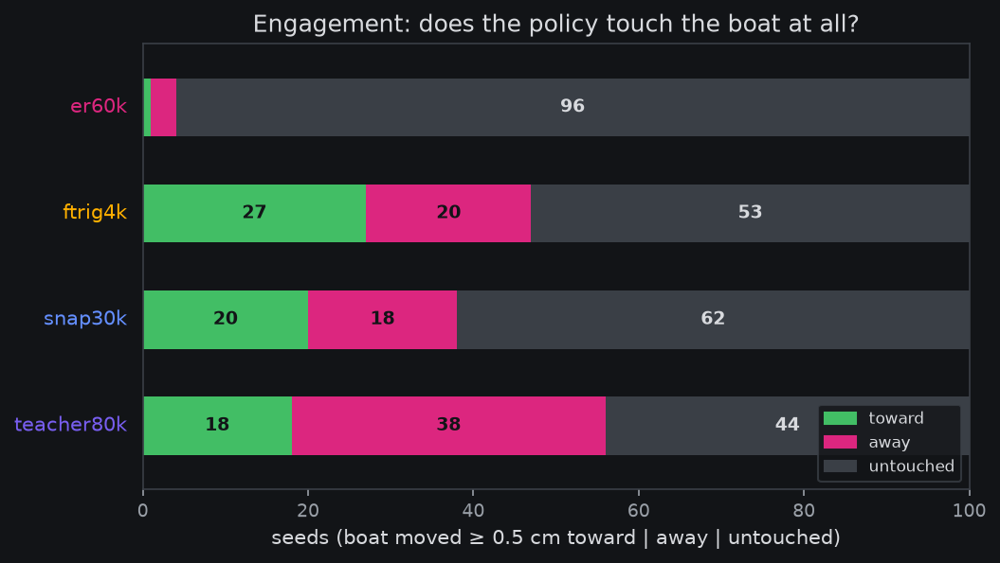
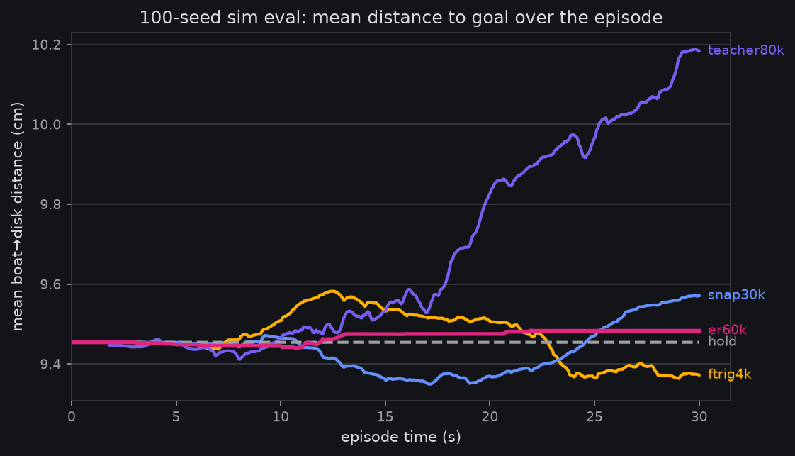
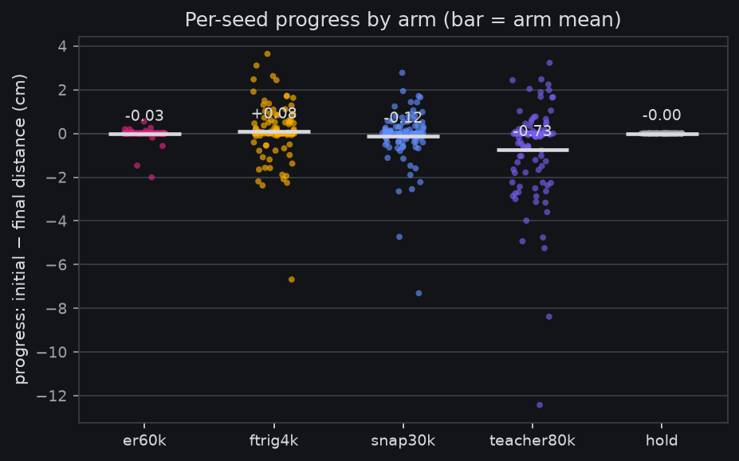

# 100-seed sim eval results: nobody picks up the boat yet — but the sim already separates policy families

*2026-08-12, closing
[the 100-seed pre-reg](2026-08-11-prereg-sim-policy-eval-100seeds.md)
(owner goal 17:07Z 08-11) + the phase-2 owner amendment (22:58Z:
"kill the arms, let's try some other policy to see if we ever get
more than 0 success"). Record-only throughout. Full artifacts:
[HTML report + video gallery](https://mcobzarenco-fontaine-reports.static.hf.space/report__sim100_seed_eval.html)
·
[analysis JSON](https://mcobzarenco-fontaine-reports.static.hf.space/analysis__sim100_seed_eval.json).*

## Plain words

We drove five different robot-control policies through the same 100
simulated episodes of the pick-up-the-boat task and measured, for
each, how much closer to the goal disk the boat ended up. The
headline is a clean negative with a real finding inside it: **no
policy ever completed the task** (0/500 successes overall), but the
policies differ sharply in *how they fail*. Our strongest offline
model (`er_60k`) reaches confidently over the table and never makes
contact (boat untouched on 96/100 episodes). The flow policies all
make contact — the big 80k teacher the most of anyone (56/100) —
but contact without sight is a coin toss at best: the teacher knocks
the boat *away* twice as often as toward the goal, ending
measurably worse than doing nothing. The only arm whose contact
tilts *toward* the goal is the student fine-tuned on the owner's own
rig recordings — the one policy whose training pixels look like this
scene. Competent on real recordings, contact without direction in
sim, and goal-directedness appearing exactly where the training
pixels match — that points at the *pictures* the sim renders, not at
the policies or the physics. The next lever is
visual matching: making the sim's camera views look like the real
rig's, which the SIMPLER line of work found is exactly what makes a
sim a trustworthy policy meter.

## What ran

Two phases, one protocol
([pre-reg](2026-08-11-prereg-sim-policy-eval-100seeds.md); frozen
seeds 0–99, 30 s horizon, 30-step replan, paired design, v0 physics
with the sysid'd servos):

- **Phase 1** (as registered): `er60k` (the reference trunk,
  heun-10) + `hold` floor; the er15k/35k/55k ordering rungs were
  killed by the owner amendment after arm 1's negative landed —
  ordering read moot, auto-skipped by the frozen reads.
- **Phase 2** (owner's picks, 23:44Z relaunch): `ftrig4k` (snapflow
  student fine-tuned on the rig repos, euler-1), `snap30k` (base
  distilled student, euler-1), `teacher80k` (the artrunk 80k flow
  teacher, heun-30). One instrument delta, owner-acked: a
  `--method euler|heun` flag on `rollout_sim` + stable per-replan
  noise keying.

Cost: ~2.0 GPU-h (phase 1) + ~3.5 (phase 2) vs the 6 + 4 gates;
strikes 0/500, hold floor −0.00002 cm — both validity gates green.

## The table

| arm | policy | mean progress (cm) | median | mean best-point | moved ≥0.5 cm | best seed | success |
|---|---|---|---|---|---|---|---|
| `er60k` | er_60k trunk, heun-10 | −0.03 | −0.00 | +0.02 | 4/100 | +0.55 | 0/100 |
| `snap30k` | distilled student, euler-1 | −0.12 | +0.00 | +0.33 | 38/100 | +2.78 | 0/100 |
| `ftrig4k` | student + rig fine-tune, euler-1 | +0.08 | +0.01 | +0.52 | 47/100 | +3.64 | 0/100 |
| `teacher80k` | artrunk 80k teacher, heun-30 | −0.73 | −0.04 | +0.58 | 56/100 | +3.23 | 0/100 |
| `hold` | zero-action control | −0.00 | −0.00 | +0.00 | 0/100 | — | 0/100 |

**Progress** = initial − final boat→disk distance (cm, XY), the
pre-registered primary; **best-point** = initial − minimum over the
episode (near-misses that got undone still count here). Success
carries the pre-declared caveat (the sim `success()` lacks its
documented gripper-open check) — moot at 0 across the board.

## The finding: engagement tracks visual familiarity, not offline strength

Offline, `er_60k` is our best policy (panel MAE 5.78 vs state-copy
8.3) and the students sit *behind* it on real-frame reads. In sim
the order inverts, and it inverts along a visual-familiarity axis:

- `er60k` — trained overwhelmingly on community rigs: **4/100**
  episodes with any boat contact; videos show smooth, confident
  reaching *over the table, never at the boat*.
- `snap30k` — same community data, different family (distilled flow
  student): **38/100** with contact, mean best-point +0.33.
- `ftrig4k` — the same student *fine-tuned on the owner's rig
  episodes* (visually closest to the sim's rig-replica scene):
  **47/100**, 27 toward vs 20 away, mean best-point +0.52, best
  single push +3.64 cm.
- `teacher80k` — the strongest offline flow policy, no rig data:
  **56/100** with contact, the most of any arm — but misdirected: 18
  toward vs **38 away**, mean −0.73 cm, worst seed −12.4 cm. It
  finds the boat constantly and knocks it off the workspace.

So the two axes separate: within the flow family, offline capability
buys *contact* (38 → 47 → 56 as the policies get stronger or more
rig-tuned), but only visual familiarity buys *direction* — ftrig4k
is the sole arm with toward > away and a positive mean.

Paired per-seed reads (bootstrap CI95): ftrig4k − snap30k +0.20
[−0.13, +0.53] on final progress (CI spans zero — the *contact*
gradient is the robust read at n=100, the mean-progress gap is not);
er60k, snap30k, ftrig4k vs `hold` all span zero. The only
CI-excludes-zero reads in the study: **teacher80k − hold −0.73
[−1.18, −0.34]** and teacher80k − er60k −0.70 [−1.16, −0.29] — the
strongest offline policy is measurably *worse than doing nothing* in
the raw sim.

## Is it really the visual gap? (owner question, 01:11Z)

The evidence says mostly yes, with a caveat worth keeping:

1. These same checkpoints are good on real pixels offline; "bad
   checkpoints" would act badly everywhere, not selectively in sim.
2. The teacher arm was the built-in checkpoint-quality control, and
   it answered: the strongest offline policy finds the boat 56/100
   times, so "checkpoints too weak to act" is dead. What it lacks is
   *direction* (2:1 away), and direction appears exactly in the one
   arm trained on rig-like pixels — the gap fingerprint, since
   physics is identical across arms.
3. The caveat: grasp-phase physics *is* still fidelity-limited
   (phantom collision margin, gripper friction override — the
   sim-review findings), so even a visually-matched policy may top
   out at push-the-boat rather than pick-it-up until those bite.

Two follow-ups queued: an **encoder OOD probe** (~0 GPU-h: sim
frames vs real rig frames through the frozen vision trunk — is sim
far out-of-distribution, per camera?) and **`sim-visual-matching`**
(SIMPLER's green-screen/texture-matching recipe: bake the real
top-cam background + table into the scene, color-match boat and
disk, match camera pose). Both go into one pre-reg next session.

## Videos

The
[report's gallery](https://mcobzarenco-fontaine-reports.static.hf.space/report__sim100_seed_eval.html)
has best/median/worst clips per arm; the er60k "reach-but-miss"
clips are the money shot — watch the arm sweep a clean arc 5 cm
above the boat — and the teacher's worst seed (−12.4 cm) shows the
opposite failure: plenty of contact, no idea where the goal is.

## What this feeds

- The v0 sim is **not yet a policy meter for offline-trained
  checkpoints** — the pre-registered ordering read died with the
  rung arms, and the family inversion says raw-sim numbers would
  mislead if read as policy quality.
- It IS already a **behavioral testbed**: deterministic, 0 reset
  strikes in 500 episodes, a clean metric floor, and enough
  sensitivity to separate policy families and detect the rig
  fine-tune's contact bump.
- `sim-visual-matching` is the named lever for the owner's
  ≥1-success goal; the encoder OOD probe is the cheap check that
  the lever points the right way.
