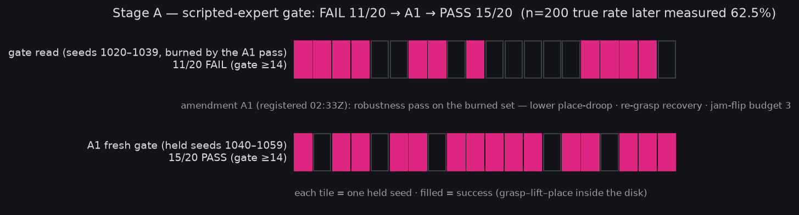
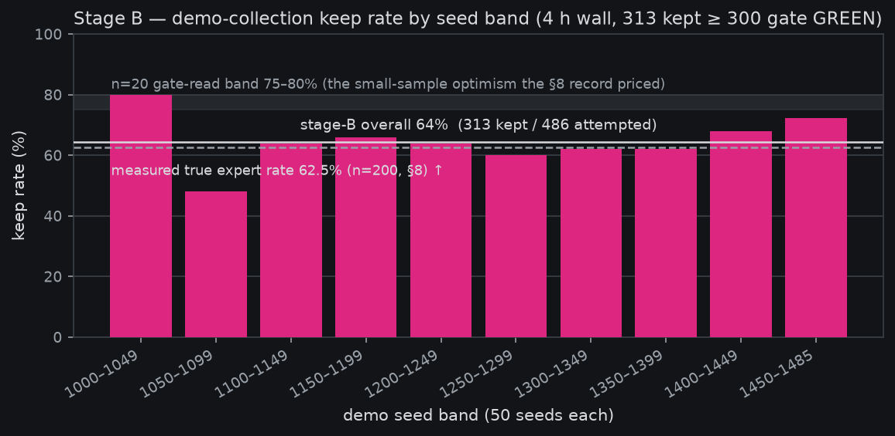
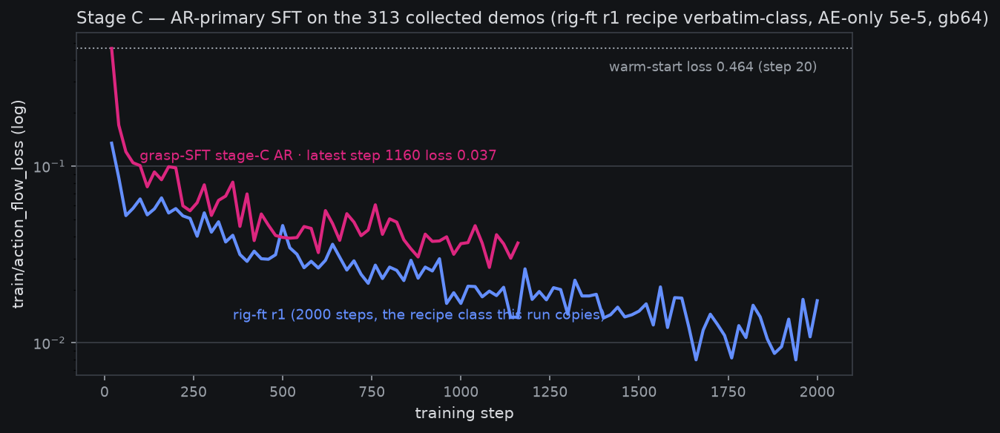
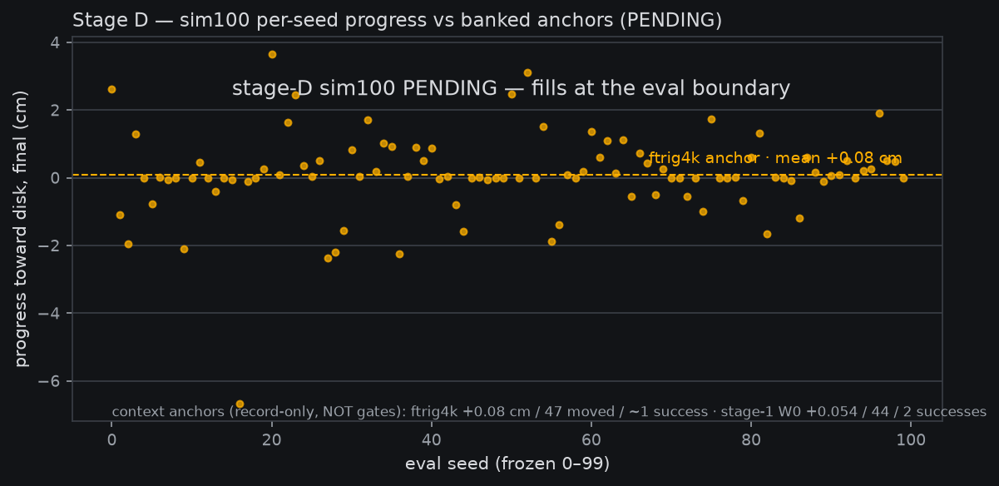

# Grasp-SFT bootstrap — the chain, end to end (stage D pending)

*2026-08-15, drafted ~09:2xZ during the stage-C ride (pre-reg:
[grasp-SFT bootstrap](2026-08-14-prereg-grasp-sft-bootstrap.md)).
Status: **DRAFT — stages A–C are banked fact; the stage-D sim100
verdict is pending** (eval launches at the stage-C endpoint, ~12:0xZ
today; the verdict section and the final charts fill in when
`reports/analysis__grasp_sft_stageD_sim100.json` banks). Posted early
per the chart-led-reports standing preference so the story so far is
readable in one place.*

**Plain words.** Our previous reinforcement-learning experiment ended
with an unusual verdict: the robot was too clumsy for rewards to teach
it anything. So we went back a step and did what you'd do with a
clumsy student — showed it worked examples. This page is the record of
that chain: (A) we wrote a scripted "expert" that can solve the task
by cheating (it reads the simulator's exact object positions), and
tuned it until it succeeded on held-out scenarios it had never seen;
(B) we let that expert perform the task hundreds of times overnight
and kept the 313 successful attempts as demonstrations; (C) we are
fine-tuning the robot's neural policy on those demonstrations right
now; and (D) later today the tuned policy takes a 100-scenario exam it
has never seen — pass marks pre-committed before any of this started.
At least 20 passes and reinforcement learning gets its rematch on a
competent student; 5–19 and we collect more demonstrations first;
fewer than 5 and the problem is somewhere else entirely (most likely
in what the robot *sees*, not what it does).

## Stage A — a scripted expert that earns its gate

The expert drives the arm from privileged simulator state (true object
pose), so its only job is *physical competence*: grasp the boat,
carry it, place it on the disk. Getting there surfaced eight distinct
mechanisms, each one a real property of the rig the learned policies
also face — the full list is documented in `sim/scripted_expert.py`,
but three carry the story:

- **The torque wall is real.** Unregularized IK picks straight-arm
  poses whose gravity moment *saturates* the sysid'd shoulder servo
  (force pinned at its 3.478 limit) — the arm literally cannot hold
  the pose it chose. A nullspace posture pull toward the low-torque
  basin fixed the solve; the same static-torque wall bounds any
  learned policy's low-forward grasps.
- **Carry height was capped by the same wall** — until the traverse
  became a pure *pan arc*: the pan joint's axis is vertical, so
  swinging the lifted posture costs no gravity torque and the carry
  height survives the trip. This was the breakthrough that took the
  expert from 0 to 10/16 successes in one change.
- **Grasping fails by jamming, not by missing.** The dominant failure
  is the moving-jaw shell landing on the boat's deck and pressing
  20–40 N — contact, not gravity (static load is 0.13 of the limit).
  Physical jam detection with a retreat-and-retry on the mirrored
  wrist-roll branch recovers most of these.

The registered gate (≥14/20 held seeds) **failed first time, 11/20**.
One amendment was allowed and spent: A1 registered a robustness pass
(lower place-droop, re-grasp recovery, a jam-flip budget of 3),
in-channel with an objection window, and a **fresh** held set —
seeds 1040–1059, never touched during tuning. It read **15/20 PASS**,
and the 75% fresh vs 80% burned spread says the pass generalized
rather than overfit. Stage A closed: *sim hosts the grasp; the old
F-physics reading was an expert-coverage gap, not a physics gap.*

## Stage B — 313 demonstrations, and a small-sample lesson

Collection ran as a detached unit against a 4-hour wall: production
visual config, successes only, demo seeds ascending from 1000 (the
100 eval seeds 0–99 can never appear in training data by
construction). It banked **313 kept of 486 attempted (64%)** — gate
≥300 GREEN, ~4.0 GPU-h.

The chart is also a statistics lesson we've now paid for twice: the
n=20 gate reads suggested 75–80% expert success, and the first hours
of collection seemed to underperform it. A CPU-side n=200 measurement
(seeds 1078–1277) put the **true rate at 62.5%** — the gate reads were
ordinary small-sample optimism (a 75% read at n=20 has a CI stretching
well below 60%). The §8 record in the pre-reg prices this; the
collection itself was never touched mid-run.

## Stage C — SFT on the demos, riding the rig-ft r1 recipe

Stage C fine-tunes the MolmoAct2 trunk (AR objective, action-expert
params only, LR 5e-5, global batch 64, 3000 steps ≈ 3.5 epochs over
the 313 episodes / 54,101 frames) — deliberately *verbatim-class* on
the rig-ft r1 recipe that worked before, with a mechanical diff
receipt in the launcher header: only the data mixture, run names, and
step count differ.

The curve cleared its one registered reference — *materially below the
warm-start loss by ~570 steps* — with room: 0.464 at step 20 to 0.038
by step ~1000. Note the curves are **not** comparable in absolute
terms (different data, different starting distance from the target
behavior); the reference is shape and stability, and both show the
same clean settle with no instability at this LR.

## Stage D — the exam (PENDING)

At the stage-C endpoint the checkpoint is converted (two-hop, carrying
the demo-set-recomputed normalization — the same identity frame it
trained in, no shim anywhere in the chain) and evaluated on the frozen
100 seeds, sequential driver, euler-10. The decision surface was
frozen in the pre-reg **before stage A ran**:

| sim100 successes | verdict | consequence |
|---|---|---|
| ≥ 20/100 | **GRPO GO** | fresh Decision-11 registration ([draft ready](2026-08-15-prereg-grpo-r2-post-sft.md)) |
| 5–19 | ITERATE_BC_ONCE | one more collection/SFT round first |
| < 5 | F_TRANSFER | visual/renderer lane becomes binding; more demos won't help |

Context anchors (record-only, not gates): ftrig4k read ~1/100
successes with +0.08 cm mean progress on this exact protocol; the
stage-1 W0 arm read 2/100. Those are what "before the bootstrap"
looks like. **This section and the strip fill in when the verdict
banks — expected later today.**

## Ledger

- Chain spend so far: ~0.9 (A) + ~4.0 (B) + ~4.1 projected (C)
  GPU-h; stage D adds ~1–1.5 vs the pre-registered ≤13 chain gate.
- Banked artifacts: `reports/analysis__grasp_sft_stageA_gate.json`,
  `..._a1.json` (+ 20 gate videos under
  `outputs/sim/grasp_sft/stageA_gate_a1/`),
  `reports/curve__grasp_sft_stageb_collect.json`,
  `reports/curve__grasp_sft_stagec_ar_loss.json`, and — pending —
  `reports/analysis__grasp_sft_stageD_sim100.json`.
- Charts regenerate from banked JSONs only:
  `fontaine/scripts/grasp_sft_chain_charts.py`.
