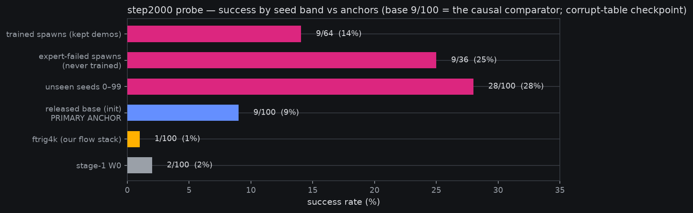
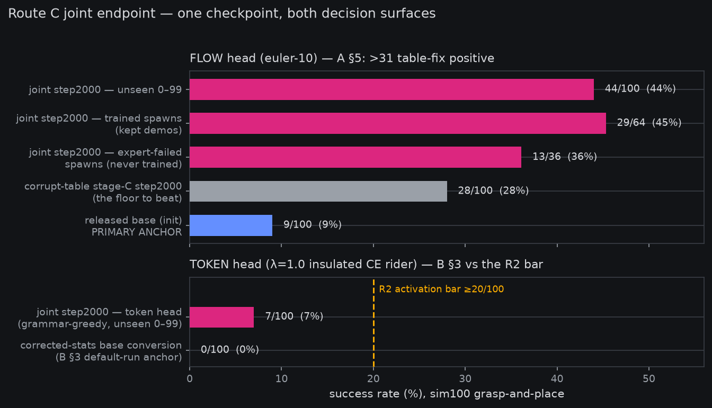
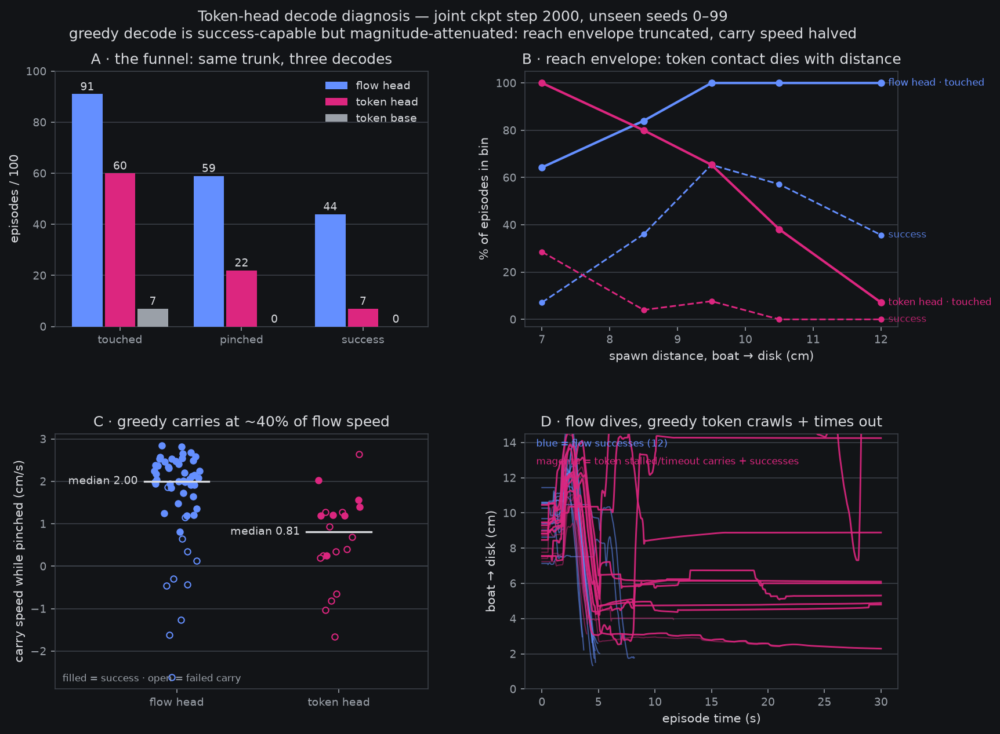

# Grasp-SFT bootstrap — the chain, end to end (probe read banked)

*2026-08-15, drafted ~09:2xZ during the stage-C ride (pre-reg:
[grasp-SFT bootstrap](2026-08-14-prereg-grasp-sft-bootstrap.md));
probe section finalized ~13:4xZ, forward pointers ~16:0xZ. Status: the stage-C run was killed at
step 2040 on the owner's order (10:10Z) and the formal stage-D exam is
suspended; in its place a **two-arm probe of the step-2000
checkpoint** ran and is now fully banked — see the probe section
below. Headline: **9 → 28/100 on the unseen holdout, ≈3.1× the
released base we warm-started from** (the owner-agreed primary
anchor), with **no memorization signature** on the training band. A
data-pipeline bug found the same morning (corrupt q01/q99 quantile
rows — see the ledger) caps this checkpoint's ceiling; the
corrected-table retrain is
[pre-registered (owner-gated)](2026-08-15-prereg-grasp-sft-retrain-corrected-table.md)
on our first-class stack (`bijou.train`) per the owner's standing
decision.*

**Plain words.** Our previous reinforcement-learning experiment ended
with an unusual verdict: the robot was too clumsy for rewards to teach
it anything. So we went back a step and did what you'd do with a
clumsy student — showed it worked examples. This page is the record of
that chain: (A) we wrote a scripted "expert" that can solve the task
by cheating (it reads the simulator's exact object positions), and
tuned it until it succeeded on held-out scenarios it had never seen;
(B) we let that expert perform the task hundreds of times overnight
and kept the 313 successful attempts as demonstrations; (C) we
fine-tuned the robot's neural policy on those demonstrations; and (D)
the tuned policy sat a 100-scenario exam it had never seen. The
result: it now completes the task **28 times in 100** where the model
we started from managed 9 — and, reassuringly, it is *not* just
replaying the demonstrations from memory: it does no better (actually
slightly worse) on the exact scenarios it studied than on brand-new
ones. A separate bug we caught the same morning means the model was
trained with a mis-calibrated sense of one wrist joint's range, so 28
is probably an undercount of what the demonstrations can teach; the
corrected re-run is queued behind the owner's GPU time.

## Stage A — a scripted expert that earns its gate

The expert drives the arm from privileged simulator state (true object
pose), so its only job is *physical competence*: grasp the boat,
carry it, place it on the disk. Getting there surfaced eight distinct
mechanisms, each one a real property of the rig the learned policies
also face — the full list is documented in `sim/scripted_expert.py`,
but three carry the story:

- **The torque wall is real.** Unregularized IK picks straight-arm
  poses whose gravity moment *saturates* the sysid'd shoulder servo
  (force pinned at its 3.478 limit) — the arm literally cannot hold
  the pose it chose. A nullspace posture pull toward the low-torque
  basin fixed the solve; the same static-torque wall bounds any
  learned policy's low-forward grasps.
- **Carry height was capped by the same wall** — until the traverse
  became a pure *pan arc*: the pan joint's axis is vertical, so
  swinging the lifted posture costs no gravity torque and the carry
  height survives the trip. This was the breakthrough that took the
  expert from 0 to 10/16 successes in one change.
- **Grasping fails by jamming, not by missing.** The dominant failure
  is the moving-jaw shell landing on the boat's deck and pressing
  20–40 N — contact, not gravity (static load is 0.13 of the limit).
  Physical jam detection with a retreat-and-retry on the mirrored
  wrist-roll branch recovers most of these.

The registered gate (≥14/20 held seeds) **failed first time, 11/20**.
One amendment was allowed and spent: A1 registered a robustness pass
(lower place-droop, re-grasp recovery, a jam-flip budget of 3),
in-channel with an objection window, and a **fresh** held set —
seeds 1040–1059, never touched during tuning. It read **15/20 PASS**,
and the 75% fresh vs 80% burned spread says the pass generalized
rather than overfit. Stage A closed: *sim hosts the grasp; the old
F-physics reading was an expert-coverage gap, not a physics gap.*

## Stage B — 313 demonstrations, and a small-sample lesson

Collection ran as a detached unit against a 4-hour wall: production
visual config, successes only, demo seeds ascending from 1000 (the
100 eval seeds 0–99 can never appear in training data by
construction). It banked **313 kept of 486 attempted (64%)** — gate
≥300 GREEN, ~4.0 GPU-h.

The chart is also a statistics lesson we've now paid for twice: the
n=20 gate reads suggested 75–80% expert success, and the first hours
of collection seemed to underperform it. A CPU-side n=200 measurement
(seeds 1078–1277) put the **true rate at 62.5%** — the gate reads were
ordinary small-sample optimism (a 75% read at n=20 has a CI stretching
well below 60%). The §8 record in the pre-reg prices this; the
collection itself was never touched mid-run.

## Stage C — SFT on the demos, riding the rig-ft r1 recipe

Stage C fine-tunes the MolmoAct2 **action expert only** — the
flow-matching denoising loss is the sole training objective; the VLM
trunk (the autoregressive part) is completely frozen
(`--ft_vlm=false --ft_embedding=none`). "AR" in this arm's *name*
refers to the model family / decode path, not the loss. Recipe: LR
5e-5 on the action-expert params, global batch 64, 3000 steps ≈ 3.5
epochs over the 313 episodes / 54,101 frames — deliberately
*verbatim-class* on the rig-ft r1 recipe that worked before, with a
mechanical diff receipt in the launcher header: only the data
mixture, run names, and step count differ. (Owner decision 10:07Z
2026-08-15, registered mid-ride: this is the **last** run on their
`train_lerobot.py` — all subsequent training goes through
`bijou.train` / the first-class stack.)

The curve cleared its one registered reference — *materially below the
warm-start loss by ~570 steps* — with room: 0.464 at step 20 to 0.038
by step ~1000. Note the curves are **not** comparable in absolute
terms (different data, different starting distance from the target
behavior); the reference is shape and stability, and both show the
same clean settle with no instability at this LR.

## The step-2000 probe — what the checkpoint actually learned

The owner's 10:10Z re-steer replaced the formal exam with a sharper
question: *does the tuned policy generalize, or does it replay its
demonstrations?* The probe ran the step-2000 checkpoint (converted
from the killed run's last banked save) under the frozen eval
protocol on two arms — the 100 unseen exam seeds, and the first 100
seeds of the demo-collection band, which the banked collection state
splits into **64 spawns the policy actually trained on** (the
scripted expert succeeded there, so those episodes are in the SFT
set) and **36 spawns the expert failed on** — a free,
same-distribution holdout.

| band | successes | moved > 0.5 cm | mean progress |
|---|---|---|---|
| trained spawns (kept demos) | **9/64 (14%)** | 26 | +1.25 cm |
| expert-failed spawns (never trained) | **9/36 (25%)** | 20 | +2.15 cm |
| unseen seeds 0–99 | **28/100 (28%)** | 42 | +1.97 cm |
| released base — **primary anchor** | 9/100 | — | — |
| ftrig4k / stage-1 W0 (context) | ~1 / 2 per 100 | — | — |

Two reads, both banked in
`reports/analysis__grasp_sft_step2000_probe.json`:

- **The causal read of the SFT is 9 → 28 ≈ 3.1× on truly unseen
  seeds.** The right comparator is the released checkpoint we
  warm-started from, which scored 9/100 on the same scenarios under
  its own intact normalization (owner-corrected framing, agreed
  12:0xZ). The ~1–2/100 ftrig4k/W0 rows are different-lineage context,
  not the baseline. And since the step-2000 checkpoint both trained
  and served under the corrupt quantile table, 3.1× is a **floor** on
  what the demonstration data is worth.
- **No memorization signature — if anything the sign is inverted.**
  The policy is *worst* on the exact spawns it saw demonstrations for
  (14%) and best on seeds it never saw (28%). At these sample sizes
  the inversion is ~2 standard errors — suggestive, not proven — but
  the memorization signature (trained ≫ unseen) is decisively absent,
  and the sim's determinism makes this a strong test: a
  trajectory-replaying policy would ace its own training spawns. One
  candidate mechanism for the inversion: "kept" spawns are the ones
  the *scripted* expert could solve, and scripted-expert-friendly need
  not be policy-friendly — the bands aren't difficulty-matched.

Probe ledger: ~3.4 GPU-h vs the 4.0 gate, 0 reset strikes across all
200 episodes, 200 videos banked under
`outputs/sim/grasp_sft/step2000_probe/`.

## Stage D — the exam (SUSPENDED by the 10:10Z re-steer)

At the stage-C endpoint the checkpoint is converted (two-hop, carrying
the demo-set-recomputed normalization — the same identity frame it
trained in, no shim anywhere in the chain) and evaluated on the frozen
100 seeds, sequential driver, euler-10. The decision surface was
frozen in the pre-reg **before stage A ran**:

| sim100 successes | verdict | consequence |
|---|---|---|
| ≥ 20/100 | **GRPO GO** | fresh Decision-11 registration ([draft ready](2026-08-15-prereg-grpo-r2-post-sft.md)) |
| 5–19 | ITERATE_BC_ONCE | one more collection/SFT round first |
| < 5 | F_TRANSFER | visual/renderer lane becomes binding; more demos won't help |

Context anchors (record-only, not gates): ftrig4k read ~1/100
successes with +0.08 cm mean progress on this exact protocol; the
stage-1 W0 arm read 2/100. Those are what "before the bootstrap"
looks like. **The formal exam never ran**: the 10:10Z owner re-steer
killed stage C at step 2040 and replaced the exam with the two-arm
probe above. And the table's *consequence* column has since been
re-based: [GRPO-R2 Amendment A2](2026-08-15-prereg-grpo-r2-post-sft.md)
(registered 14:4xZ) moves the R2 activation bar to the **token-SFT
arm's discrete-head** unseen count — a flow-head sim100 read no longer
triggers the GRPO registration, because token-GRPO trains the discrete
head that this stage-C run never touched. The ≥20 / 5–19 / <5 surface
survives as the frozen *verdict on the data* for whichever
corrected-table flow checkpoint banks next; it just isn't the R2
trigger anymore.

## Where this goes next — three owner decisions pending

Everything below is pre-registered and launch-ready; nothing runs
until the owner picks and frees the GPU (theirs since 13:35Z).

1. **Retrain arm** —
   [corrected-table retrain](2026-08-15-prereg-grasp-sft-retrain-corrected-table.md):
   *continue-from-2k* (proposed primary 13:33Z: warm in features,
   ~2.9 GPU-h, likely better endpoint, muddier attribution) vs
   *from-base* (clean table-fix pricing, per the posted draft). Either
   way the read is against the same comparators: 9/100 base primary,
   28/100 corrupt-table floor.
2. **Route for the next SFT GPU-hours** — A: flow retrain (~5.5
   GPU-h, prices the table fix); B:
   [token-SFT arm](2026-08-15-prereg-grasp-sft-token-sft-arm.md)
   (~7–8 GPU-h, unlocks token-GRPO via A2); C: one `--objective
   joint` run (both heads, confounded read). A and B share the
   corrected base and don't block each other.
3. **Composition** — the
   [`--image-augment` sim2real flag](2026-08-15-prereg-image-augment-sim2real.md)
   (landed, oracle-pinned, `p=0` bitwise-identical) composes with
   whichever arm runs: on the retrain directly (one run, two changes,
   confounds the vs-28 comparison) or as a clean follow-up A/B.

## Ledger

- Chain spend, final: ~0.9 (A) + ~4.0 (B) + ~2.7 (C, killed at step
  2040) + ~3.4 (probe) ≈ **11 GPU-h** vs the pre-registered ≤13 gate.
- Banked artifacts: `reports/analysis__grasp_sft_stageA_gate.json`,
  `..._a1.json` (+ 20 gate videos under
  `outputs/sim/grasp_sft/stageA_gate_a1/`),
  `reports/curve__grasp_sft_stageb_collect.json`,
  `reports/curve__grasp_sft_stagec_ar_loss.json`,
  `reports/analysis__grasp_sft_step2000_probe.json` (+ 200 probe
  videos), and the step-2000 weights-only delta on
  `fontaine-checkpoints/molmoact2_grasp_sft_stagec_ar_step2000`.
- The quantile class bug (lerobot per-episode quantile aggregation:
  q01/q99 = weighted *mean* of per-episode quantiles; wrist_roll's
  true ±157° box banked as [35.5, 94.4], ~19% of frames clamped) is
  fixed in `collect_demos.rewrite_quantile_stats()` with an oracle;
  the dataset's `stats.json` is corrected and re-uploaded. This
  checkpoint remains trained-on-corrupt — the
  [corrected-table retrain pre-reg](2026-08-15-prereg-grasp-sft-retrain-corrected-table.md)
  (owner-gated) prices the difference.
- Charts regenerate from banked JSONs only:
  `fontaine/scripts/grasp_sft_chain_charts.py`.

## Addendum 2026-08-16 — route C taken; first verdict is in

The owner picked **route C** at 00:18Z (GPU freed): one
`--objective joint` run merging the A+B pre-regs, per the
[registered amendment](2026-08-16-amendment-grasp-sft-route-c-joint.md)
— `L_flow + 1.0·L_CE`, flow head **insulated** (flow grads into the
trunk ≡ 0, so the merge preserves both parents' semantics), from-base
with the **corrected** norm table, made to fit in VRAM by the new
`--offload-optim` (AdamW moments in host RAM, bitwise-exact oracle).

The run completed clean at 06:51Z — 2000 steps, ~5.7 GPU-h, flow
`loss_action` 0.0245, CE `loss_aux` 0.155 from 4.33. Weights banked:
`fontaine-checkpoints/molmoact2_grasp_sft_joint_corrected_step2000`.

**Leg 1 of the endpoint probes (flow head, unseen seeds 0–99,
euler-10) landed 08:21Z: 44/100 successes** — against the base's
9/100 and the corrupt-table stage-C AE's 28/100. The A §5 verdict
surface fires **TABLE_FIX_POSITIVE** outright (44 > 31, the
conservative 28+3 clause), so the pre-registered overlap band at
29–31 never comes into play: the corrected lineage becomes the SFT
artifact. What the +16 doesn't yet separate is table fix vs the
joint-CE trunk (the confound the amendment accepted going in);
the remaining legs (flow-train memorization read, token-unseen vs
the R2 bar ≥20, token-base anchor) close out by ~12:3xZ and the
consolidated chart-led report follows.

## Addendum 2026-08-19 — route C closed: all five reads on one checkpoint

The remaining three probe legs took three days to land — not for GPU
reasons but for calendar ones (an owner rollout window on the H100,
the pdnorm screen taking the GPU in between, one disk-full incident,
and a schema seam: the 08-16 metadata-v2 flip refuses the joint
checkpoint's v1 metadata, so legs 3/4 ran from a worktree pinned at
the leg-1/2-era code with the same stand-ins substrate — comparability
preserved by construction, worktree removed at close). Reads banked in
`reports/analysis__grasp_sft_joint_probes.json`; every leg 0 reset
strikes, seeds exactly as registered.

**Flow head — A §5 fires TABLE_FIX_POSITIVE.** Unseen 44/100 (mean
progress +3.5 cm, 64/100 moved) vs base 9/100 and the corrupt-table
stage-C AE's 28/100. The train band confirms **no memorization
signature**: trained-kept spawns 29/64 (45%) vs expert-failed
never-trained spawns 13/36 (36%) vs unseen 44/100 (44%) — the kept /
unseen gap is ~1 SE; the checkpoint generalizes rather than replays.
The corrected lineage is the SFT artifact.

**Token head — B §3 lands in the 5–19 owner-decision band.** The same
checkpoint, grammar-greedy through `--serve-head ar`: **7/100**
(seeds 34/35/63/68/71/91/96, mean progress −0.26 cm). The base-token
anchor leg (default-run per B §3, on the corrected-stats base
conversion with an AR surface derived from the joint config —
hardlinked weights, zero-parameter decoder rider) reads **0/100, 6/100
moved**: the base token head cannot do the task at all, so the +7 is
real SFT transfer — but a λ=1.0 insulated CE rider lands ~6× below
its flow sibling and a third of the R2 activation bar (≥20). The
discrepancy is the finding: under insulation the CE gradient stream
alone, at equal nominal weight, learned far less control than the
flow stream on identical data. Token-GRPO (R2) would start from 7%,
not 44%.

**Chain ledger — the gate line honestly.** Train 5.7 + probe legs
~8.0 (legs 1–4 at 1.35/1.43/2.4/2.1 — the token legs ran ~2.2–2.4
GPU-h vs the ~1.3/leg projection, grammar-greedy replans are slower —
plus ~0.7 across three killed attempts: the 08-16 owner pause, one
disk-full death, one AR-surface refusal at load) ≈ **13.7 vs the
amendment's ≤13 — crossed at the final leg by ~0.7**. The overage
bought the two recovery relaunches and the slower-than-projected
token protocol; no further chain spend exists (all remaining work is
CPU) and the crossing is recorded here rather than absorbed.

Where it goes: the flow read hands the corrected lineage to the
isolation ladder (the [pdnorm screen](2026-08-18-prereg-grasp-sft-v2-joint-pdnorm.md)
convicted its 3-dataset mix against exactly this class of artifact);
the token read puts R2 token-GRPO activation to the owner with
receipts — activate from a 7% base, precede it with a token-weighted
SFT arm (λ>1 or uninsulated), or park R2.

## Addendum 2026-08-19 (ii) — the decode diagnosis: why 7 vs 44 on one trunk

The queued CPU dissection ran the same day (instrument
`fontaine/scripts/token_decode_diagnosis.py`, f960f83; JSON in
`reports/analysis__token_decode_diagnosis.json`; every number below is
computed from the banked probe episodes and videos, no GPU touched).
The question it was queued to answer: is the token head's 7/100 a
broken decode, a broken head, or something narrower — and which of the
three R2 options does the evidence support?

**What it is not.** Not the 08-13 zeros-fallback class: a motion
instrument over all 300 banked videos (frame differencing at 0.5 s)
finds **zero frozen episodes** in any arm — grammar masking has fully
retired the no-op-chunk failure. Not mode collapse to one canonical
trajectory either: cross-seed frame dissimilarity for the token head
is *higher* than flow's, not lower.

**What it is: magnitude attenuation.** The grip channel is
contact-coded in the sim, so the funnel reads directly off the traces.
Flow converts touch → pinch → success at 91 → 59 → 44; the token head
at 60 → 22 → 7; the token base at 7 → 0 → 0. SFT bought *reach* (touch
7 → 60) but greedy decode under-commands amplitude everywhere past it:
the touch rate collapses with spawn distance (14/14 at 6–8 cm down to
1/14 at 11–13 cm; zero successes past 10 cm, where flow still succeeds
out to 11.8), and grasped carries move at **0.81 cm/s vs flow's
2.00** — 9 of 15 pinch-failures are genuine carries that stall short
of the disk, two of them running out the 30 s clock *still holding the
boat* (flow: zero). Same trunk, same features; the discrete argmax
path just commands smaller motions. It is the ar-draws mean-collapse
shape, finally visible in closed loop.

Record-only curiosities: the two heads' competence envelopes are
complementary (in the close 6–8 cm band the token head touches 14/14
with 4 successes vs flow's 9/14 with 1), and 5 of the 7 token
successes are on seeds flow fails — the token pathway adds coverage
rather than shadowing flow.

**The recommendation posted with the receipts: activate R2 from 7%.**
The CE stream already owned every trunk update in route C (insulation
gave it the whole gradient; final CE 0.155), so a token-focused SFT
variant on the same 313 demos would mostly re-buy reach it already
has — the deficit sits in the decode distribution. That is exactly the
pathway GRPO trains: R2's rollouts sample at T=1.0, not greedy, and
the 08-13 dT table showed this attenuation class relaxing monotonically
with temperature. The failure mass being late-funnel (60 touch / 22
pinch) means group-relative advantage sees dense signal; at p = 0.07
the expected mixed-group rate in 8-groups is ≈44%, and R2's wave-0
calibration read stays the cheap abort (proposed bar: mixed < 20%).
Parking is the option the data argues against hardest: the head is
success-capable and flow-disjoint. The owner call stands.
