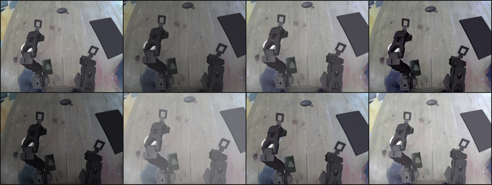

# Pre-reg — `--image-augment`: the train-time sim2real photometric recipe (v0, frozen)

*2026-08-15, ~14:1xZ. From the owner's sim2real question (13:09Z:
"should we augment the images for sim2real?"). Feature is LANDED and
oracle-tested (`09129af`, CPU-only, check.py green 865); this
document freezes the v0 recipe parameters so any training arm that
turns the flag on cites one registered spec instead of re-typing
numbers. **No GPU job starts from this document** — the flag defaults
off, and which arm (if any) runs with it is the owner's pick.*

**Plain words.** Our policies train on simulator images but will one
day run on a real camera. Real cameras differ from the simulator in
boring but relentless ways: lighting and white balance drift, lenses
defocus slightly, sensors add noise, video gets JPEG-compressed. A
policy that keys on the exact pixel statistics of the simulator can
fall over on shifts a human wouldn't notice. The standard, cheap
insurance (used by pi0, OpenVLA and most robot-learning stacks) is to
corrupt the *training* images a little — random brightness, contrast,
color, blur, noise, compression, small shifts — so the policy learns
the task under many appearances and can't overfit to one. The
evaluation images are **never** touched: we always measure on clean
frames. This page records exactly what "a little" means, so the
knob is a registered quantity, not a vibe.

*One real stage-B demo frame (top-left, clean) and seven independent
draws of the v0 recipe (seed 20260815). Geometry and content are
intact; appearance varies about as much as a change of room lighting
or webcam would produce.*

## §1 What landed (commit `09129af`)

- **`bijou/image_augment.py`** — the recipe (`ImageAugmentSpec`
  frozen dataclass + `augment_image`), pure CPU, torchvision ops, all
  randomness from the caller's generator.
- **`Collator.image_augment`** (default 0.0) — per-camera-frame
  Bernoulli gate applied at the `CameraFrame` seam in
  `bijou/interface.py`, the same pattern as `--state-dropout`.
- **`bijou.train --image-augment 
`** — CLI wiring, validated
  [0, 1], logged at launch when on.
- **11 oracles** (`tests/test_image_augment.py`), the load-bearing
  ones being the off-path pins (§3).

## §2 The v0 recipe (frozen)

Per camera frame, with probability `p` (the flag), the frame is
augmented; an augmented frame gets, in fixed physical order —
crop/translate (camera pose) → photometric (scene/ISP) → defocus
(optics) → sensor noise → JPEG (compression last):

| op | gate | draw |
|---|---|---|
| random crop/translate | always | side scale ~ U(0.90, 1.00), placed uniformly, bilinear resize back |
| brightness | always | additive delta ~ U(−0.15, +0.15) |
| contrast | always | factor ~ U(0.7, 1.3) |
| saturation | always | factor ~ U(0.7, 1.3) |
| hue | always | shift ~ U(−0.05, +0.05) (torchvision convention, 0.5 = 180°) |
| gamma | always | exp(U(ln 0.8, ln 1.25)) — log-uniform, symmetric |
| Gaussian sensor noise | p = 0.5 | σ ~ U(0.002, 0.02) |
| defocus blur | p = 0.25 | gaussian k5, σ ~ U(0.1, 1.2) |
| JPEG artifacts | p = 0.25 | quality ~ U{40 … 85} |

Parameters live once, as the `ImageAugmentSpec` defaults; arms cite
"v0" and the commit. Any future change to the ranges is a new spec
version on a new page, not an edit here.

## §3 Guarantees (oracle-pinned)

1. **Aug-off is bitwise the old pipeline.** At `p = 0` the collator
   passes each image tensor through **by identity** — no clone, no
   clamp, no dtype round-trip — and consumes **zero RNG**, so every
   existing run's dropout/augment streams and pixel bytes are
   byte-identical to the pre-flag code. (The molmoact2 uint8
   truncation downstream would amplify any float epsilon; identity is
   the only safe off-path.)
2. **Eval is never augmented.** The probe collator clone runs
   `image_augment=0.0` (the `train.py` dropout-0 convention) and the
   eval/rollout-side collator constructions never set the field, so
   the 0.0 default *is* the guarantee — scored and served frames are
   always clean.
3. **Deterministic given the seed.** All draws come from the
   collator's per-worker generator (a pure function of `--seed`,
   rank, worker id), so runs replay exactly.

## §4 Expected effects, stated before any run

- **Sim-domain evals (sim100) may dip slightly with aug on.** The
  policy spends capacity on appearance invariance the clean-sim
  proxy doesn't reward. A small dip is *expected and acceptable*;
  the value prices in only at rig transfer (the project north star),
  which no current screen measures. Nobody should read a 1–3 count
  sim100 delta between aug-on/aug-off arms as "augmentation hurt".
- **Recommended first use:** `--image-augment 0.8` (80% of frames
  augmented, 20% clean) on whichever retrain arm the owner picks —
  either directly on the corrected-table retrain (one run, two
  changes: stated openly as a confound against the 28/100 floor
  comparison) or as a follow-up arm off the retrain endpoint (clean
  A/B, ~2.9 GPU-h more). Owner's call; this page only freezes the
  recipe.

## §5 The recorded heavier alternative

Render-time domain randomization (lighting, textures, camera pose
varied at *collection* time) attacks the same gap from the sim side
and composes with this flag. It needs demo re-collection (~4 GPU-h a
pass) and the machinery exists from the arm-photometrics/texture
screens. Recorded as the escalation path if photometric-only proves
insufficient at rig transfer — not priced here.
