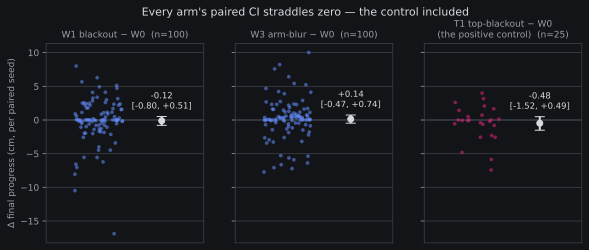
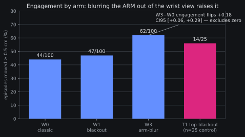

# Wrist-transfer screen: closed F-instrument — the control couldn't referee its own match

*2026-08-15 02:4xZ. Consolidated results page for the wrist-transfer
screen ([FINAL pre-reg](2026-08-14-prereg-wrist-transfer-screen.md),
stage 1 executed 22:24Z 08-14 → rc 01:32Z 08-15, boundary read closed
at 01:3xZ per the frozen §4; the 01:34Z Discord post is the short
record, this page is the full one). Reads:
`wrist_stage1_reads.py` → `reports/analysis__wrist_screen_stage1.json`;
charts recompute the same paired recipe and abort on mismatch.*

**Plain words.** Our robot policy watches two cameras: one overhead,
one on its own wrist. We suspected the simulated wrist view looks fake
enough (it films our simulated robot arm up close, and an encoder can
tell sim from real there easily) that the policy ignores or misuses
it. The screen's plan: corrupt the wrist view in controlled ways
(black it out, blur just the arm's pixels out of it) and measure
whether behavior changes. To trust "no change means the channel
doesn't matter," we included a *positive control* — corrupting the
**top** camera, which we know the policy needs: if the instrument
can't detect even that, the instrument is broken. That is exactly what
happened: with only 25 episodes, the control's confidence interval was
too wide to certify anything. The screen therefore closed
**F-instrument** — no conclusion about the wrist channel in either
direction — and its ~10 remaining GPU-hours were returned. One
genuinely interesting side-finding survives (recorded, not certified):
blurring the arm out of the wrist view made the policy *touch the boat
more often*, a paired effect whose interval excludes zero at n=100.

## What ran (stage 1, one detached unit, ~3.1 GPU-h of the ≤14 gate)

ftrig4k @ step_004000, euler-1 deterministic, 30 s episodes, the
frozen sim100 substrate. Cells: determinism entry gate (W0 twice,
seeds 0–9, per-seed rows bit-equal — PASS), hold floor (25 seeds —
PASS, 0.0000 mean progress, 0 strikes), then W0 classic / W1 wrist
blackout / W3 wrist arm-blur at n=100 paired seeds and T1 top-blackout
at n=25.

Validity receipts, all green before any treatment read: W0 sanity band
(+0.054 cm mean progress, 44/100 moved, inside the registered bands),
spawn-xy pairing bit-equal across arms, honesty-placement and
`none`-bit-replay receipts from stage 0 (`c5be36f`), hook consumption
receipted (24/25 T1 top frames bit-differ; the 25th episode ended
before its second replan).

## The frozen gate that failed

The §3 T1 gate: the top-blackout control must move at least one of
paired Δengagement / Δ|progress| with a CI95 excluding zero.

| read | n | mean | CI95 | verdict |
|---|---|---|---|---|
| T1−W0 Δengagement | 25 | +0.16 | [−0.12, +0.44] | straddles 0 |
| T1−W0 Δ\|progress\| | 25 | −0.28 | [−1.29, +0.62] | straddles 0 |

Blacking out the camera the policy demonstrably uses produced point
estimates in the expected directions — and intervals too wide to
certify either. Per the frozen §4 that is **F-instrument**: the screen
cannot referee the wrist arms, stages 2/3 never launch, and no
transfer-link claim is made in either direction.

## The power analysis (the successor lesson)

The control was priced at n=25 against effect sizes nobody had
measured yet. Stage 1 measured them: the W3 arm shows an engagement
flip of +0.18 with CI half-width ±0.115 **at n=100**. The control's
half-width at n=25 was ±0.28 — about 2× the point estimates the wrist
arms actually produce. A control that needs the effect to be ~2× the
treatment effects to fire is not a control; it is decoration. The
successor rule is mechanical: **price the control at the same n as the
treatment arms** (T1 at n=100 ≈ 1.2 extra GPU-h — the cheapest
insurance in the ladder).

## The record-only finding that wants a successor

**W3 (arm-blur) raises engagement**: +18 flips/100, paired CI95
[+0.06, +0.29], excludes zero — the only registered read in the whole
screen that does. Blurring the *robot's own arm* out of the wrist view
makes the policy touch the boat more often (44→62/100 moved), while
final progress stays null (+0.14 cm [−0.47, +0.74]). Under
F-instrument this stays record-only, but the shape is suggestive: the
sim's wrist-view arm rendering may actively *inhibit* engagement —
consistent with the honesty probe's 0.877 AUROC saying the arm pixels
are the wrist view's most sim-vs-real-separable content.

It is not certified because with a dead control, a wrist read that
fires could be instrument artifact — that asymmetry (treatment fires,
control can't) is precisely why the gate exists.

## What this cost and what it returned

~3.3 GPU-h total (stage 0 receipts + stage 1) of the ≤14 gate; the
F-instrument close at the stage-1 boundary returned the ~10 GPU-h
stages 2/3 would have spent on an instrument that cannot certify them.

## What a successor screen needs

1. **A competence floor first.** At ~1–2 successes/100 the behavior
   metrics ride on touches and near-misses, which is why engagement —
   not success — is where W3 shows up. The
   [grasp-SFT bootstrap](2026-08-14-prereg-grasp-sft-bootstrap.md)
   (running now) is that floor; re-screen wrist fidelity on a policy
   whose success rate can actually move.
2. **Control at treatment n** (above).
3. Keep the paired-seed + determinism-gate design verbatim — it worked
   exactly as intended: every read above is paired per-seed with
   bit-equal spawns, and the failure it caught was real.
