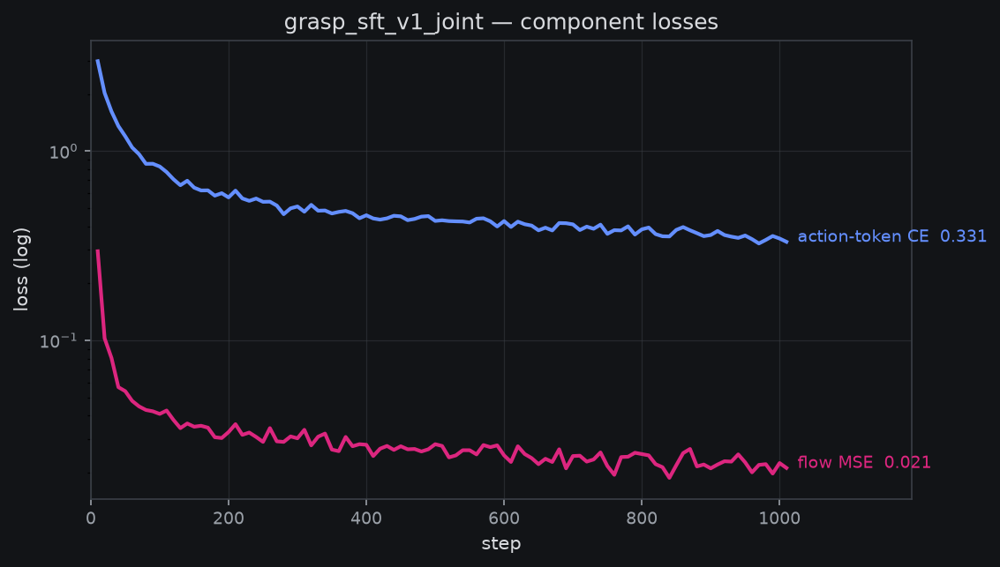
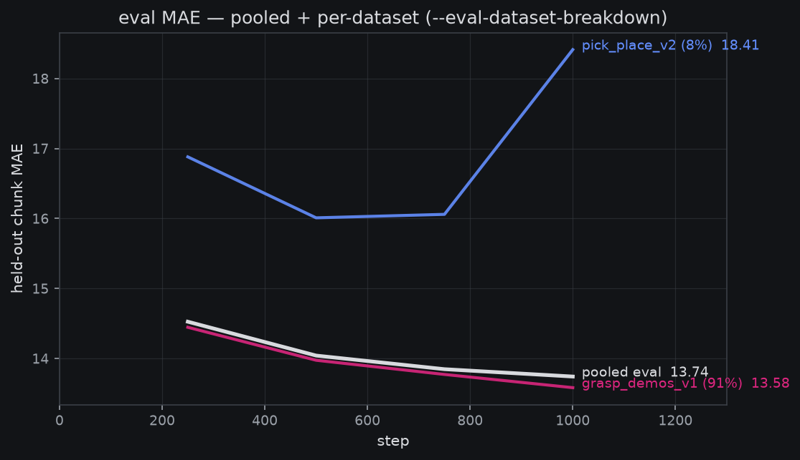
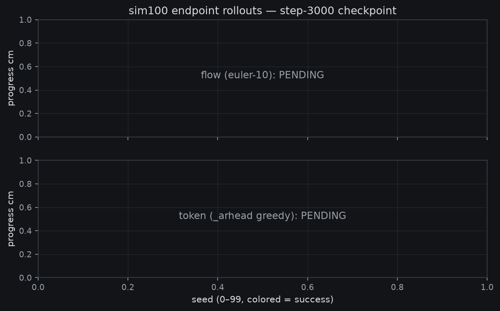

# Grasp-SFT v1: the 5,000-demo joint run — endpoint results

*2026-08-16→17. Run 2 of the recipe: `grasp_sft_v1_joint_8xa100`
RESTARTED with `--recompute-stats` on the owner's 20:51Z order
(launched 21:14:48Z 08-16, unit `grasp-sft-v1c`), complete 01:07Z
08-17 at step 3000. Run 1b — same command on the remap-only release
table — was killed at step ~1900 by the same order after its real-data
eval slice rose monotonically (16.0→18.4) while sim fell: the remapped
table leaves wrist_roll/wrist_flex saturating away from ground truth,
so per-channel normalization was recomputed from the corpus itself
(receipt: wrist_roll ±65.6/43.5 → ±157.2, wrist_flex 4.9/93.4 →
−52.4/95.0, lift lows −96.1 → −124.8, descending orientation
preserved). Anchors: the route-C joint probe checkpoint — trained on
~10× fewer demos — scored
[44/100 unseen (flow)](2026-08-16-amendment-grasp-sft-route-c-joint.md)
and the token-head competence bar is ≥20/100.*

**Plain words.** Two days ago we generated 5,000 fresh demonstrations
of the pick-and-place task with our scripted expert (about 16× more
than the 313 the previous model learned from). This page records the
model trained on that full corpus: a "joint" fine-tune, meaning the
same network simultaneously learns two ways of producing actions — a
fast continuous head (flow) and a token-by-token head that speaks the
base model's discrete action language. The first attempt at this run
was stopped two-thirds through and restarted when we found the model
was, in effect, reading mis-calibrated instruments: the table that
normalizes joint angles clipped two wrist joints well short of their
real range, and the real-robot slice of the eval was getting *worse*
as training went on. The restart recomputed that table from the data
itself. The question the run answers: does 16× more demonstration
data move the 44/100 success rate of the smaller-data model?
**No — it collapsed it: 5/100 on the same seeds, and the follow-up
[isolation work](2026-08-17-sft-v1-flow-isolation.md) traced the
collapse to a mis-fit normalization table, not to the data.**

## The run

- **Recipe** (route C, the only measured joint config): `bijou.train
  --objective joint --joint-ce-weight 1.0 --insulate-flow
  --recompute-stats`, init from the owner's re-converted
  `molmoact2-so101-released`, image-augment 0.8, eff. batch 96 (12×8
  ranks), activation checkpointing + ZeRO-1, 3000 steps, eval every
  250 with `--eval-dataset-breakdown`, async save every 500. Same
  seed as run 1 (registered comparability policy).
- **Data**: 3 datasets, 4,551 train episodes / 1.49M frames
  ([grasp_demos_v1](https://huggingface.co/datasets/mcobzarenco/fontaine-grasp-demos-v1)
  ~91% + `pick_place_v2` ×4 repeat 7.9% + `pick_place_clean` ×4 repeat
  0.8%), 506 episodes held out.
- **History**: launch 1a (17:49Z 08-16) died at its *first eval* — the
  ported `molmo_flow` decoder returns CPU actions and the joint family
  is the first to route the in-train eval through it; one-line fix
  (`2d6a2b3`), relaunch 18:21Z. Run 1b then trained to ~1900 before
  the owner-ordered kill above (~17.5 GPU-h spent; saves archived as
  `_run1_remaponly`). Run 2 = `main` merge `3a12c86`
  (`--recompute-stats`) + 20-step smoke with per-joint receipt before
  relaunch.
- **Cost**: run 2 **~31 GPU-h** (21:14:48Z→01:07:43Z wall on 8×A100,
  eval pauses included) vs the 40 GPU-h babysit gate; ~3.9 s/step
  steady, VRAM ~64.5 GiB/rank, zero tracebacks end to end.
- Curves: [wandb `grasp_sft_v1_joint_8xa100` run `cgo3by9j`](https://wandb.ai/aristotle1337/fontaine).

## Training curves

Both heads learn without fighting: the flow MSE (insulated from the CE
gradient) and the action-token CE fall together; windowed loss ended
at 0.32–0.34 and grad norms stayed ~1.6 throughout. (Absolute MAE
below is NOT comparable to run 1's curve — the recomputed table
rescales the metric; per-dataset *trends* are the comparison.)

Held-out chunk MAE was **not monotone — it oscillated all run**: 4.05
@250 → 4.54 → 3.74 → 5.00 → 5.09 → **3.62 @1500** (best) → **6.64
@1750** (worst) → 5.49 → 6.36 → 5.48 → 5.52 → **5.41 @3000**. Most of
the drop happened by step 250; after that the curve swung in a
widening band with train_mae tracking eval at every point (no
train/eval divergence on the pooled read — the swing is the model
moving, not the probe).

| dataset | eval MAE @3000 | train MAE @3000 |
|---|---|---|
| grasp_demos_v1 (sim, 91%) | 5.06 | 4.99 |
| pick_place_v2 (real, 8%) | **15.77** | **8.15** |
| pick_place_clean (real, 1%) | — (no eval slice) | 5.33 |

The split is the story: the sim slice sits tight (train≈eval≈5), but
the real-robot slice shows a **2× train/eval gap** — the model fits
the real *training* frames (8.15) and does not generalize to held-out
real episodes (15.77, vs 10.0 at step 250). At an 8% mix share, more
sim demos did not buy real-data generalization; run 1b's coverage
diagnosis (kill signature: v2 rising monotone) became, under the
corrected table, a *flat-to-bouncy* v2 slice that never improved past
its step-250 reading.

## The competence read: sim100 vs the probe anchors

Protocol identical to the route-C probe legs (euler-10 flow on unseen
seeds 0–99; `--serve-head ar` greedy for the token head), sharded 4×25
across the box's GPUs — exact, because every rollout stochastic
stream is keyed by the (seed, replan, draw) triple, invariant to batch
composition.

- **Flow, unseen**: **5**/100 vs the probe checkpoint's 44/100
  (and base 9, corrupt-table 28). The strip shows the shape: 51/100
  episodes moved the boat >0.5 cm, median final distance 8.7 cm — the
  policy *reaches* competently and cannot grasp.
- **Token, unseen**: **0**/100 vs the R2 competence bar ≥20/100 —
  but this number was **our serving bug, not the model**: the
  inference collator decoded action tokens under per-item dataset
  quantiles instead of the merged training table. With the fix
  (`b779ba4`) the same head scores 3/20 on held-out seeds 100–119;
  the full-100 fixed read is leg 3 of the running eval chain.

**Verdict: 16× data did not move the needle — it fell off the table,
and the table is literally why.** The probe checkpoint (313 demos,
same joint objective) grasps 44/100; this run, 5/100. The isolation
work that followed pinned it: both broken runs normalized flow targets
under a window that mis-fits a wrist channel (run 2's pooled recompute
gives wrist_flex 0.24× weight; run 1b's rig table clips wrist_roll at
~±66° vs the ±157° the demos use), the probe's table fits, and a
step-500 sim100 read (4/100) dates the collapse to the first 500
steps — **broken from the start, not degraded from competence**. The
5/100 is a normalization result, not a data-scaling result; v2 (live
now, on the regenerated corpus whose own pooled table fits sim) is
the run that answers the data question cleanly.

## Artifacts

- Checkpoint (weights-only, standing rule):
  [`grasp_sft_v1_joint_step3000`](https://huggingface.co/mcobzarenco/fontaine-checkpoints/tree/main/grasp_sft_v1_joint_step3000)
  (byte-verified against the box post-upload)
- Banked reads: `reports/analysis__grasp_sft_v1_endpoint.json`,
  regenerable via `fontaine/scripts/grasp_sft_v1_endpoint_report.py`
- HTML eval report (flow leg, per-seed table + outcome strip):
  [`eval__grasp_sft_v1_step3000__flow_unseen100.html`](https://mcobzarenco-fontaine-reports.static.hf.space/eval__grasp_sft_v1_step3000__flow_unseen100.html)

**Integrity note (2026-08-17).** The merged per-seed sim100 JSONs and
the rollout videos were deleted from the box before they were synced
off: a session preparing the demo-gen v2 launch ran `rm -rf
~/flow-matching/outputs` to clear stale state, unaware the endpoint
artifacts were still pending their rsync. The per-seed numbers above
and in the HTML report are **reconstructed from the surviving shard
stdout logs** (`reconstruct_sim100_from_logs.py` — every summary
table survived in `~`, outside the wiped tree; 0.1 cm print
precision). The reconstruction reproduces every previously posted
headline exactly (5/100, 0/100, moved 51/100, median final 8.7 cm ≈
8.65). The videos are the one unrecoverable artifact; the rollouts
are deterministic (triple-keyed noise), so any seed can be re-rendered
from the uploaded checkpoint if ever needed.

## What's next

The successor run is already live:
[`grasp_sft_v2_joint_8xa100`](2026-08-17-prereg-grasp-sft-v2-joint.md)
— the run-2 recipe verbatim on the regenerated
[grasp-demos-v2](https://huggingface.co/datasets/mcobzarenco/fontaine-grasp-demos-v2)
corpus (smoother expert v1.3, 1.88M frames), whose own recomputed
pooled table fits the sim demos. Its step-500 save is the first
checkpoint that can beat the 4/100 step-500 band and pin the corpus
as the lever. In parallel the eval chain finishes the run-2 story:
step-500 token (leg 2, running) and the endpoint token head under the
serving fix on all 100 seeds (leg 3). Owner-gated items and the full
queue live in `fontaine/queue.json`.
