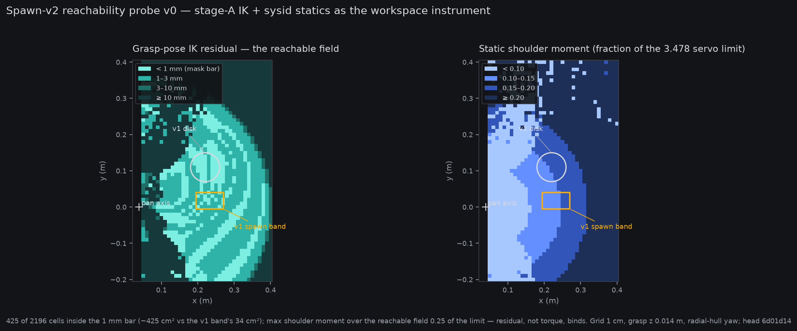

# Pre-registration (DRAFT) — sim spawn-v2: randomize the disk and the boat

*2026-08-16, ~10:3xZ. Owner steering 09:16Z: "Both the disc and boat
should be placed randomly." Status: **DRAFT** — the CPU slice of queue
item `sim-spawn-v2-randomization`. Finalization (frozen constants from
the measured envelope + objection window) comes before any sim change
lands or any GPU stage launches; the owner's priority call (asked
in-channel 09:50Z: does this outrank the token-legs report?) sequences
the GPU slices.*

**Plain words.** Today's simulator always puts the wooden disk in the
same spot and drops the toy boat in a small patch right in front of
it, so every episode looks alike: boat on the same side, ~9–10 cm
from the goal. That was a deliberate prototype choice — the patch is
where the arm is strong and where the boat can't land on the parked
gripper — but it means a policy could pass our evals while only ever
having seen one corner of the problem. Spawn-v2 places *both* objects
randomly: the disk anywhere the arm can comfortably work, the boat
anywhere in a ring around the disk. "Comfortably work" is not a
hand-drawn box: during the scripted-expert work we measured exactly
where the arm's shoulder servo runs out of static torque and where
its inverse kinematics can put the jaws, and those measurements — not
guesses — define the allowed region. Everything trained or evaluated
so far keeps its numbers under the old protocol (frozen, labeled
spawn-v1); new demos and the new headline eval move to spawn-v2.

## §1 Spawn-v1, exactly (the thing being replaced)

`sim/so101_sim.py`: disk **fixed** at (0.22, 0.11) m, radius 0.04 m
(success = boat base inside the disk radius, upright, still, not
held). Boat: `SPAWN_X (0.195, 0.27) × SPAWN_Y (-0.005, 0.04)`,
uniform yaw — a 7.5 × 4.5 cm band in front of the disk, mean
boat→disk distance ~9.5 cm. The band's documented rationale: (a) the
comfortable-reach envelope around the menagerie pickup keyframe
(~0.22 m forward); (b) jaw clearance — spawns nearer than x ≈ 0.17
landed the boat ON the parked jaw tips (x ≈ 0.155) for ~4% of seeds;
(c) layout match to the original rig recordings. All three carry into
v2 as *constraints*, not as a fixed band.

## §2 Spawn-v2 design

Two placements per episode, both from the episode's spawn RNG stream:

1. **Disk**: uniform over the **measured workspace region** W — the
   set of table positions where the scripted expert's IK solves a
   grasp-height jaw-pad pose with residual < 1 mm AND the sysid'd
   shoulder servo's static gravity moment at that pose stays under a
   registered fraction of its force limit (the stage-A torque wall,
   `SERVO_SYSID` + the nullspace posture machinery, used here as an
   *instrument*). W is precomputed once by the reachability probe
   (§3) and frozen as an explicit polar-grid mask constant — the
   sampler draws from the mask, so the envelope is inspectable data,
   not a runtime solver call.
2. **Boat**: uniform over the **full annulus** around the drawn disk
   center — r ∈ [r_min, r_max], θ ∈ [0, 2π), uniform yaw — rejection
   sampled against: (a) boat pose itself inside W (the arm must be
   able to grasp *and* the disk to receive); (b) min separation:
   r_min ≥ disk radius 0.04 + hull half-length 0.03 + margin (boat
   must not start touching the disk); (c) parked-jaw clearance: hull
   keep-out around the settled home pose's jaw tips (the measured ~4%
   failure of v1); (d) table bounds with hull margin. r_max is a
   drawn-distance cap so episode length stays in the phase-clock
   budget the scripted expert and evals assume — pinned at
   finalization from the measured expert traverse envelope.

**Determinism + protocol versioning.** Disk draws add draws to the
spawn stream, so v2 seeds are NOT stream-compatible with v1 — by
design, as a *registered protocol break*: `spawn_version` becomes an
explicit sim parameter; `"v1"` reproduces today's draw order
bit-identically (oracle-guarded), `"v2"` is the new protocol. Every
banked v1 read stays frozen and labeled; no v1 number is ever
compared against a v2 number in a verdict.

**Rejection sampling is bounded**: the sampler refuses (loud error,
not a silent retry-forever) if acceptance over the first N draws
falls below a registered floor — a degenerate mask should fail the
oracle suite, not stall an eval.

## §3 Instrument: the reachability probe (CPU, this queue item's slice)

`sim/spawn_v2.py` (sampler + mask constants) +
`fontaine/scripts/spawn_v2_reachability_probe.py` (the instrument):
sweep a polar grid over the table's reachable quadrant, run the
stage-A IK (jaw-pad-midpoint space, wrist locked to the P4 pitch, 4
free dofs, nullspace posture pull) at grasp height, record IK
residual + static shoulder moment fraction; emit the W mask + a chart
(the measured envelope is itself a finding — the same torque wall the
learned policies face). Oracles (all CPU): v1 bit-compat under
`spawn_version="v1"`; v2 determinism (seed → identical placements);
constraint invariants on 10k draws (separation, keep-out, bounds,
in-W); acceptance-floor refusal on a degenerate mask.

### §3.1 Instrument v0 — first measured fields (added ~10:3xZ, same session)

The probe ran (CPU, ~2 min; `reports/analysis__spawn_v2_reachability_v0.json`,
head `6d01d14`): 1 cm Cartesian grid, 2196 cells, stage-A `solve_grasp`
at GRASP_Z = 0.014 m with the pan pre-swung to each cell's bearing and
a radially-facing hull.

Three facts the finalization constants will be cut from:

1. **425 cells sit inside the 1 mm residual bar** (~425 cm² vs the v1
   band's 34 cm² — a ~12× larger spawn field), an annular region from
   near the base out to ~0.35 m, containing the v1 band (0.57 mm at
   its center) and the v1 disk (0.31 mm) comfortably.
2. **Static torque does not bind**: over the whole reachable field the
   shoulder's static gravity moment peaks at 0.25 of the 3.478
   force limit — the nullspace posture pull keeps solves out of the
   straight-arm poses that saturated the servo in stage A. The torque
   bound in W is a backstop, not the working constraint; the residual
   bar does the work.
3. **v0 caveat**: the <1 mm region shows ring-banding — cells where
   the fixed-budget DLS iteration converges marginally flicker across
   the bar. Before the mask freezes, the probe gets a convergence
   margin (more iterations + a hysteresis band, plus a morphological
   clean) so W is a solid region, not a speckle field. This is an
   instrument artifact, not arm physics. Measured consequence on the
   sampler (2000 episodes on the v0 mask): mean 7.2 boat attempts,
   p99 45, **max 194 — one attempt shy of the 200-draw refusal bar**,
   because disks drawn at speckled mask edges see a mostly-rejected
   annulus. The mask clean and the refusal bar must be finalized
   together, with the bar sitting well above the cleaned mask's
   measured tail.

## §4 Registered consequences (the expensive part, priced)

| stage | what | cost class |
|---|---|---|
| A′ | scripted-expert validation re-run under spawn-v2, fresh held seeds, gate ≥70% (v1 ladder's bar) | ~0.2–0.4 GPU-h |
| B′ | demo re-collection under spawn-v2 (target per the stage-B recipe) | ~4 GPU-h |
| C′ | SFT on spawn-v2 demos (route per owner — joint class measured 5.7 GPU-h) | ~4–6 GPU-h |
| D′ | spawn-v2 eval, seeds 0–99 — becomes the **new primary** read | ~1.3–2 GPU-h |

The current joint checkpoint's 44/100 (and the whole route-C chain)
stays the frozen **band-protocol** read. The scripted expert's pan-arc
traverse was designed around a fixed disk bearing; A′ is a genuine
re-validation, not a formality — if it fails its gate, the expert
gets ONE registered robustness amendment (the v1 ladder's precedent)
before any F-verdict.

## §5 What finalization must pin (open in this draft)

The torque-fraction bound and grid pitch defining W; r_min margin,
r_max, keep-out radius, acceptance floor N/rate; A′ seed band + gate
arithmetic; whether B′–D′ inherit the stage-B/C frozen recipes
verbatim or re-open any knob (default: verbatim). Owner calls that
sequence it: priority vs the token-legs report (asked 09:50Z), and
the C′ route choice.
