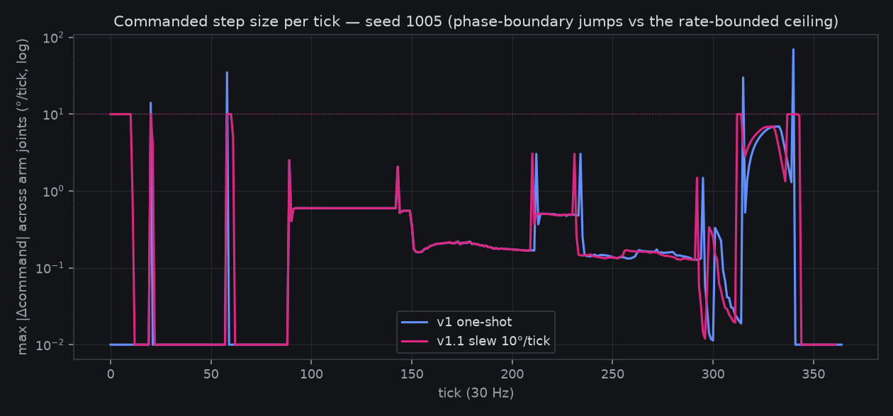
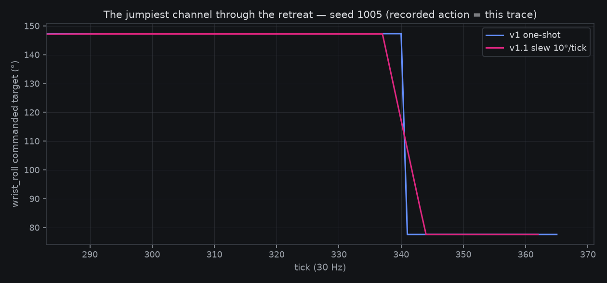
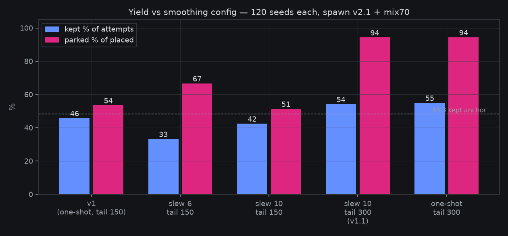

# 2026-08-16 — Smoother demos v1.1: rate-bounded expert commands, and the tail-budget artifact that was taxing v1

**Owner steering 16:53Z: "the action traces are very jumpy — smoother
overall?" Answer: yes — landed same-session (`dbc0731`), and the
instrumented read found a v1 yield bug on the way: kept% goes UP
(45.8 → 54.2 on the 120-seed bench) while the largest commanded step
drops 293° → 10°/tick.**

## Why the traces were jumpy

The scripted expert's recorded action *is* its commanded absolute
joint target. The loaded carry phases already slewed at 1.5–2.5°/tick
(a full-speed swing slips the pinch — measured back at P4), but every
unloaded phase commanded **one-shot absolute targets**: the lift is a
−35° shoulder step in one tick, the retreat home swing is the whole
joint-space distance in one tick, and a roll-branch flip can jump
wrist_roll by hundreds of degrees. The servos low-pass all of that in
the flight path, but the *dataset* records the commands — so the
visualizer shows step functions, and an SFT policy is asked to
imitate them.

## The fix that worked — and the one that didn't

An output-stage feedforward slew limiter now rate-bounds every
commanded channel (`SLEW_ARM_DEG = 10`, `SLEW_JAW_DEG = 12`, `None`
restores the legacy one-shot expert). Feedforward from the last
*command*, never from the measured pose — pose-referenced slewing
compounds servo lag into a crawl (measured earlier today: parked-at-
home collapsed to 3%).

Rate matters more than expected:

- **6°/tick** (first try) collapsed placement 59.2 → 40.0%. The
  instrument showed every lost seed dying at the 600-tick main clock:
  recovery moves (jam-flips, pinch-miss retries) get too slow and the
  episode runs out of budget. Not a physics failure at all.
- **10°/tick** recovers placement to 58.3% (baseline 59.2, n=120 —
  within noise) and still caps every step at 10°.

## The surprise: v1 was throwing away ~10% of its yield

The attribution instrument (per-episode: which `success()` term
failed, what was still moving, boat displacement over the tail)
showed the *baseline* losing 13 of 120 episodes to a measurement
artifact: `success()` has no gripper-open term, so it can fire
mid-settle while the boat is still pinched. The 150-tick retreat tail
then has to cover settle + open + retreat (~135–155 ticks) — 33 of 71
placed episodes exhausted it mid-home-swing, and the post-tail
stillness re-verify (max|qvel| < 0.5 *includes arm dofs*) demoted 13
of them with the boat perfectly placed on the disk.

Doubling the tail budget to 300 fixes it for both experts (artifact
13 → 3; parked-of-placed 53.5 → 94.3%) without touching the success
bar — fast episodes still exit the moment the arm is home and quiet,
so their recordings are unchanged. This budget was costing shipped v1
real data: same protocol, same physics, kept 45.8 → 55.0 just from
letting the tail finish.

## v1.1 defaults (landed, oracle-tested)

| | placed % | kept % | parked % of placed | max cmd step |
|---|---|---|---|---|
| v1 (one-shot, tail 150) | 59.2 | 45.8 | 53.5 | 293°/tick |
| **v1.1 (slew 10/12, tail 300)** | 58.3 | **54.2** | **94.3** | **10°/tick** |

120 seeds each, spawn v2.1 + mix70, seeds 1000–1119; measurement
harness `fontaine/scripts/smooth_expert_measure.py`, raw rows in
`fontaine/notes/smooth_*.json`. Success protocol untouched; the
still-bar's arm-dof inclusion is a possible protocol change but is
**not needed** — the tail budget alone kills the artifact.

Applies to v1.1 regens; the shipped v1 5k stays as-is (owner:
"in-flight 5k fine"). The two 17:07Z bug reports were verdict-posted
the same session:

- **Top-cam cylinder**: it *does* composite in (segmentation: ~1,350
  px) — but the measured real-vs-sim read vindicates the report. The
  real rig's wooden disk is **78% brighter than its table** (ratio
  1.78, visible side wall + drop shadow, ~3,400 px); the sim disk is
  **slightly darker than its surround** (ratio 0.95) — isoluminant
  camouflage. Calibration attempt (same session) found the real
  constraint: the raw-rendered disk is *already* near saturation
  (228/255) — the v3 composite's per-episode affine (gain ~0.55,
  fitted on table statistics) compresses any foreground white to
  ≤~1.1× the plate, so the real 1.78 is unreachable by material alone
  (measured: v1 0.88 mean, brightened material 0.87). Revised v1.1
  proposal: exempt the disk's segmentation mask from the episode
  affine (keep the global grade) — predicted ~1.5; a composite-
  semantics change under the `disk_appearance="realcal"` flag, owner
  sign-off pending (`fontaine/scripts/disk_contrast_probe.py` is the
  instrument).
- **Episode-boundary frame**: the merged dataset is exact — data
  indices contiguous across all 5,000 episodes, per-episode video
  spans equal length/fps, zero overlaps, ffprobe frame counts match
  summed lengths (file-000: 13,643 = 13,643). The stray end-frame is
  the visualizer rendering the exclusive `to_timestamp` inclusively.
