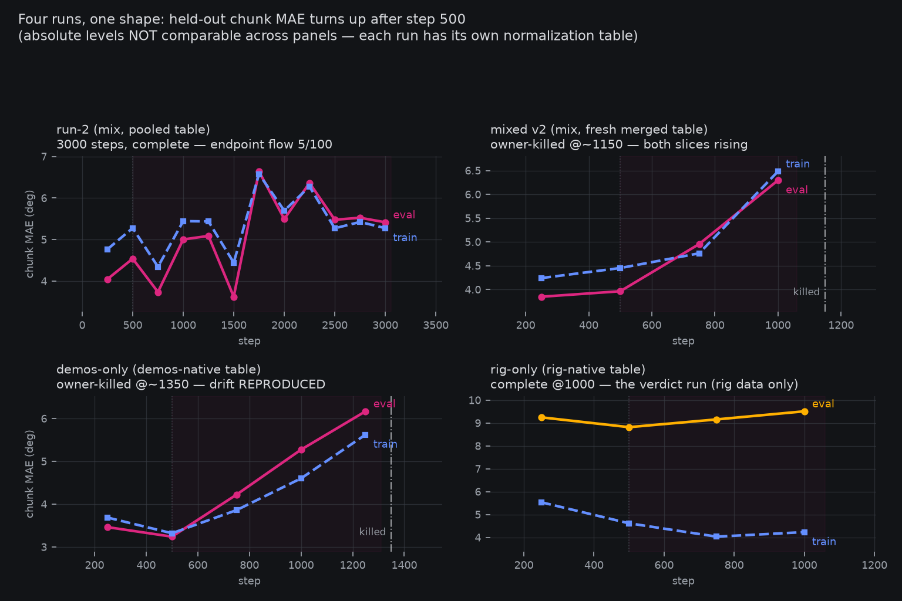
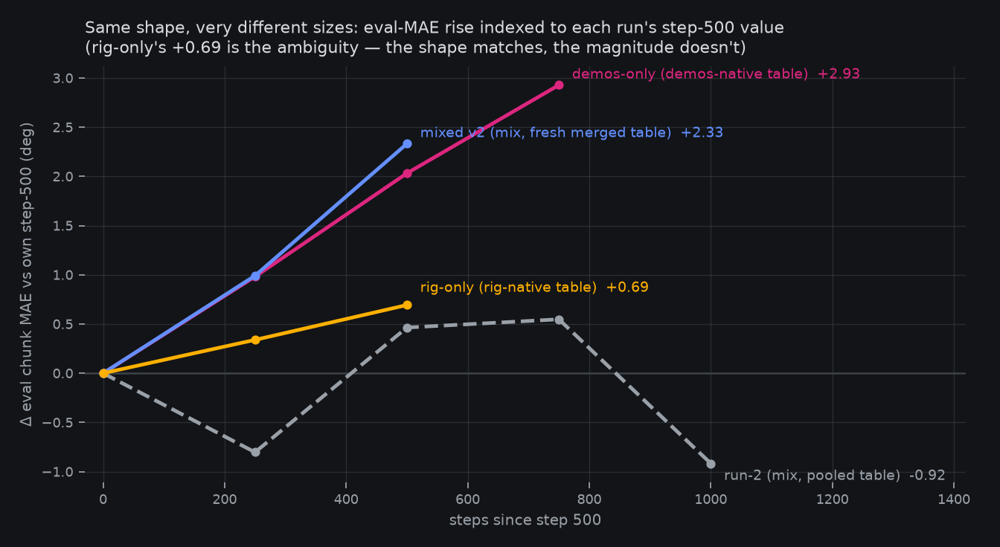
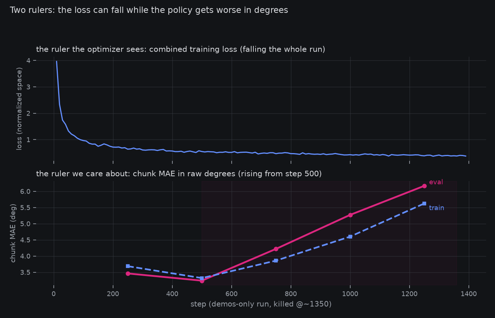
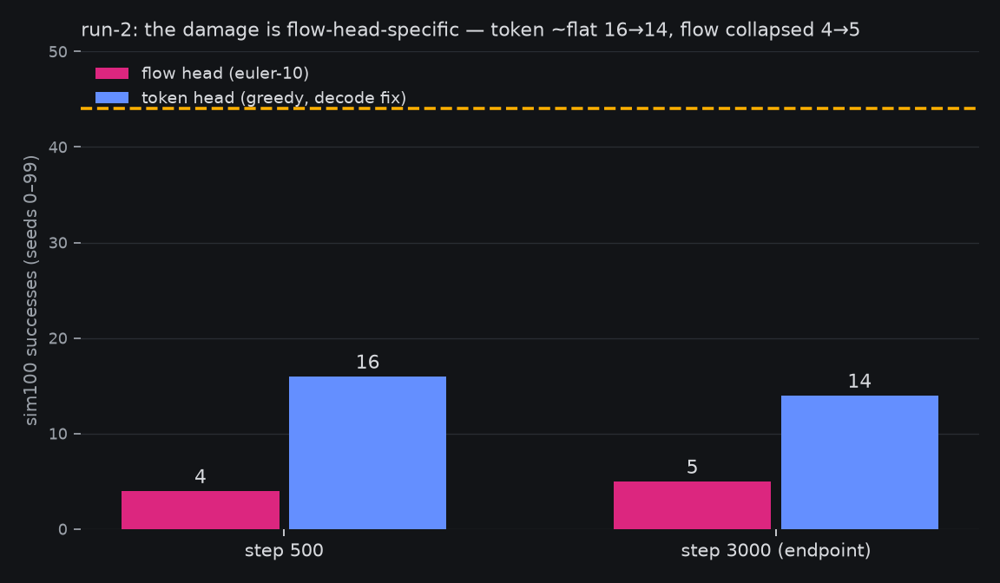

# The MAE-drift saga: five runs, one shape, and what's still standing

*2026-08-17 15:0xZ. Queue item `sft-drift-saga-report-page` — the
chart-led consolidated record of the grasp-SFT drift investigation
(owner preference: chart-led reports for closed screens). The rig-only
verdict landed 14:52Z and is folded in; the 1-GPU discriminator slot
stays open pending the owner's call. Curves regenerate from banked
artifacts via `fontaine/scripts/sft_drift_saga_charts.py`
(`reports/curve__sft_drift_saga.json`).*

**Plain words.** For two days, every big fine-tune we launched has
shown the same sickness: partway through training, the model's actions
start getting *worse* — its predicted joint angles slide away from the
ground truth on held-out data, then on the very data it is training
on — while the training loss serenely keeps falling. We killed run
after run, each time removing a suspect: the sim/real data mix, the
normalization table, and finally the simulated demos themselves. Today
the cleanest cut yet finished: a run on **only real-robot data**, data
that has trained healthy models before. Its curve is *ambiguous* —
the same worsening shape, but seven times smaller. This page is the
full record: every curve, the mechanism that lets a falling loss hide
a worsening policy, what each run eliminated, and the one suspect no
run has yet isolated — the 8-GPU distributed training machinery every
sick run shares and every healthy run lacks.

## The runs, in one grid

The drift signature, as it emerged over the saga: **held-out chunk MAE
(raw degrees) rising monotonically from step ~500, with the
train-slice MAE rising alongside it, while the optimizer's loss falls
throughout.** Mixed v2 and demos-only show it unmistakably. Run-2's
pooled curve oscillates instead (its failure was different — broken
from step ≤500 by a mis-fit table, per the
[isolation page](2026-08-17-sft-v1-flow-isolation.md)). Rig-only, the
verdict run, is the gold panel — and the reason this page ends with a
question rather than a conviction.

| run | data | table | fate | drift? |
|---|---|---|---|---|
| probe `joint_corrected@2000` | 313 demos | demos-native | **healthy — 44/100 grasps** | no |
| run-1b | mix (demos+rig) | rig-lineage remap | killed @~1900 | yes — real slice 16.0→18.4 monotone |
| run-2 | mix (demos+rig) | pooled recompute | complete @3000 — flow 5/100 | no clean drift; broken by ≤500 (table) |
| mixed v2 | mix (v2 demos+rig) | fresh merged recompute | killed @~1150 | **yes — both slices** |
| demos-only | v2 demos only | demos-native recompute | killed @~1350 | **yes — both slices** |
| **rig-only** | rig datasets only | rig-native recompute | **complete @1000** | **ambiguous, leaning drift** |

Each kill removed a suspect. Demos-only reproducing the drift under a
demos-native table **exonerated the sim/real mix and the table** as
sole causes. Rig-only was the data axis's last cut: its corpus (51
episodes of real tele-op, `pick_place_v2` + `clean`) has trained
healthy models on this rig before.

## The rig-only verdict: ambiguous, leaning drift-shaped

Full curve (6-episode holdout, eval every 250): eval
**9.24 → 8.82 → 9.15 → 9.51**, train **5.53 → 4.62 → 4.03 → 4.23**.

The eval slice dipped then rose monotonically from step 500 — the
SHAPE of every drifting run — and ended above its step-250 reading.
Train fell to 750, then ticked up at the endpoint: its first rise.
Against calling it drift: the magnitude is small, the holdout is six
episodes, and the run ended at 1000 with no continuation to confirm.

The overlay is the honest picture. Indexed to each run's own step-500
value, demos-only rose **+2.93** and mixed v2 **+2.33** within 750/500
steps; rig-only rose **+0.69** in 500. (Run-2, dashed, is the
contrast: over the same window its pooled eval went *down* — its
sickness was congenital, not degenerative.) Same shape, a quarter to
a fifth of the size — consistent with either a weaker expression of
the same disease on much smaller data, or a small model wobbling on a
six-episode holdout.

## The mechanism that hides it: two rulers

The optimizer never sees the drift because it measures in a different
space. Flow targets are normalized per channel by `1/(q99−q01)²`
before the MSE; token CE weighs all channels uniformly in symbol
space; chunk MAE is raw degrees. A model can keep lowering the
normalized loss while its raw-degree predictions on the channels that
matter — wrist joints, where a grasp lives or dies — walk away from
ground truth. Losses falling was never evidence of health; the
demos-only panel above is the proof by counterexample.

## The head asymmetry

Run-2's collapse is **flow-head-specific**: the token head, trained
through the same corpus and table, scores 16/100 at step 500 and
14/100 at the endpoint (~flat), while the flow head sits collapsed at
4→5. The eval chain that closed today (leg 3, 14:17Z) pinned the
endpoint number on all 100 seeds: median progress 0.69 cm, 54/100
moved — reaches, rarely completes. Whatever the drift is, it acts
through the flow pathway's loss geometry, not the shared trunk alone.

## What's left standing: the config-delta table

Every drifting run shares, and every healthy run lacks, the following
(the honest list, refined with the owner 13:2xZ):

| delta | drifting runs (run-1b, run-2, mixed v2, demos-only) | healthy runs (44/100 probe, 28/100 stage-C) |
|---|---|---|
| **distributed stack** | 8×A100 torchrun + ZeRO-1 + `--chunk-grad-allreduce` | single GPU |
| effective batch | 96 (12 × 8 ranks) | 96 (single-rank accumulation) |
| image augment | 0.8 | 0.8 (probe) |
| table mode | `--recompute-stats` at launch | baked corrected table |
| init | `molmoact2-so101-released` re-conversion | same lineage, earlier conversion |
| corpus scale | 1.5–1.9M frames (except rig-only: 32k) | ~100k frames |

Rig-only's contribution: if its +0.69 is real drift, the **corpus is
off the hook entirely** — 32k frames of known-good rig data drifted
under the same recipe/stack. That would leave the recipe/stack column,
and the top suspect is the one no run has isolated: the distributed
machinery.

## The staged next cut

The 1-GPU discriminator is prepared on the box
(`launch_box_grasp_sft_v2_demosonly_1gpu_discriminator.sh`): the
demos-only recipe on ONE GPU — same effective batch 96, same
micro-batch 12, same seed, augment, `--recompute-stats`, init — the
*only* delta being the distributed stack. Demos-only's curve rose
+0.98 by 250 steps past 500 and +2.93 by 750 past; a 1-GPU curve that
holds flat through step 1000 convicts the distributed path, one that
drifts identically exonerates it and shortens the remaining list to
augment / batch geometry / recompute-at-launch / init. ~7–9 GPU-h,
owner-gated — the ask is in-channel.

## Ledger

Saga cost so far (box 8×A100 unless noted): mixed v2 ~2.6 GPU-h
(killed @~1150) + demos-only ~4 GPU-h (killed @~1350) + rig-only
~10.5 GPU-h (complete, ≤12 gate) + run-1b re-eval 0.5 GPU-h (local) +
eval chain ~6.2 GPU-h (local, ≤12 gate). Artifacts: all three box
runs' `train_log.jsonl` rsynced local **before** any cleanup
(`outputs/train/rigonly_artifacts/`, 08-17 wipe lesson), saves kept on
the box (rig-only 250–1000, mixed v2 + demos-only 500/1000). Related
pages: [v1 endpoint results](2026-08-16-grasp-sft-v1-results.md) ·
[flow-regression isolation](2026-08-17-sft-v1-flow-isolation.md) ·
[v2 pre-reg](2026-08-17-prereg-grasp-sft-v2-joint.md).

*Finalize slots: the discriminator verdict (if the owner greenlights
it) and any rig-only continuation land here.*
