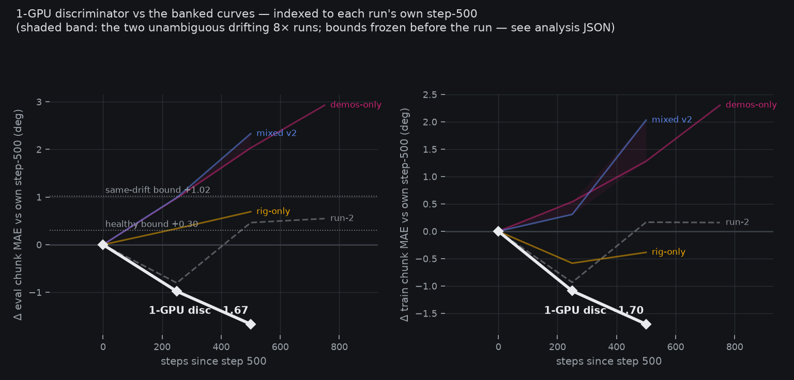
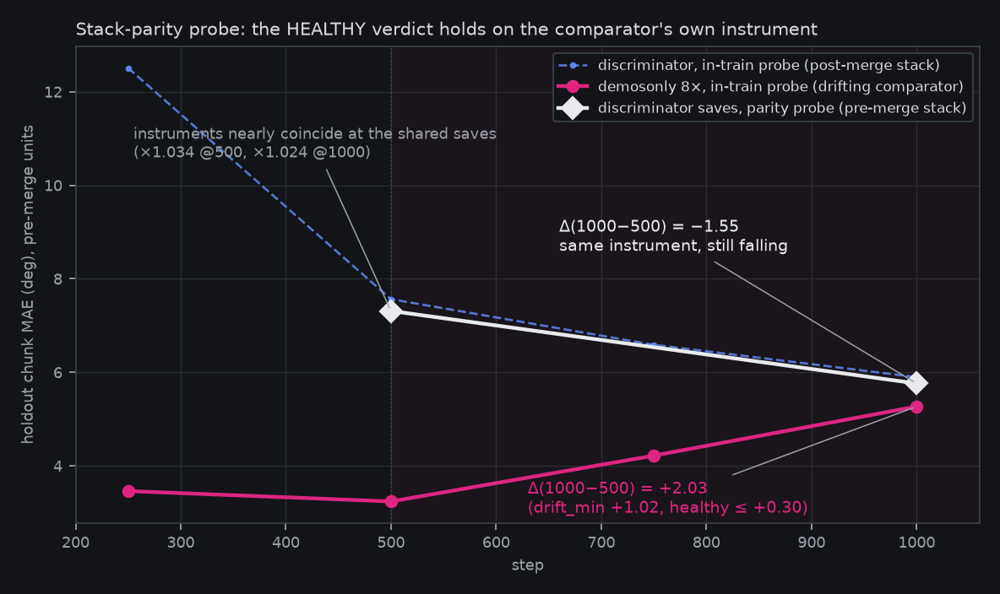

# Discriminator verdict: HEALTHY — the distributed path is convicted

*2026-08-18 00:42Z (verdict read) + 00:5xZ (stack-parity
confirmation, this page). Closes the
[drift-discriminator pre-registration](2026-08-17-prereg-sft-drift-discriminator.md)
and answers the question the
[saga page](2026-08-17-sft-drift-saga.md) ended on. Instruments:
`sft_drift_saga_charts.py --discriminator` (frozen before launch)
and `stack_parity_probe.sh` (Amendment 1's pre-registered
disambiguator). Verdict posted in-channel 00:43Z; artifacts:
`reports/analysis__sft_drift_discriminator.json`,
`reports/stack_parity/step_000500.json`, `step_001000.json`.*

**Plain words.** The drift saga's last suspect was the 8-GPU
distributed training machinery — the one ingredient every sick run
shared and every healthy run lacked. The test: run the *exact* recipe
of the sickest run (demos-only data, same batch size, same
normalization) on **one** GPU, and watch the same instrument. If the
drift is in the recipe, one GPU should get sick too. It didn't: the
held-out error fell for the whole run, through the very window where
every 8× run turned upward. Then, because our measuring stick had
changed mid-saga (a normalization overhaul landed between the sick
runs and this one), we re-scored this run's saved checkpoints with the
*old* measuring stick — the same one the sick runs were measured
with. Same answer: falling, by a wide margin, where the comparator
rose. The distributed path — `torchrun + zero1 +
chunk-grad-allreduce` — is convicted. Single-GPU training is clean,
and the next experiments proceed on it with drift risk retired.

## The verdict read

`grasp_sft_v2_demosonly_1gpu_disc` (attempt 2, local H100, eff-batch
96 via accumulation, 1000 steps, ~5.8 GPU-h vs the 12 gate) completed
clean. Eval-slice chunk MAE: **12.51@250 → 7.57@500 → 6.59@750 →
5.90@1000** — descending through the entire verdict window
(steps 500→1000, where every 8× comparator rose).

- **Primary rule (raw units)**: Δeval(1000−500) = **−1.67** vs
  HEALTHY ≤ +0.30 (drift_min +1.0158). HEALTHY.
- **Amendment 1 (scale-adjusted ×3.613)**: bound +1.084. Same
  −1.67. HEALTHY.
- Rules agree ⇒ no AMBIGUOUS-BY-INSTRUMENT; the pre-registered
  meaning applies: **the distributed stack is the delta separating
  every drifting 8× run from every healthy run, and the same recipe
  on 1 GPU stayed healthy.** Corroboration: train-slice Δ −1.70,
  no monotone-rise flag, loss 0.4186 falling throughout.

## The stack-parity confirmation

The verdict above carried a caveat, pre-recorded at 22:34 before the
step-750 probe: this was the **first run on the merged family-norm
stack**, so its probe numbers live on a different measurement surface
than the comparators' — and a still-descending curve satisfies the
HEALTHY bound trivially. Amendment 1's disambiguator was queued as
the cheap confirmation: re-score the discriminator's saved
checkpoints (steps 500 and 1000) with the **pre-merge eval stack**
(`9094e60`, the old `MolmoNorm.CHECKPOINT` path) — the same
instrument, units and normalization table the drifting comparators
reported in.

Ran this session (GPU freed at run end; probe-matched pins — holdout
0.1, split-seed 0, 256 samples seed 0, chunk 30, euler-10):

| surface | @500 | @1000 | Δ(1000−500) |
|---|---|---|---|
| ours, pre-merge units (parity probe) | 7.3137 | 5.7626 | **−1.551** |
| ours, post-merge units (in-train probe) | 7.5654 | 5.8989 | −1.67 |
| demosonly 8×, pre-merge units (frozen anchors) | 3.2397 | 5.27 | **+2.03** |

**On the comparator's own instrument, the verdict holds**: our curve
falls −1.55 across the window where the drifting run rose +2.03
(healthy ≤ +0.30, drift_min +1.02). The units-artifact half of the
caveat is retired.

Two findings ride along:

1. **The instrument barely moved.** Same-checkpoint cross-stack
   ratios are ×1.034 @500 and ×1.024 @1000 — the family-norm merge
   shifted this probe ~2–3%, not the ×3.613 Amendment 1 estimated.
   That estimate came from a step-250 *cross-run* level ratio, which
   we now know was dominated by genuine model-level difference at 250
   (the 1-GPU run starts much higher and converges), not by units.
   No harm done — both rules agreed at every read — but future
   cross-stack comparisons can treat the two surfaces as near-parity
   at converged checkpoints.
2. **wrist_roll corroborates the flow-norm analysis.** Under the old
   checkpoint table, our worst motor by far is wrist_roll (16.87@500,
   12.31@1000, vs state-copy's 3.99) — exactly the channel the
   [per-channel occupancy analysis](2026-08-17-sft-v1-flow-isolation.md)
   showed the pooled table overflowing at 288%. The
   `--per-dataset-flow-norm` rerun now has a second independent
   signature pointing at the same channel.

**Residual caveat, carried honestly**: our curve had not plateaued by
step 1000, and the comparators' drift signature was a rise *off a
flat floor*. Whether drift would appear after our floor is a question
only a longer run answers. It is a footnote, not a live doubt — the
conviction rests on matched recipe + matched window + matched
instrument, all satisfied.

## Consequences (per the pre-registered interpretation grid)

- **CONVICTED** → single-GPU is the recipe class on this host (the
  box is gone anyway); the gated `per-dataset-flow-norm` rerun
  proceeds on it **with drift risk retired**, its baseline arm being
  this very run (same recipe, same platform, `per_dataset_flow_norm
  = False`).
- Step-1000 is the **first non-drifting v2-corpus checkpoint** —
  banked with step-500 (verdict evidence, weights-only + both run
  logs) at
  [`fontaine-checkpoints/grasp_sft_v2_demosonly_1gpu_disc`](https://huggingface.co/mcobzarenco/fontaine-checkpoints/tree/main/grasp_sft_v2_demosonly_1gpu_disc).
- The 8× drift mechanism itself (what exactly `zero1 +
  chunk-grad-allreduce` does to the flow head) is now a
  *mechanism-hunt* question, not a blocker — it only becomes urgent
  if multi-GPU training returns.
