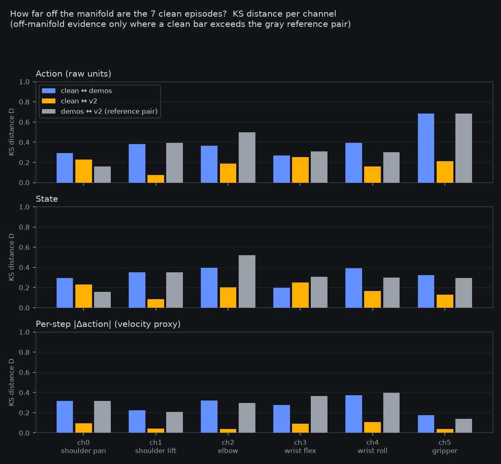
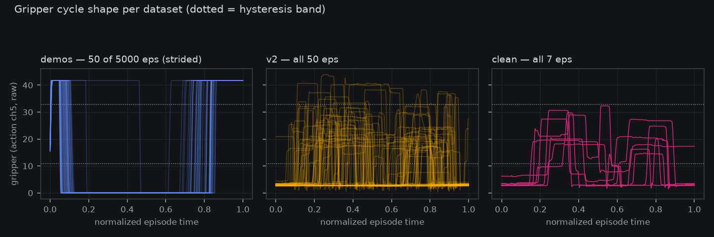

# Pre-registration: demos + clean only (the poison-pinning cell)

*Draft cut 2026-08-20 12:1x–13:0xZ (work session, queue item
`prereg-draft-demos-plus-clean`), the
[onerig pre-reg](2026-08-19-prereg-demos-plus-one-rig.md)'s named
follow-up after its 28/100 mix-exoneration verdict. Launch is
DELEGATED (standing no-GO-ask rule 2026-08-18; the onerig ≥20 grid
text names this cell with no owner-call carve-out): the cell fires at
the next free GPU window after the `grpo-r2` lane closes its
boundary, announced in-channel at launch. Launcher staged:
`fontaine/scripts/launch_local_grasp_sft_v2_joint_1gpu_pdnorm_democlean_h100.sh`
(full-parse green vs the merged CLI: family-inferred
`molmoact2_joint`, `per_dataset_flow_norm=True`,
`prune_superseded_optim=True`, seed 0, both datasets resolved, repeat
pattern matched).*

**Plain words.** Yesterday's experiment produced a striking result:
a model trained on simulated demos plus the big real-robot dataset
grasps 28 times out of 100 — but add back one tiny extra dataset (7
episodes, about 0.7% of what the model sees) and, in the earlier
"convicted" run, success collapsed to 1 in 100. One recipe change,
a 28× swing. That makes the tiny dataset the prime suspect — but
the earlier run changed the *combination*, not just the tiny set, so
the suspicion isn't yet proof. This experiment is the direct test:
train on the demos plus ONLY the tiny dataset. If grasping collapses
again, seven episodes of real-robot data — 3,399 frames against 1.9
million — are sufficient to poison the whole run, and we can dissect
those seven episodes frame by frame. If grasping survives, neither
real dataset alone is harmful and the failure needs the three-way
mixture — an interaction effect, which is stranger and equally worth
knowing. Either way the production recipe (demos + the big set,
28/100) is untouched; this run only pins the mechanism. Pass/fail
numbers are frozen below before anything runs.

## Where this cell comes from

The [onerig verdict](2026-08-19-prereg-demos-plus-one-rig.md)
(battery closed 2026-08-20, post id 1539950050740801616) exonerated
mixing-per-se with every guard read banked:

- **Demos + v2 (×4) → 28/100** on unseen 0–99 vs the demosonly
  control's **11/100** — paired Δ **+17** (CI95 [8, 26], McNemar
  exact p = 0.0009) — and vs the convicted three-way cell's 1/100,
  paired Δ **+27** (CI95 [19, 36], p = 1.5e-8).
- The **only recipe delta from the convicted cell was dropping
  clean**: 13,596 repeat-weighted frames, 0.65% of the convicted
  mix's sampling. Rig data at ~6% share HELPS grasping once clean is
  out.
- The panel guard chain held end-to-end (28.81 native / 27.26
  truth-fit vs the 25.15 null; wrist receipts on the convicted
  channels), so the collapse-and-recovery is not a normalization
  artifact: the panel does not separate the 28/100 grasper from the
  1/100 convict — grasping lives in sim100.

So the convicted cell and the exonerated cell differ by exactly one
subtraction, and the subtracted part is 0.65% of the corpus. Two
hypotheses survive:

1. **Clean is the poison** — sufficient by itself, dose be damned.
2. **The three-way composition is the poison** — clean is only
   harmful alongside v2 (or v2 alongside clean); each alone is fine.

This cell separates them with one run. Note the naming symmetry: the
onerig pre-reg named "demos+clean" and "full mix minus v2" as
alternative follow-ups — **they are the same cell** (the convicted
mix minus v2 *is* demos + clean ×4). One run answers both framings:
it is simultaneously the other single-rig-dataset cell and the other
one-subtraction from the convicted cell. The grid below is clean in
both directions, which is exactly what the onerig draft asked of a
follow-up.

## The cell

**Mix = `grasp_demos_v2/merged` + `so101_pick_place_clean` (×4), and
nothing else.** Frame accounting (repeat-weighted, the convention of
the onerig pre-reg): demos 1,942,375 raw; clean 3,399 raw × 4 =
13,596 — a **0.70% clean share** here vs 0.65 points inside the
convicted mix. Dose held nearly constant; dataset count two; the
only difference from the convicted cell is the 130,716 v2 frames
removed, and the only difference from the exonerated onerig cell is
which rig dataset carries the (tiny vs moderate) rig signal.

Mechanism candidates this cell can speak to, named now:

- **(a) Content**: clean's 7 episodes were recorded as the
  "low-noise" pass — if their state/action distribution (calibration,
  wear state, pacing) sits off both the demos and v2 manifolds, 0.7%
  of gradient steps pulling toward it could be disproportionately
  destructive to the flow head.
- **(b) Degenerate per-dataset stats row**: pdnorm gives clean its
  OWN normalization row computed from just 3,399 frames — a
  near-constant channel in 7 episodes means a tiny scale and huge
  normalized flow targets on clean batches. The convicted run had
  pdnorm active and still collapsed, so "clean + its own row" is a
  live poison vector, not one the table fix already cleared.
- **(c) Composition-only**: neither (a) nor (b) fires alone; the
  collapse needs both rig sets present (e.g. two competing rig rows,
  or CE/state-table merge effects that only appear at three
  datasets). This is the hypothesis a PASS here would leave standing
  alone.

The recorded stats rows at boot (record-only read below) give (b) a
direct look regardless of the verdict.

## Command

Staged launcher
`fontaine/scripts/launch_local_grasp_sft_v2_joint_1gpu_pdnorm_democlean_h100.sh`
= the pdnorm launcher with exactly **one recipe delta**:
`so101_pick_place_v2` deleted from `--train-data` (the mirror image
of the onerig launcher's clean-deletion). Everything else verbatim:
per-dataset flow norm, joint objective `--insulate-flow` ce-weight
1.0, `--recompute-stats` (CE/state tables merged over the two
remaining datasets), `--dataset-repeat
'mcobzarenco/so101_pick_place*=4'` (now matches only clean),
eff-batch 96 = micro-12 × 8 chunks, act-ckpt + offload-optim +
`--prune-superseded-optim`, decoder-lr 5e-5 / backbone-text-lr 1e-5,
image-augment 0.8, holdout 0.1, eval-250 with
`--eval-dataset-breakdown`, save-500, **3000 steps**, **seed 0**
(same-seed comparability policy). Fit smoke (`STEPS=20 SMOKE=1`)
before the full run; compute-app abort guard for the owner
policy-server carried.

## Baselines and anchors (all already banked)

- **Onerig cell 28/100** — `grasp_sft_v2_joint_1gpu_pdnorm_onerig/`
  `step_003000` (HF-banked), same recipe/platform/seeds: the direct
  "other single rig dataset" comparison.
- **Demosonly control 11/100** —
  `grasp_sft_v2_demosonly_1gpu_disc/step_001000`, same platform, same
  seeds; the shared control both mixed cells were paired against.
- **Convicted mixed cell 1/100** — `grasp_sft_v2_joint_1gpu_pdnorm`
  step 3000: this run plus the v2 frames.
- **Probe band 44/100** — `joint_corrected@2000`, the healthy class.
- **Panel ladder** (k4l2, wear-corrected class): onerig 28.81 native
  / 27.26 truth-fit ≈ convicted 27.44 ≈ disc-1000 re-worn 27.40 ≈
  released 27.14, all at/above the 25.15 midpoint null; state-copy
  8.37. Truthfit rewear instrument and report presets carry over
  unchanged.
- **Drift anchors**: discriminator Δeval(1000−500) = −1.67 on this
  platform; convicted-mix probe elevation 5.45/5.47 → 6.83 → 6.17;
  onerig probe 4.5266@3000 (ended improving).

## Reads and frozen decision grid

**Primary — sim100 flow leg at step 3000** (unseen seeds 0–99,
`sim.rollout_sim` euler-10, episode 30 s, execute-horizon 30,
bfloat16 decoder — the v1/v2 protocol), with the two registered
serving conditions carried: `--stats-repo-id grasp_demos_v2/merged`
(worn-row rule) and `--clutter-appearance standins` (substrate pin).

Decision bounds, fixed now (same numeric grid as the convicted and
onerig cells; interpretations adapted):

- **≤ 10/100** → **clean is the poison, sufficiency proved**: 7
  episodes at ~0.7% sampling share reproduce the collapse with v2
  absent — and with clean wearing its own pdnorm row, so the table
  fix does not clear this vector. Banks same-session with an HTML
  panel. Named follow-ups (drafts, next-cell choice per the standing
  delegation): the clean **stats-row autopsy** (recorded rows +
  per-channel scale comparison vs v2/demos — mechanism (b) read,
  free, from this run's logs) and a **repeat-1 dose arm** (~0.17%
  share) only if the autopsy is inconclusive.
- **≥ 20/100** → **clean alone is NOT sufficient**: both two-dataset
  mixes grasp; the collapse requires the three-way composition —
  interaction, not ingredient. The production implication banks
  immediately (any two-dataset mix from this family is usable; the
  three-way is quarantined). Named follow-up: gradient-conflict /
  stats-row instrumentation ON the three-way mix, not more
  subtraction cells — the subtraction ladder is exhausted at
  interaction.
- **11–19** → ambiguous (the control's own band): per-channel MAE,
  per-slice breakdown, videos to the owner before any claim.

**Paired reads recorded alongside** (`sim100_paired_read.py`): vs
the onerig cell's banked 100 episodes (the direct "which rig dataset
hurts" estimate), vs the demosonly control's 100, and vs the
convicted cell's 100 (the direct "did removing v2 rescue anything"
estimate).

**Secondary — drift guard**: in-train eval probe, Δeval(1000−500) ≤
+0.30 (discriminator rule, same instrument). Failure = new
information (mix-specific drift), grasp read still stands, endpoint
choice re-opens to best-grasping save.

**Tertiary — panel guard, paired at endpoint**:
`pdnorm_panel_guard.py` at step 3000 vs the disc-1000 banked npz on
shared frames, frozen house rule: fail = worse than +0.05 CI-excl-0.
Per-motor deltas recorded. Truthfit rewear + ladder restamp
(`--endpoint <row>`) at the endpoint session exactly as for the
onerig cell.

**Record-only**: (1) the recomputed per-dataset stats rows at boot —
bank clean's flow-norm row next to v2's and the demos', flag any
channel whose clean-row scale is ≪ its v2/demos scale (mechanism
(b)'s fingerprint); (2) eval-250 probe curve vs the convicted and
onerig curves (does clean alone reproduce the 2250–2750 elevation?);
(3) the clean-slice eval breakdown, with the caveat named now that
holdout 0.1 of 7 episodes is ~1 episode — a noisy, record-only
curve, never a gate; (4) token-leg sim100 may run as unregistered
corroboration.

## Gates and boundaries

- **GPU-hours gate: 17** (class gate, same shape as onerig: train
  ~13 at ~15.1 s/step + endpoint sim100 ~2.5 + panel + probes ~1).
  No new baseline legs: all four comparisons are banked.
- **Launch window**: the next free GPU window AFTER the `grpo-r2`
  lane closes its boundary (endpoint ~22:0xZ 08-20 + boundary eval);
  the launch is delegated, announced in-channel, never gated on an
  owner GO. The fit smoke runs in the same window.
- **Boundaries**: step-1000 drift-guard read (provisional);
  step-3000 endpoint → sim100 + panel + paired reads + verdict post
  through the frozen grid.
- **In-run instrument**: babysit registry entry at launch; first
  poll checks GPU util/rate + `free -g` + `df -h /` (standing
  checks).
- **Checkpoint policy**: saves under
  `~/checkpoints/finetune/grasp_sft_v2_joint_1gpu_pdnorm_democlean`;
  endpoint banks to `fontaine-checkpoints` same-session if any gated
  read makes it load-bearing (a collapsed-by-7-episodes checkpoint
  is exactly as bankable as a grasping one — it is the poison
  exhibit), weights-only + logs, standing HTML report.
- **Seed policy**: seed 0 throughout (comparability with all four
  anchors).

*Objection/decision path: this pre-reg is frozen as written from the
drafting session; any edit after posting lands as a registered
amendment first. The launch itself is mechanical at the named
window.*

## Results — mechanism-(a) clean-content probe (record-only, banked 14:5xZ 08-20)

*This is a results append, not a spec edit. The probe's own reads
were frozen in-channel (post 1540009095803703316, 14:46Z) before any
number was computed: per-channel KS distance judged against the
demos↔v2 reference pair, overlap coefficient, pacing, gripper-cycle
shape. Full data, raw parquet (clean 3,399 / v2 32,679 / demos
1,942,375 frames). Script
`fontaine/scripts/clean_content_manifold_probe.py`, 11 oracle tests
green; json in `reports/analysis__clean_content_manifold_probe.json`.*

**Headline: the 7 clean episodes are NOT generically off-manifold —
in joint space they sit closer to v2 than demos sit to v2 on almost
every channel. The genuine content anomaly is concentrated in the
gripper, and it is amplitude, not behavior: clean's episodes are
annotated complete pick-and-place cycles, but their "open" plateau
never exceeds 32.3 raw — ~25–27% short of the demos (41.69) and v2
(40+) convention.**

Per-channel action KS/overlap (state and velocity panels in the
chart; full grids in the json):

| channel | KS clean↔demos | KS clean↔v2 | KS demos↔v2 (ref) | OVL clean↔demos | OVL clean↔v2 |
|---|---|---|---|---|---|
| ch0 shoulder pan | **0.295** | **0.228** | 0.161 | 0.378 | 0.541 |
| ch1 shoulder lift | 0.382 | 0.074 | 0.395 | 0.520 | 0.686 |
| ch2 elbow | 0.365 | 0.189 | 0.499 | 0.366 | 0.563 |
| ch3 wrist flex | 0.267 | 0.250 | 0.310 | 0.461 | 0.545 |
| ch4 wrist roll | 0.392 | 0.161 | 0.301 | 0.351 | 0.449 |
| ch5 gripper | 0.684 | 0.211 | 0.684 | **0.008** | 0.548 |

- **Under the frozen framing** (off-manifold only where clean's D
  exceeds the demos↔v2 reference on the same channel, both ways):
  **1 of 6 channels qualifies — ch0 shoulder pan** (action 0.295 /
  0.228 vs ref 0.161; state agrees), and only modestly. Notably ch0
  is the same channel carrying the residual ×2.84 pdnorm
  amplification from the mechanism-(b) autopsy — both weakened
  mechanisms point at the same joint.
- **Velocity profile is v2-like**: per-step |Δaction| KS clean↔v2 ≤
  0.109 on every channel, far under the demos↔v2 reference (0.14–
  0.40). Episode lengths unremarkable: clean mean 486 frames between
  demos 388 and v2 654.
- **The gripper is where clean is genuinely strange** — behaviorally,
  not distributionally-vs-v2:

  - Demos' gripper action is strictly **bang-bang** {0.0, 41.69} —
    every rig set is continuous, so the near-zero gripper overlap vs
    demos (clean 0.008, but also v2 0.011) is a demos-vs-rig
    *encoding* difference, not clean-specific. Per-dataset flow norm
    wears each set its own row, which partially absorbs this.
  - Clean-specific: by the frozen pooled-range hysteresis, **zero
    full open/close cycles in all 7 episodes** (demos mean
    2.0/episode, v2 0.84) and a gripper that **never exceeds 32.3
    raw**. Two cross-checks sharpen what that means (both labeled
    **post-hoc** — the pooled-range number above is the frozen
    primary): (1) the episode annotations say these ARE completed
    pick-and-place demonstrations — all 7 carry the task "Pick up
    the toy boat and place it on the wooden disk", subtask events
    through "close the gripper" → "release it", progress 0→1; (2)
    re-running the hysteresis on each dataset's OWN range, clean
    cycles normally (mean 1.71/episode, median 2 — demos-like). So
    the robust clean-specific anomaly is **amplitude compression,
    not missing behavior**: clean's open-gripper plateau sits at
    q99 30.6 / max 32.3 raw where demos command 41.69 and v2
    reaches 40.2 — the clean episodes teach an "open" ~25–27%
    short of both other sets' convention, on the channel where
    demos are bang-bang.

**Feed into the adjudication** (when the verdict lands ~03:3xZ
08-21): if the cell convicts clean (≤10), generic "(a) content
off-manifold" is *weakly* supported — the specific carriers are the
gripper amplitude compression (open ≈ 30 vs the 40+ convention,
×4-repeated at 0.69% share) and the modest ch0 shift; a follow-up
would edit the gripper channel, not the whole set. If the cell
exonerates (≥20), this probe documents why 0.7% clean is harmless
alone: it is near-manifold rig data — annotated complete
pick-and-place — everywhere except one joint's shift and one
channel's amplitude convention.
