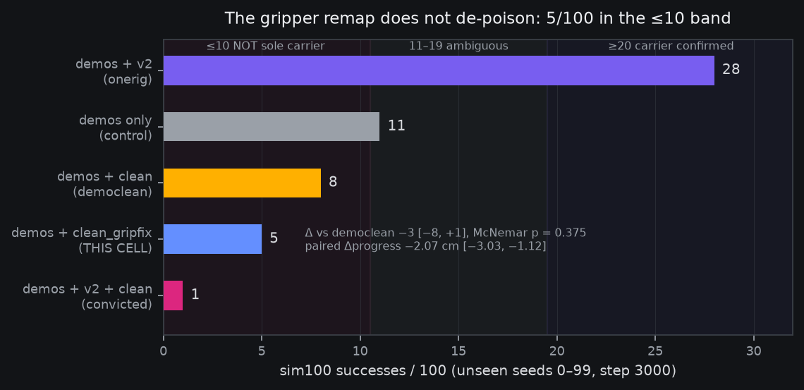

# Pre-registration DRAFT: the gripper-carrier isolation cell (demos + gripper-remapped clean)

*Draft cut 2026-08-21 06:4xZ (the democlean endpoint-close session),
the [demos+clean pre-reg](2026-08-20-prereg-demos-plus-clean.md)'s
named ≤10-branch follow-up, drafted at the verdict (democlean
**8/100 — clean convicted, sufficiency proved**). Launch is delegated
per the standing no-GO-ask rule: the cell fires at the next free GPU
window once the transform tooling lands its oracles, announced
in-channel at launch. DRAFT status: the transform materializer named
below does not exist yet — the exec session freezes the final
command block in-channel before launch; the reads and grid below are
frozen now and do not move.*

**Plain words.** We now know seven episodes of real-robot data poison
grasping all by themselves — 0.7% of training is enough to drop
success from 28/100 to 8/100. We also know, from measuring those
episodes every way we could, that they are surprisingly normal except
for one thing: their gripper never opens all the way. Every other
dataset teaches "open" as roughly 40–42 units; these seven episodes
teach it as at most 32 — about 25% short. This experiment edits
exactly that one number: same seven episodes, gripper values rescaled
so "open" matches everyone else's convention, nothing else touched.
If grasping survives, one channel's amplitude convention was the
whole poison — a cheap, checkable data-hygiene rule for every future
mix. If grasping still collapses, the poison lives somewhere subtler
in those episodes, and we've eliminated the loudest suspect. Either
way the production recipe stays untouched.

## Where this cell comes from

The [democlean verdict](2026-08-20-prereg-demos-plus-clean.md)
(8/100, banked 06:3xZ 08-21) proved clean-alone sufficiency and
refuted composition-only. The banked mechanism reads localize what is
actually strange about clean:

- **Gripper amplitude compression** (manifold probe, frozen reads):
  clean's open plateau sits at q99 30.6 / max 32.3 raw where demos
  command exactly 41.69 (bang-bang {0, 41.69}) and v2 reaches 40.2 —
  a ~25–27% shortfall on the channel where the demos are binary.
  Behaviorally clean cycles normally on its own range (1.71
  transitions/ep) — the anomaly is amplitude, not missing behavior.
- **Modest ch0 shoulder-pan shift** (the only channel exceeding the
  demos↔v2 reference KS both ways; also the ×2.84 worst pdnorm
  amplification ratio) — the named residual suspect if this cell
  exonerates the gripper.

One-variable discipline, third rung: convicted→onerig subtracted
clean (28/100), convicted→democlean subtracted v2 (8/100), this cell
edits ONE CHANNEL of clean and keeps everything else byte-identical.

## The cell

**Mix = `grasp_demos_v2/merged` + `so101_pick_place_clean_gripfix`
(×4), and nothing else** — where `clean_gripfix` is the 7 clean
episodes with the gripper channel (ch5, action AND state) rescaled by
the frozen scalar **41.69 / 32.3 = 1.2907** (zero fixed point
preserved: closed = 0 stays 0; open plateau lands on the demos'
41.69 convention). All other channels byte-identical; episode count,
lengths, camera streams, annotations untouched. The transform is
output-side data hygiene — exactly what a deployment could do.

Frozen transform decisions (so the exec session has no degrees of
freedom): scalar multiply, not per-episode affine (one number, one
suspect); ch5 only; both action and state columns (they must stay
consistent for the state-conditioned policy); the scalar is pinned to
the banked manifold-probe numbers (41.69 demos open command / 32.3
clean max), not re-estimated. `--recompute-stats` then gives the
transformed set its own pdnorm row from the transformed values, as it
would any dataset.

Materializer: a new
`fontaine/scripts/make_clean_gripfix_dataset.py` (exec session) with
oracles: ch5 columns equal source × 1.2907 exactly; every non-ch5
column byte-identical; frame/episode counts identical; transformed
max ≈ 41.69 ± the bf16 class; a no-op guard that refuses if the
source already exceeds 40.

## Command

The democlean launcher verbatim
(`launch_local_grasp_sft_v2_joint_1gpu_pdnorm_democlean_h100.sh`)
with exactly one delta: `so101_pick_place_clean` →
`so101_pick_place_clean_gripfix` in `--train-data` and the
`--dataset-repeat` pattern. Per-dataset flow norm, joint
`--insulate-flow` ce-weight 1.0, `--recompute-stats`, eff-batch 96,
decoder-lr 5e-5 / backbone-text-lr 1e-5, image-augment 0.8, holdout
0.1, eval-250, save-500 + the keep-latest-optimizer pruner from
launch (44G/save class), **3000 steps, seed 0** (same-seed
comparability with all four anchors). Fit smoke first; compute-app
abort guard carried.

## Baselines and anchors (all banked)

- **democlean 8/100** — the direct paired arm: same 7 episodes,
  un-remapped. THE comparison this cell exists for.
- **Onerig 28/100** — the healthy two-dataset cell (demos + v2).
- **Demosonly control 11/100** — the never-mixed floor.
- **Convicted three-way 1/100** — the original collapse.
- Probe-curve anchors: democlean 11.82→4.6848 (collapsed cell,
  healthy-looking curve — the probe is decoupled and record-only
  here), onerig …→4.53, convicted …→6.17.

## Reads and frozen decision grid

**Primary — sim100 flow leg at step 3000**, protocol byte-identical
to the democlean/onerig/convicted batteries (unseen seeds 0–99,
euler-10, episode 30 s, execute-horizon 30, bfloat16 decoder,
`--stats-repo-id grasp_demos_v2/merged`, `--clutter-appearance
standins`).

Same numeric grid, interpretations adapted:

- **≥ 20/100** → **the gripper amplitude convention IS the carrier**:
  a one-scalar, one-channel edit de-poisons the 7 episodes. Banks
  same-session; the production implication is a concrete mix-hygiene
  rule (per-channel amplitude-convention check before any mix), and
  clean re-enters the usable pool in remapped form.
- **≤ 10/100** → **the gripper amplitude is NOT the (sole) carrier**:
  the poison survives the loudest-suspect edit. Named follow-up
  ladder (drafts, delegation standing): the ch0 shift next, then
  content-level slicing (per-episode leave-one-out at ×4 repeat is 7
  cheap cells if it comes to that).
- **11–19** → ambiguous (the control's band): per-channel MAE,
  per-slice breakdown, videos to the owner, no claim.

**Paired reads recorded alongside** (`sim100_paired_read.py`): vs
democlean 8/100 (the carrier estimate — THE read), vs onerig 28/100
(full-recovery yardstick), vs control 11/100 (does the remapped mix
at least stop hurting).

**Secondary — drift guard**: Δeval(1000−500) ≤ +0.30, same
instrument, record-only expectations reset by the democlean
decoupling: the probe canNOT clear this cell, only flag drift.

**Tertiary — panel guard** at endpoint vs the disc-1000 banked npz,
frozen house rule (fail = worse than +0.05 CI-excl-0), truthfit
rewear alongside — unchanged from the last three cells.

**Record-only**: the recomputed `clean_gripfix` pdnorm row vs clean's
banked row (ch5 scale should move ×1.29, everything else pinned —
this doubles as a live materializer oracle); eval-250 curve vs the
democlean curve (same-seed, one-channel-delta twin runs).

## Gates and boundaries

- **GPU-hours gate: 17** (class gate: train ~13.7 measured on the
  identical recipe + battery ~3).
- **Launch window**: next free GPU window after the materializer's
  oracles are green — delegated, announced in-channel, never gated on
  an owner GO. The H100 is free at this draft's cut (battery leg 2
  finishing); if the exec session is this one's chained successor,
  the window is immediate.
- **Boundaries**: step-1000 drift read (record-only per above);
  step-3000 endpoint → the same battery script pattern → verdict
  through the grid.
- **Checkpoint policy**: saves under
  `~/checkpoints/finetune/grasp_sft_v2_joint_1gpu_pdnorm_gripfix`;
  endpoint banks weights-only per the standing rule on any decisive
  read.
- **Seed policy**: seed 0 (comparability); the ×4 repeat and 0.70%
  share carried unchanged.

*Objection/decision path: reads and grid frozen as drafted; the exec
session's only freedoms are the materializer's file-format details
and the launch window. Any spec change lands as a registered
amendment first.*

## Amendment 1 (registered 08:0xZ 2026-08-21, pre-launch): dataset named `_a` to preserve the episode-identical train split

**Found at exec, before launch.** The episode holdout is a pure
function of `(repo_id, num_episodes, fraction, split_seed)`
(`bijou/data.py::holdout_episodes`). Renaming the clean set therefore
redraws which of the 7 episodes is held out: `so101_pick_place_clean`
(democlean) holds out **episode 2** (373 frames; 3026 trained, 0.69%
effective share), while the draft's `so101_pick_place_clean_gripfix`
would hold out **episode 6** — the run would train on {0,1,2,3,4,5}
where democlean trained on {0,1,3,4,5,6}. That one-episode swap is a
second treatment variable riding THE paired read: a ≥20 verdict could
mean "the gripper convention was the carrier" or "poison-heavy episode
6 left the train split" (per-episode content demonstrably matters —
per-episode LOO is this pre-reg's own named follow-up).

**The fix stays inside the frozen recipe**: the materialized dataset is
named **`so101_pick_place_clean_gripfix_a`**, chosen so its draw is
exactly `(2,)` — the clean-side train split becomes episode-identical
to democlean's ({0,1,3,4,5,6}, 3026 kept frames, 0.69% share, the same
373-frame episode held out). The demos split is untouched (its draw
keys on its own repo id) and the `--dataset-repeat
'mcobzarenco/so101_pick_place*=4'` glob matches the new name
unchanged. No flag, seed, or read moves; the launcher's single delta
is the dataset path. (The draft's "0.70% share" line was itself a
rounding of democlean's logged 0.69% — the `_a` split reproduces the
logged value exactly.)*

## Results — endpoint verdict (banked 02:1xZ 08-22)

*Results append, not a spec edit. Train closed 3000/3000 ~22:07Z
08-21 (~13.6 GPU-h vs the 17 gate, all saves verified, probe closed
4.88@3000 — record-only per the decoupling rule); sim100 leg closed
01:56Z 08-22 through the battery unit
`fontaine-gripfix-endpoint-battery` (protocol byte-matched to the
democlean/onerig/convicted batteries, ~2.6 GPU-h vs the 3.5 gate at
the leg-1 boundary). Artifacts:
`outputs/sim/grasp_sft/gripfix_endpoint/flow_unseen.json`, paired
reads `reports/analysis__sim100_paired_gripfix_vs_{democlean,onerig,
control}.json`, checkpoint banked weights-only to
`fontaine-checkpoints/grasp_sft_v2_joint_pdnorm_gripfix_step3000`.*

**Plain words.** The one-number fix didn't work. We rescaled the
seven poisonous episodes' gripper channel so their "open" matches
everyone else's convention — the loudest, most measurable anomaly
those episodes have — retrained the exact same recipe, and grasping
stayed collapsed: 5 successes out of 100, statistically
indistinguishable from the unfixed version's 8. Whatever makes seven
real-robot episodes poison a 5,000-episode training mix, it is not
(only) the gripper amplitude. The suspect list now moves to the next
candidate: a shifted shoulder joint, and if that also fails, testing
the seven episodes one at a time.

**VERDICT: 5/100 — the ≤10 band. The gripper amplitude convention is
NOT the (sole) carrier; the poison survives the loudest-suspect
edit.** Success seeds {16, 39, 60, 61, 71} (4 of 5 shared with
democlean's 8), mean progress **−1.65 cm** (democlean: +3.39), zero
reset strikes.

Paired per-seed reads (`sim100_paired_read.py`, McNemar exact):

| pair | Δ successes | CI95 | p | reading |
|---|---|---|---|---|
| vs democlean 8/100 (THE read) | −3 | [−8, +1] | 0.375 | the one-channel remap bought NO recovery |
| vs onerig 28/100 (yardstick) | **−23** | [−32, −14] | 5.7e−06 | nowhere near the healthy cell |
| vs control 11/100 (demos only) | −6 | [−13, +1] | 0.18 | still at-or-below never mixing at all |

**The remap didn't just fail — paired progress got certifiably
worse.** Δprogress vs democlean **−2.07 cm, CI95 [−3.03, −1.12]
excluding zero** (win rate 31/100); vs control −1.55 [−2.55, −0.55].
Record-only interpretation: the ×1.2907 rescale touches ch5 in both
action AND state columns, so the model trains on gripper *states* no
real rollout revisits — the edit may have added its own
off-manifold artifact on top of whatever the true carrier is. The
verdict stands on the success grid; this nuance feeds the follow-up
design, not the claim.

**Mechanism scorecard update.** The democlean verdict left "(a)
content, with named carriers" standing, fingerprinting the gripper
amplitude + the modest ch0 shoulder-pan shift. This cell strikes the
gripper amplitude as a sufficient explanation. Standing: **the ch0
shift** (the only channel exceeding the demos↔v2 reference KS both
ways, ×2.84 worst pdnorm amplification), then content-level slicing.

**Registered follow-up (this pre-reg's ≤10 branch): the ch0-shift
cell** — same one-variable discipline, clean's shoulder-pan channel
shifted to the shared convention; per-episode leave-one-out at ×4 (7
cheap cells) remains the ladder's last rung. Pre-reg draft queued as
its own item per the branch.

**Hygiene guards (leg 2, banked 02:2xZ): both green, both silent as
expected.** Panel guard vs the disc-1000 banked npz: **PASS** —
endpoint 30.28 vs baseline 58.14 pooled chunk MAE (Δ −27.86, CI95
[−28.56, −27.89], n=15056), nowhere near the +0.05 fail line.
Truthfit rewear: native 30.28 → truthfit 28.35, estimator seam +1.94
(democlean's: +1.91 — same class); ladder anchors reproduced
(disc-1000 27.40 / released 27.14 / null 25.15). The pair of numbers
worth staring at: gripfix's truthfit panel wear 28.35 vs democlean's
28.43 — **essentially identical offline panels for a 5/100 and an
8/100 policy**, the third exhibit in this lineage that the k4l2
panel cannot see grasp collapse. Guards are hygiene; sim100 owns the
verdict. Unseen-100 HTML report:
`reports/eval__grasp_sft_v2_joint_1gpu_pdnorm_gripfix__step_003000__panel_v2_k4l2_euler10_draws1_stable.html`.
