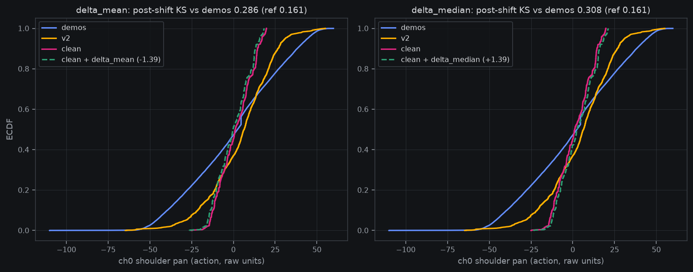

# Pre-registration DRAFT: the ch0 isolation cell (demos + shoulder-pan-affined clean)

*Draft cut 2026-08-22 06:5xZ (work session), the [gripfix
pre-reg](2026-08-21-prereg-clean-gripper-carrier.md)'s registered
≤10-branch follow-up — carrier-hunt ladder rung 2, drafted at the
gripfix verdict (**5/100 — gripper amplitude NOT the sole carrier**).
The registered follow-up named a ch0 *shift*; the constant-freeze
read below (spec frozen in-channel 06:45Z/06:47Z BEFORE compute,
posts `1540612893836574780` / `1540613448264712243`) refuted the
shift form at zero GPU cost and certified a moment-matched affine as
the only viable one-channel edit — this draft registers that form
amendment with the measured evidence, before any launch. Launch is
delegated per the standing no-GO-ask rule: the cell fires at a free
GPU window once the materializer's oracles are green, announced
in-channel at launch. DRAFT status: the materializer named below does
not exist yet; the reads and grid below are frozen now and do not
move.*

**Plain words.** Seven episodes of real-robot data poison grasping at
0.7% of the training mix, and we are hunting the carrier one suspect
at a time. The loudest suspect — a gripper that never opens all the
way — was fixed and grasping stayed collapsed, so it isn't (only)
that. The second-loudest suspect is the shoulder-pan joint: those
seven episodes barely swing it. We first checked whether the joint is
simply *offset* (pointing somewhere slightly different on average) —
it isn't: the average position matches everyone else's to within 1.4
units. What differs is the *range*: the episodes sweep about a third
as widely as every other dataset. So this experiment stretches that
one joint's recorded values — same center, 2.76× the swing — so its
statistical footprint matches the rest of the data exactly, changes
nothing else, and retrains. If grasping recovers, the shoulder-pan
distribution was the poison. If it stays collapsed, both named
suspects are exhausted and we move to testing the seven episodes one
at a time.

## The measured basis (banked this session, CPU, record-only)

Instrument `fontaine/scripts/ch0_shift_constant_read.py` +
`ch0_affine_addendum_read.py`, report
`reports/analysis__ch0_shift_constant_read.json`; oracles green
(banked manifold-probe KS reproduced to 1e-9; KS shift-invariance
under equal shift).

- **The "modest ch0 shift" suspect was mis-specified.** Clean's ch0
  mean sits **1.39 raw units** from demos' (+1.48 vs +0.09 — ≈0.05 of
  demos' std). The anomaly is **spread compression**: std 10.16 vs
  demos 27.99 and v2 19.21; q05/q95 span ±14/17 where demos sweep
  ±46.
- **A pure location shift is pre-refuted**: both frozen candidates
  (Δ_mean −1.39, Δ_median +1.39) leave KS essentially unmoved — 0.295
  → 0.286 / 0.308 vs the demos↔v2 reference 0.161. Launching a shift
  cell would have burned ~17 GPU-h on a transform measurably unable to
  move the marginal.
- **The moment-matched affine lands deep in-band** (frozen decision
  rule from the addendum spec): post-affine KS vs demos **0.047
  action / 0.049 state** (reference band 0.161/0.159); vs v2
  0.193/0.206 (slightly over the band on the v2 side — recorded, the
  rule keyed on the clean↔demos side). The robust
  (median/range95-matched) candidate also lands in-band (0.092/0.094)
  but strictly worse; moment wins.
- **Support containment**: the transformed range [−72.9, +50.6] sits
  inside demos' observed ch0 support [−110.0, +79.6] (action and
  state) — the edit does not manufacture out-of-support joint values.

## The cell

**Mix = `grasp_demos_v2/merged` +
`so101_pick_place_clean_ch0fix_n` (×4), and nothing else** — where
`clean_ch0fix_n` is the 7 clean episodes with the shoulder-pan
channel (ch0, action AND state) transformed by the frozen affine

**x′ = 0.0923439813196304 + (x − 1.481974338423806) × 2.755193138766973**

(target = demos' action-column moments, the shared-convention choice
gripfix made with 41.69; one transform for both columns, constants
from the action stats, state-vs-action deltas banked for reference).
All other channels byte-identical; episode count, lengths, camera
streams, annotations untouched.

Frozen transform decisions (no exec degrees of freedom): the
moment-matched affine above, exactly — not per-episode, not
re-estimated; ch0 only; both action and state columns (state-action
consistency for the state-conditioned policy, the same rule gripfix
froze); constants pinned verbatim to the banked read.
`--recompute-stats` then gives the transformed set its own pdnorm row.

**Dataset name frozen: `mcobzarenco/so101_pick_place_clean_ch0fix_n`**
— the suffix is chosen (gripfix Amendment-1 lesson, pre-applied) so
the episode holdout draw is exactly `(2,)`:
`holdout_episodes(repo_id, 7, 0.1, 0)` verified this session — the
clean-side train split stays episode-identical to democlean's
({0,1,3,4,5,6}, 3026 kept frames, 0.69% share, the same 373-frame
episode held out).

Materializer: a new `fontaine/scripts/make_clean_ch0fix_dataset.py`
(exec session) with oracles: ch0 columns equal the affine of source
exactly (float64 transform, cast back to source dtype); every non-ch0
column byte-identical; frame/episode counts identical; transformed
range inside demos' observed support [−110.0, +79.6]; recomputed
holdout draw is `(2,)`; a no-op guard that refuses if the source ch0
std already exceeds 20 (i.e. the source is not spread-compressed).

## Command

The democlean launcher verbatim
(`launch_local_grasp_sft_v2_joint_1gpu_pdnorm_democlean_h100.sh`)
with exactly one delta: `so101_pick_place_clean` →
`so101_pick_place_clean_ch0fix_n` in `--train-data` (the
`--dataset-repeat 'mcobzarenco/so101_pick_place*=4'` glob matches
unchanged). Per-dataset flow norm, joint `--insulate-flow` ce-weight
1.0, `--recompute-stats`, eff-batch 96, decoder-lr 5e-5 /
backbone-text-lr 1e-5, image-augment 0.8, holdout 0.1, eval-250,
save-500 + keep-latest-optimizer pruner from launch, **3000 steps,
seed 0** (same-seed comparability with all five anchors). Fit smoke
first; compute-app abort guard carried.

## Baselines and anchors (all banked)

- **democlean 8/100** — the direct paired arm: same 7 episodes,
  un-transformed. THE comparison.
- **gripfix 5/100** — the exonerated-suspect anchor: same discipline,
  ch5 edit, no recovery.
- **Onerig 28/100** — the healthy two-dataset cell.
- **Demosonly control 11/100** — the never-mixed floor.
- **Convicted three-way 1/100** — the original collapse.

## Reads and frozen decision grid

**Primary — sim100 flow leg at step 3000**, protocol byte-identical
to the democlean/onerig/convicted/gripfix batteries (unseen seeds
0–99, euler-10, episode 30 s, execute-horizon 30, bfloat16 decoder,
`--stats-repo-id grasp_demos_v2/merged`, `--clutter-appearance
standins`).

Same numeric grid, interpretations adapted:

- **≥ 20/100** → **the ch0 distribution IS the carrier**: a
  one-channel affine de-poisons the 7 episodes. Banks same-session;
  the mix-hygiene implication extends from amplitude conventions to
  per-channel *spread* checks; clean re-enters the pool transformed.
- **≤ 10/100** → **the ch0 marginal is NOT the (sole) carrier**, and
  the named-suspect list from the manifold probe is exhausted. Named
  follow-up (delegation standing): per-episode leave-one-out at ×4 —
  7 cells, the ladder's registered last rung — with a design pass
  first (the LOO pre-reg should weigh cheaper orderings, e.g.
  leave-K-out bisection, before committing ~17 GPU-h × 7).
- **11–19** → ambiguous (the control's band): per-channel MAE,
  per-slice breakdown, videos to the owner, no claim.

**Registered asymmetry note (honesty clause, priced in before
launch): this cell is one-sided.** ≥20 is decisive — an edit that
*recovers* grasping proves the carrier. ≤10 is weaker than gripfix's
≤10 was: the ×2.755 amplification enlarges the vision–proprioception
disagreement class that gripfix's ≤10 branch flagged (its remap
certifiably hurt paired progress, −2.07 cm CI-excl-0), so a
no-recovery outcome cannot fully distinguish "carrier remains" from
"edit-added artifact re-poisons". The grid verdict stands as written
(band membership), but the ≤10 *mechanism* claim is capped at
"suspect list exhausted, edit-family exonerated as a fix path". The
paired-progress read carries the artifact detection either way.

**Paired reads recorded alongside** (`sim100_paired_read.py`): vs
democlean 8/100 (THE read), vs gripfix 5/100 (edit-artifact
comparison: two one-channel edits, same discipline), vs onerig 28/100
(yardstick), vs control 11/100.

**Secondary — drift guard**: Δeval(1000−500) ≤ +0.30, record-only
(the probe canNOT clear this cell — decoupling banked three times).

**Tertiary — panel guard** at endpoint vs the disc-1000 banked npz,
frozen house rule (fail = worse than +0.05 CI-excl-0), truthfit
rewear alongside — unchanged from the last four cells.

**Record-only**: the recomputed `clean_ch0fix_n` pdnorm row vs
clean's banked row (ch0 scale should move ×2.755, everything else
pinned — the live materializer oracle); eval-250 curve vs the
democlean curve (same-seed, one-channel-delta twins).

## Gates and boundaries

- **GPU-hours gate: 17** (train ~13.7 measured on the identical
  recipe + battery ~3).
- **Launch window**: delegated, announced in-channel, never gated on
  an owner GO. The squint screen owns the H100 first (leg B →
  ~10:3xZ 08-22, then leg C ≈1 GPU-h); this cell fires at the first
  free window after the squint leg C boundary unless owner steering
  reorders.
- **Boundaries**: step-1000 drift read (record-only); step-3000
  endpoint → the battery script pattern (clone
  `launch_gripfix_endpoint_battery.sh`, name deltas only) → verdict
  through the grid.
- **Checkpoint policy**: saves under
  `~/checkpoints/finetune/grasp_sft_v2_joint_1gpu_pdnorm_ch0fix`;
  endpoint banks weights-only on any decisive read.
- **Seed policy**: seed 0 (comparability); ×4 repeat and the 0.69%
  effective share carried unchanged.

*Objection/decision path: reads and grid frozen as drafted; the exec
session's only freedoms are the materializer's file-format details
and the launch window. Any spec change lands as a registered
amendment first.*
