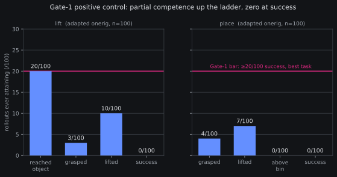
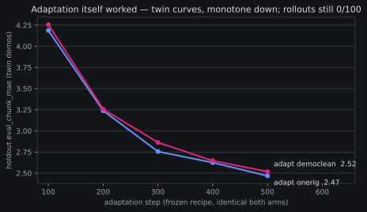

# Squint-twin qualification screen: closed F-instrument — the positive control never scored

*2026-08-22 23:xxZ. Consolidated results page for the Squint-twin
qualification screen ([pre-reg +
amendments](2026-08-22-prereg-squint-twin-screen.md), executed
02:54Z–13:57Z 08-22 across three GPU legs; the 22:32Z Discord
recovery post is the short record, this page is the full one).
Verdict artifact: `outputs/squint_screen/eval/gate1.log`; charts
recount milestone attainment from the per-rollout predicate rows and
abort on mismatch with the banked verdict
(`squint_screen_close_charts.py`).*

**Plain words.** We tried to qualify a second simulator — a published
digital twin of exactly our robot arm — as an independent referee for
comparing our models. The qualification plan had three gates:
mechanical plumbing (drive the twin with a real robot episode —
passed), a positive control (teach our model the twin's world with
in-twin demonstrations; if even an adapted model can't score, the twin
can't referee — **this failed**), and only then the actual A/B
measurement (never reached). The adapted model *learned the
demonstrations* by every offline measure we have — its prediction
error fell smoothly, identically across both arms — and then scored
**zero successes in 200 scored rollouts**. It reaches toward the cube,
sometimes even moves it, and never completes either task. Per the
pre-registered rule that is **F-instrument**: the twin cannot be made
legible to our stack at this budget, the screen closes with no
comparison attempted, and the twin's registered role stays *none* —
except as an unlimited generator of ground-truth-labeled robot videos,
which survives and already banked its first 200 episodes.

## What ran (three legs, ~6.6 GPU-h within-protocol of the ≤7 gate)

- **Leg A** (02:54Z→05:43Z, ~1.9 GPU-h): Squint's own state-based SAC
  experts trained per task (success-at-end 1.00 both, DR off), rolled
  out and re-rendered through our frozen dual-camera adapter, →
  LeRobot conversion. Banked: `squint_twin_demos_v1`, 100+100
  episodes with per-step ground-truth predicates. Conversion oracle
  GREEN (round-trip 6.5e-8 rad vs the 1e-5 gate; frames bit-exact
  pre-encode; PSNR 35.6/39.6 dB recorded as fact). Gate-0 replay had
  passed at preflight-2: tracking p50 0.0025 rad, 3/3 gripper events,
  no arm clip > 0.05 rad.
- **Leg B** (r4 09:10Z→13:33Z, ~4.4 GPU-h): both arms adapted by the
  frozen Slot-6 recipe, identical, no tuning. Endpoints saved clean:
  onerig probe 2.47@500, democlean 2.5187@500. (The r1–r3 incident —
  an ENOSPC-killed save plus two `--resume` attempts that exposed the
  [flow-head resume bug](2026-08-22-offload-mirror-bug.md) — cost
  ~2.7 GPU-h of re-spend; the cell-gate crossing was recorded
  in-channel at 09:0xZ. The bug is since fixed and GPU-verified,
  `665dadb7`.)
- **Leg C** (13:38Z→13:57Z, ~0.35 GPU-h): Gate-1 band pilots + cells
  on the adapted *stronger* arm (onerig @500), euler-10, n=100 paired
  seeds per task, DR off.

## The frozen gate that failed

Gate 1 (the positive control): the adapted stronger arm must score
**≥20/100 success on its best task**. Band pilots came back 0/20 on
both tasks (BELOW_BAND); the cells completed to n=100 anyway per the
leg script: **0/100 lift, 0/100 place**. Best task 0 vs the bar of
20 → `FAIL_F_INSTRUMENT`, the pre-registered valid end. No relative
read was attempted, Gate-2's spend was skipped, and the substitution
ladder (Reach, easier) was logged — never auto-run; running it is a
new pre-registered session's decision.

The milestone forensics are the interesting part: this is **not a
plumbing flatline**. The policy orients to the task — `reached_object`
fires in 20/100 lift rollouts, a grasp registers in 3–4/100, the cube
gets moved high enough to trip `item_lifted` in 7–10/100 (mostly
without a stable grasp — nudged or scooped, not held) — and the full
task completes exactly never. A transport bug (units, joint order,
stats row) would produce flailing, not approach behavior; Gate 0's
replay receipts already ruled that class out separately.

## The offline–closed-loop gap, again

Adaptation itself worked by every offline instrument we have: holdout
`eval_chunk_mae` fell 4.19→2.47 (onerig) and 4.26→2.52 (democlean),
monotone, near-identical twins under one frozen recipe — and the
closed-loop score is zero. This is the [probe
decoupling](2026-08-21-probe-decoupling-note.md) in its purest form
yet: offline action-prediction error on held-out demos simply does
not certify closed-loop competence, here across a far-OOD renderer
gap. 500 steps at ≤2.5 GPU-h/arm was enough to fit the demos'
surface statistics and not enough to cross the execution threshold in
the twin's world.

## What survives, what it feeds

- **The labeled-rollout corpus (idea #6) survives the fail branch by
  design**: 200 demo episodes (`squint_twin_demos_v1`) + 200 scored
  eval rollouts, every one with per-step honest predicates and
  ground-truth success — detector-calibration data at unlimited
  volume, generated for ~0 marginal cost whenever we want more.
- **Eval-design v1**: the twin registers as a *labeled-rollout
  generator only*. It screens nothing, gates nothing; the next
  evaluation tier stays sim100-only, per the frozen fail branch.
- **The substitution-ladder call** (for whichever future session
  pre-registers it): Reach-class tasks are the one place the forensics
  give hope — `reached_object` already fires at 20/100, so a Reach
  control could plausibly sit in the 20–80 band. But a ladder rung
  costs a fresh demos+adaptation leg (~3 GPU-h) and buys, at best, a
  qualification instrument for an easier capability class than the
  one we care about (grasping). Against the carrier-hunt's live
  cells, it should wait.
- **Two class fixes** landed en route and outlive the screen: the
  designed-timeout-vs-`set -e` unit kill, and the vector-env
  auto-reset poisoning a recorded final step (a smoke that bypasses
  the read under test leaves it untested); plus the per-task
  predicate ladders in the eval client (place has no
  `reached_object`), `4e91601e`.

## Claims discipline

Per the pre-reg's frozen contract: no sim-to-real claim, no absolute
twin numbers as claims, and **silence proves nothing** — this verdict
demotes the twin as an instrument; it says nothing about either
checkpoint's quality. onerig 28/100 vs democlean 8/100 stands exactly
where sim100 certified it, untouched by anything that happened here.

Total screen spend: ~6.6 GPU-h within-protocol (gate ≤7) + ~2.7
GPU-h incident re-spend (crossing recorded in-channel). The screen is
closed; the queue items `squint-twin-screen-exec` and
`squint-gate2-harness` close with it.
